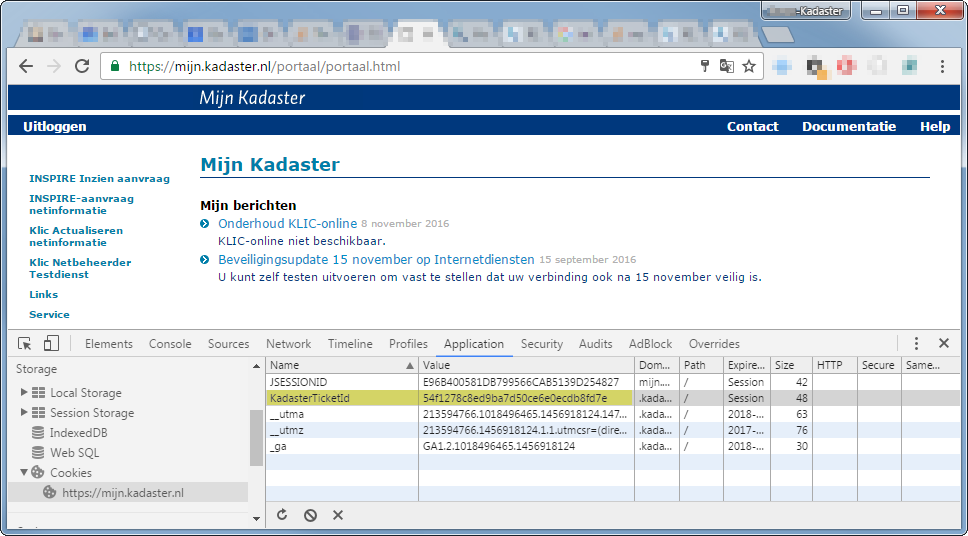

# B2B-koppeling BMKL 2.0

Dit document biedt een handleiding voor het aanleveren van beheerdersinformatie
via de B2B-koppeling volgens het BMKL 2.0. als decentrale netbeheerder.

Ook worden de services beschreven waarvan een centrale netbeheerder gebruik van kan maken.


**Inhoudsopgave**

-   [Context](#context)
-   [Scope](#scope)
-   [Leeswijzer](#leeswijzer)
-   [Authenticatie](#authenticatie)
-   [Endpoints](#endpoints)
-   [Opvoeren testmelding (centraal/decentraal)](#opvoeren-testmelding)
      - [Mijn Kadaster](#mijn-kadaster)
      - [KLIC Netbeheerder Testdienst portaal](#klic-netbeheerder-testdienst-portaal)
      - [Opvoeren testmelding - 1 van 5](#opvoeren-testmelding---1-van-5)
      - [Opvoeren testmelding - 2 van 5](#opvoeren-testmelding---2-van-5)
      - [Opvoeren testmelding - 3 van 5](#opvoeren-testmelding---3-van-5)
      - [Opvoeren testmelding - 4 van 5](#opvoeren-testmelding---4-van-5)
      - [Opvoeren testmelding - 5 van 5](#opvoeren-testmelding---5-van-5)
-   [Beheerdersinformatie en documenten aanleveren (enkel decentraal)](#beheerdersinformatie-en-documenten-aanleveren-enkel-decentraal)
-   [Beheerdersinformatie aanleveren mbv REST interface (enkel decentraal)](#beheerdersinformatie-aanleveren-mbv-rest-interface-enkel-decentraal)
      - [Netbeheerders en serviceproviders](#netbeheerders-en-serviceproviders)
      - [Swagger API Documentatie](#swagger-api-documentatie)
      - [Opvragen lijst van gebiedsinformatie-aanvragen](#opvragen-lijst-van-gebiedsinformatie-aanvragen)
      - [Opvragen van één specifieke gebiedsinformatie-aanvraag](#opvragen-van-één-specifieke-gebiedsinformatie-aanvraag)
      - [Gebiedsinformatie-aanvraag bevestigen](#gebiedsinformatie-aanvraag-bevestigen)
      - [Beheerdersinformatie aanleveren (enkel decentraal)](#beheerdersinformatie-aanleveren-enkel-decentraal)
      - [Opvragen gegevens aangeboden beheerdersinformatie (enkel decentraal)](#opvragen-gegevens-aangeboden-beheerdersinformatie-enkel-decentraal)
      - [Uitgeleverde beheerdersinformatie opvragen](#uitgeleverde-beheerdersinformatie-opvragen)

## Context
Voor het oriënteren, plannen en uitvoeren van graafwerkzaamheden in een bepaald gebied hebben
grondroerders informatie nodig over de locatie en aard van de in de grond aanwezige kabels en leidingen.
Deze informatie bevindt zich bij decentrale netbeheerders of in de centrale voorziening Kabels en Leidingen.
Het systeem KLIC wordt opgezet als de centrale voorziening voor het ontsluiten van deze informatie.
Grondroerders doen bij KLIC een aanvraag door het intekenen van een gebied waar men informatie over
nodig heeft. KLIC verzoekt en verkrijgt van de decentrale netbeheerders de informatie, die niet centraal
beschikbaar is, en combineert deze met de informatie van de centrale netbeheerders die in de centrale
voorziening Kabels en Leidingen aanwezig is.
Voor de integratie van informatie van verschillende partijen is het noodzakelijk dat er een gemeenschappelijk
begrippenkader bestaat. Het IMKL (Informatiemodel Kabels en Leidingen) beschrijft de wijze waarop de
gegevens over kabels en leidingen eenduidig kan worden vastgelegd.
De Web API die in dit document wordt gepresenteerd, beschrijft de wijze van communicatie tussen
netbeheerders en KLIC met uitzondering van het aanleveren van gegevens voor de centrale voorziening.
Het doel van deze Web API is om een uitbreidbare, betrouwbare en makkelijk te gebruiken interface te bieden
voor alle betrokkenen.

## Scope
Dit document beschrijft de Web API voor centrale en decentrale netbeheerders van het systeem KLIC. De API
betreft de uitwisseling van informatie over de gebiedsinformatie-aanvragen en de uitwisseling van
beheerdersinformatie.
Het document beschrijft niet de levering van kabel- en leidinginformatie aan de centrale voorziening door
centrale netbeheerders en ook niet de uitwisseling van informatie met gebruikers van de uitgewisselde
informatie in de context van KLIC of INSPIRE.
Dit document geeft een technische beschrijving van de Web API, maar bevat geen procedurele afspraken
zoals wettelijke termijnen waarbinnen gereageerd moet worden.

## Leeswijzer

In dit voorbeeld wordt er ingelogd als een netbeheerder. De API kan ook gebruikt worden wanneer er ingelogd is als een serviceprovider.
Zie hiervoor [Netbeheerders en serviceproviders](#netbeheerders-en-serviceproviders)

De sectie [Beheerdersinformatie en documenten aanleveren](#beheerdersinformatie-en-documenten-aanleveren) beschrijft het proces
van het aanleveren van beheerdersinformatie en de bijbehorende documenten door de centrale netbeheerder. Alle bestanden worden verpakt in één zipbestand.

Om dit zipbestand aan te kunnen leveren moet er eerst een testmelding opgevoerd worden, zodat er een gebiedsinformatie-aanvraag aangemaakt
wordt waarvoor beheerdersinformatie en de bijbehorende documenten aangeleverd kunnen worden. Dit wordt beschreven in de
sectie [Opvoeren testmelding](#opvoeren-testmelding) De decentrale netbeheerder doet een testmelding via de link
"Opvoeren testmelding - BMKL 2.0 decentraal (b&egrave;ta-versie)"

De sectie [Beheerdersinformatie aanleveren mbv REST interface](#beheerdersinformatie-aanleveren-mbv-rest-interface) beschrijft de verschillende componenten van de API. Voor het aanleveren van een zipbestand kunnen achtereenvolgens de volgende secties doorlopen worden:

- [Opvragen lijst van gebiedsinformatie-aanvragen](#opvragen-lijst-van-gebiedsinformatie-aanvragen)
- [Opvragen van één specifieke gebiedsinformatie-aanvraag](#opvragen-van-één-specifieke-gebiedsinformatie-aanvraag)
- [Gebiedsinformatie-aanvraag bevestigen](#gebiedsinformatie-aanvraag-bevestigen)
- [Beheerdersinformatie aanleveren](#beheerdersinformatie-aanleveren)

Sectie [Opvragen gegevens aangeboden beheerdersinformatie](#opvragen-gegevens-aangeboden-beheerdersinformatie) beschrijft hoe vervolgens
de status van een aanlevering gecontroleerd kan worden van een decentrale netbeheerder.

Sectie [Uitgeleverde beheerdersinformatie opvragen](#uitgeleverde-beheerdersinformatie-opvragen) beschrijft hoe een aangeleverd zipbestand gedownload kan worden.

De centrale netbeheerder actualiseert in de NTD-omgeving eerst (indien van toepassing) documenten, via de link "NTD Actualiseren documenten (b&egrave;ta-versie)"
en vervolgens netinformatie, via de link "NTD Actualiseren netinformatie (b&egrave;ta-versie)". Daarna doet de centrale netbeheerder een testmelding via de
link "Opvoeren testmelding - BMKL 2.0 centraal (b&egrave;ta-versie)". De beheerdersinformatie en de bijbehorende documenten wordt naar aanleiding van de
gedane testmelding smanegesteld door het Kadaster.

### Authenticatie

Wanneer er gebruik gemaakt wordt van de interface in de “KLIC API documentatie” om de REST API uit te proberen, geschiedt de authenticatie
door in te loggen in Mijn Kadaster. In de browser wordt dan een cookie gezet, waarmee daarop volgende requests geauthentiseerd kunnen worden.

**Het Kadaster werkt aan een interface waarbij door middel van OAuth geauthentiseerd wordt.** Omdat deze interface nog niet beschikbaar is,
wordt in dit voorbeeld gebruik gemaakt van het Kadaster-cookie dat in de browser gezet wordt wanneer er ingelogd wordt in Mijn Kadaster.

Om het Kadaster-cookie te kunnen gebruiken vanuit CURL moet er in een browser ingelogd worden in Mijn Kadaster en vervolgens de waarde van
het betreffende cookie uit de browser gehaald. In Chrome gaat dat op de volgende manier:

1.  Ga naar <https://mijn.kadaster.nl>
2.  Log in
3.  Open de hulpprogramma’s voor ontwikkelaars


_Figuur 1 - Chrome hulpprogramma's voor ontwikkelaars_

4.  Navigeer naar de ‘Application’ tab
5.  Onder Storage &gt; Cookies &gt; <https://mijn.kadaster.nl> is een lijst van cookies te zien voor dit domein.

De waarde van het cookie “KadasterTicketId” kan vervolgens gebruikt worden om de requests vanuit CURL te authentiseren.
In CURL wordt het cookie meegegeven met de parameter `--cookie “KadasterTicket=0361ea1994a04255a1b60fefa2688de1”`



_Figuur 2 - Cookies voor <https://mijn.kadaster.nl>_

### Endpoints

De endpoints die gebruikt worden in dit document zijn relatief ten opzichte van de betreffende API’s. Bijvoorbeeld de service "gebiedsInformatieAanvragen/netbeheerder" wordt
voluit "https://service10.kadaster.nl/klic/ntd/leveren/api/web/gebiedsInformatieAanvragen/netbeheerder".

### Opvoeren testmelding

Om het afhandelen van een gebiedsinformatie-aanvraag te kunnen testen, biedt de NTD de mogelijkheid om een testmelding op te voeren.

#### Mijn Kadaster
Na het inloggen in Mijn Kadaster kiest u via het menu voor "Klic Netbeheerder Testdienst".

:information_source: Hiervoor dient u geautoriseerd te zijn.


_Figuur 3 Mijn Kadaster - Klic Netbeheerder Testdienst_

#### KLIC Netbeheerder Testdienst portaal

Vervolgens opent zich het "Klic Netbeheerder Testdienst" portaalscherm met hierop alle opties die binnen de NTD beschikbaar worden gesteld,
mits u hiervoor geautoriseerd bent. Op dit portaalscherm vindt u de links waar u een testmelding kunt opvoeren:

- "Opvoeren testmelding - BMKL 2.0 centraal (b&egrave;ta-versie)" waar u als centrale netbeheerder een testmelding kunt opvoeren
- "Opvoeren testmelding - BMKL 2.0 decentraal (b&egrave;ta-versie)" waar u als decentrale netbeheerder een testmelding kunt opvoeren


_Figuur 4 Optie voor opvoeren testmelding - BMKL 2.0 (b&egrave;ta-versie)_

#### Opvoeren testmelding - 1 van 5

Nadat u de link "Opvoeren testmelding - BMKL 2.0 centraal (b&egrave;ta-versie)" of "Opvoeren testmelding - BMKL 2.0 decentraal (b&egrave;ta-versie)" heeft aangeklikt opent zich het 1e scherm van het opvoeren van een testmelding.


_Figuur 5 Opvoeren testmelding - BMKL 2.0 (b&egrave;ta-versie) - scherm 1_

U maakt de keuze, of u een testcase uitvoert voor een Graafmelding, Orientatieverzoek of Calamiteitenmelding.
Kies voor een test met een Graafmelding, de meldingssoort ‘Graafmelding’. In dit voorbeeld wordt uitgegaan van een Graafmelding.

In dit scherm moet minimaal de volgende gegevens worden ingevoerd:
- _Endpoint:_ dit betreft het adres van uw eigen webservice waarop u een notificatie wilt ontvangen als er een gebiedsinformatie-aanvraag voor u als belanghebbende klaarstaat.
- _Meldingsoort:_ het soort melding; Graafmelding, Calamiteitenmelding of Orientatieverzoek
- _Gebiedspolygoon (WKT):_ de gebiedspolygoon in Well Known Text (WKT)

:information_source: De informatiepolygoon (WKT) wordt nu nog niet ondersteund / gebruikt. In een latere release zal de informatiepolygoonfunctionaliteit worden toegevoegd.

Kies daarna "Verder".

#### Opvoeren testmelding - 2 van 5

Nadat alle gegevens zijn ingevoerd en de knop "Verder" is geklikt opent zich het volgende scherm waarin u de aanvangsdatum, verwachte einddatum en graafwerkzaamheden kunt opgeven.


_Figuur 6 Opvoeren testmelding - BMKL 2.0 (b&egrave;ta-versie) - scherm 2_

#### Opvoeren testmelding - 3 van 5

Controleer het gegeven BAG-adres en pas deze, indien nodig, aan. Selecteer Ja of Nee voor het aanvragen van huisaansluitschetsen. Indien gekozen is voor Nee, start de test.


_Figuur 7 Opvoeren testmelding - BMKL 2.0 (b&egrave;ta-versie) - scherm 3_

Indien gekozen is om huisaansluitschetsen toe te voegen kunt u deze in het volgende scherm aanvragen.

#### Opvoeren testmelding - 4 van 5


_Figuur 8 Opvoeren testmelding - BMKL 2.0 (b&egrave;ta-versie) - scherm 4_

In dit voorbeeld is gekozen om huisaansluitschetsen toe te voegen. U kunt deze in het volgende scherm aanvragen.
Klik nu op de button “Start test”. Dit zorgt er voor dat er een gebiedsinformatie-aanvraag wordt ingeschoten waarmee de testmelding is gedaan.

#### Opvoeren testmelding - 5 van 5

Wanneer het bericht succesvol is verzonden, verschijnt onderstaand scherm.

**Let op: vanaf het moment dat het bericht succesvol is verzonden, kan het een paar minuten duren voordat de gebiedsinformatie-aanvraag beschikbaar is.**


_Figuur 9  Opvoeren testmelding - BMKL 2.0 (b&egrave;ta-versie) - scherm 5_

## Beheerdersinformatie en documenten aanleveren (enkel decentraal)

Beheerdersinformatie en de bijbehorende documenten worden aangeleverd in een zipbestand door de decentrale netbeheerder. Dit bestand moet voldoen aan de volgende voorwaarden:

- Het zipbestand bevat exact één bestand met de extentie `.xml`. Dit bestand bevat de beheerdersinformatie in [IMKL 2015 formaat](https://register.geostandaarden.nl/imkl2015/index.html).
- Het zipbestand mag één of meerdere PDF bestanden bevatten. Elk van deze bestanden moet gerefereerd worden vanuit het XML bestand.
- Het zipbestand mag geen mappenstructuur bevatten; alle bestanden in het zipbestand moeten op het hoogste niveau in het zipbestand opgeslagen worden.

Het aanbieden van beheerdersinformatie gaat in een aantal fases:

1. Het opvragen van gebiedsinformatie-aanvragen waarvoor beheerdersinformatie moet worden aangeleverd
2. Het bevestigen van een specifieke gebiedsinformatie-aanvraag, door deze te markeren als 'gezien'
3. Het aanbieden van beheerdersinformatie voor de bevestigde gebiedsinformatie-aanvraag

### Beheerdersinformatie aanleveren mbv REST interface (enkel decentraal)

Voor het geautomatiseerd aanleveren van beheerdersinformatie heeft het Kadaster REST interfaces beschikbaar gesteld. De documentatie over de werking van
deze interfaces is beschikbaar in de vorm van [Swagger](http://swagger.io) specificatie. Deze documentatie is te vinden bij de “KLIC API documentatie”-applicatie.
Deze applicatie is te bereiken via de KLIC Netbeheerder Testdienst portal of via de link <https://service10.kadaster.nl/klic/ntd/api-docs/>.

De applicatie biedt een overzicht van de endpoints van de verschillende API’s en hoe deze endpoints gebruikt kunnen worden. Voor de “Beheerdersinformatie” API zijn
al deze endpoints meteen uit te proberen via de aangeboden interface. Met uitzondering van het downloaden van de aangeleverde beheerdersinformatie, deze zal via
een browsers of via CURL moeten worden uitgevoerd aangezien Swagger ZIP responses niet ondersteunt.

_De voorbeelden die hieronder zijn beschreven gaan er vanuit dat er	&eacute;&eacute;n testmelding is gedaan en er zal voor deze testmelding beheerdersinformatie worden aangeleverd._

#### Netbeheerders en serviceproviders

De REST interfaces kennen verschillende endpoints voor netbeheerders en voor serviceproviders. Serviceproviders moeten in de URL van het endpoint dat ze aanroepen de bronhoudercode opnemen van de netbeheerder waarvoor zij de betreffende operatie willen uitvoeren. In de documentatie zijn deze endpoints te herkennen aan de parameter "{bronhoudercode}".

In dit voorbeeld wordt uitgegaan van een netbeheerder die zelf een aanlevering doet. Er wordt dus geen gebruik gemaakt van de endpoints met "{bronhoudercode}" erin.


#### De REST API voor BMKL 2.0 ondersteunt de volgende functionaliteit:

- Haal als belanghebbende netbeheerder een lijst met gebiedsinformatie-aanvragen op die voldoen aan opgegeven criteria.
- Haal als netbeheerder één gebiedsinformatie-aanvraag op.
- Bevestig een gebiedsinformatie-aanvraag door deze te markeren als 'gezien'.
- Lever als belanghebbende netbeheerder de beheerdersinformatie aan voor een specifieke gebiedsinformatie-aanvraag (decentraal).
- Ophalen van eerder aangeleverde beheerdersinformatie voor een specifieke gebiedsinformatie-aanvraag (decentraal).
- Haal als netbeheerder de uitgeleverde beheerdersinformatie op voor een specifieke gebiedsinformatie-aanvraag.

#### CURL

De “KLIC API Documentatie”-applicatie maakt het mogelijk om de meeste endpoints aan te roepen vanuit de browser.
In het voorbeeld in dit document wordt echter gebruik gemaakt van de command-line tool CURL (https://curl.haxx.se/). Dit heeft meer analogie met de werkwijze als een netbeheerder of serviceprovider een eigen applicatie wil ontwikkelen voor het decentraal aanleveren van beheerdersinformatie via de B2B-koppeling.
De CURL commando's worden in dit document voor de leesbaarheid weergegeven op meerdere regels. Deze commando's dienen of als één enkele regel ingevoerd te worden, of de regels dienen afgesloten te worden met een '^' (Windows) of een '\\' (Unix).

#### Swagger API Documentatie

De API Documentatie kan bereikt worden via een link op het NTD portaalscherm.


_Figuur 10 API Documentatie Link_

Het klikken van de link brengt u naar de overzichtspagina van de API Documentatie. Onder "Beheerdersinformatie" vindt u een link naar:

**API Testfaciliteit**

Een hulpmiddel om op basis van de API specificatie eenvoudig de beschikbare services uit te proberen.

**API Specificatie document**

Een beschrijving van de API volgens de OpenAPI specificatie in YAML (JSON) formaat. Dit biedt de softwareontwikkelaar een duidelijke beschrijving van de interface ten behoeve van integratie in eigen software.


_Figuur 11 API Documentatie Beheerdersinformatie / BMKL 2.0_

De "API Testfaciliteit" link brengt u naar een Swagger pagina waar alle services beschreven zijn.


_Figuur 12 API Documentatie Beheerdersinformatie / BMKL 2.0 detail_

#### Opvragen lijst van gebiedsinformatie-aanvragen

Het endpoint voor het opvragen van de lijst met gebiedsinformatie-aanvragen waar de betreffende netbeheerder bij betrokken is, kan aangeroepen worden met verschillende parameters om zo naar één specifieke, of een bepaalde set gebiedsinformatie-aanvragen te kunnen zoeken. Dit gaat met een GET request naar het endpoint `/gebiedsInformatieAanvragen/netbeheerder`. Het systeem haalt alle gebiedsinformatie-aanvragen op die voldoen aan de criteria en waarvoor de ingelogde gebruiker geautoriseerd is.

In dit voorbeeld wordt gezocht naar alle gebiedsinformatie-aanvragen voor de ingelogde netbeheerder waarbij de aanvraagSoort gelijk is aan "graafmelding" en de productiestatus gelijk is aan "open". Hiervoor wordt de parameter `aanvraagSoort` met de waarde `graafmelding` en de  `biProductieStatus` parameter toegevoegd aan het request met de waarde `open`. Daarnaast wordt er een limiet aan het aantal op te halen gebiedsinformatie-aanvragen meegegeven aan het request. Het default maximum is 50.

**Request:**
```sh
curl
--cookie 'KadasterTicketId=54f1278c8ed9ba7d50ce6e0ecdb8fd7e'
https://service10.kadaster.nl/klic/ntd/leveren/api/web/gebiedsInformatieAanvragen/netbeheerder/?aanvraagSoort=graafmelding&biNotificatieStatus=open&limiet=50
```

**Response**
```json
[
  {
    "aanvraagId": "f2314830-f211-4185-8acf-4cdd7712da5a",
    "ordernummer": "2015000471",
    "klicMeldnummer": "00G000227",
    "aanvrager": {
      "bedrijfsNaam": "Netbeheerder Actualiseren01",
      "bezoekAdres": {
        "openbareRuimteNaam": "Laan van Westenenk",
        "huisnummer": "701",
        "postcode": "7334 DP",
        "woonplaatsNaam": "APELDOORN"
      },
      "telefoon": "0881324567",
      "fax": "0888795641",
      "email": "klic.testers@kadaster.nl"
    },
    "opdrachtgever": {
      "bedrijfsNaam": "Kadaster",
      "naam": "Kadaster",
      "bezoekAdres": {
        "openbareRuimteNaam": "Hofstraat",
        "huisnummer": "110",
        "postcode": "7311KZ",
        "woonplaatsNaam": "Apeldoorn"
      },
      "telefoon": "(088) 183 20 00",
      "email": "noreply@kadaster.nl"
    },
    "aanvraagSoort": "https://api.kadaster.nl/klic/v1/cl/aanvraagSoorten/graafmelding",
    "aanvraagDatum": "2017-03-28T07:08:31+02:00",
    "giAanvraagStatus": "https://api.kadaster.nl/klic/v1/cl/giAanvraagStatussen/open",
    "soortWerkzaamheden" : [
            "https://api.kadaster.nl/klic/v1/cl/soortWerkzaamheden/funderingswerk",
            "https://api.kadaster.nl/klic/v1/cl/soortWerkzaamheden/woningbouw"
    ],
    "locatieWerkzaamheden": "Laan van Westenenk 701 7334DP Apeldoorn",
    "startDatum": "2017-04-01",
    "eindDatum": "2017-04-08",
    "graafGebied": {
      "type": "Polygon",
      "crs": {
        "type": "name",
        "properties": {
          "name": "EPSG:28992"
        }
      },
      "coordinates": [
        [
          [ 121070,
            486903
          ],
          [
            121095,
            486849
          ],
          [
            121220,
            486871
          ],
          [
            121480,
            486905
          ],
          [
            121507,
            487100
          ],
          [
            121564,
            487215
          ],
          [
            121539,
            4872260
          ],
          [
            121460,
            487288
          ],
          [
            121337,
            487331
          ],
          [
            121220,
            487338
          ],
          [
            121156,
            487308
          ],
          [
            121070,
            486903
          ]
        ]
      ]
    },
    "huisaansluitingAdressen": [
      {
        "openbareRuimteNaam": "Laan van Westenenk",
        "postcode": "7334DP",
        "huisnummer": "701",
        "woonplaatsNaam": "Apeldoorn"
      }
    ]
  }
]
```

#### Opvragen van één specifieke gebiedsinformatie-aanvraag

Van een gebiedsinformatie-aanvraag kunnen alle beschikbare gegevens opgevraagd worden met het endpoint voor het opvragen één specifieke gebiedsinformatie-aanvraag. Dit gaat met een GET request naar het endpoint `gebiedsInformatieAanvragen/{giAanvraagId}/netbeheerder`. Dit endpoint moet aangeroepen worden met de `giAanvraagId` van de betreffende gebiedsinformatie-aanvraag als parameter in het pad.

**Request:**
```sh
curl
--cookie 'KadasterTicketId=c8108ff7b97f41b991e9d9b5839804b5'
https://service10.kadaster.nl/klic/ntd/leveren/api/web/gebiedsInformatieAanvragen/f2314830-f211-4185-8acf-4cdd7712da5a/netbeheerder
```

**Response:**
```json
{
  "aanvraagId": "f2314830-f211-4185-8acf-4cdd7712da5a",
  "ordernummer": "2015000471",
  "klicMeldnummer": "00G000227",
  "aanvrager": {
    "bedrijfsNaam": "Netbeheerder Actualiseren01",
    "bezoekAdres": {
      "openbareRuimteNaam": "Laan van Westenenk",
      "huisnummer": "701",
      "postcode": "7334 DP",
      "woonplaatsNaam": "APELDOORN"
    },
    "telefoon": "0881324567",
    "fax": "0888795641",
    "email": "klic.testers@kadaster.nl"
  },
  "opdrachtgever": {
    "bedrijfsNaam": "Kadaster",
    "naam": "Kadaster",
    "bezoekAdres": {
      "openbareRuimteNaam": "Hofstraat",
      "huisnummer": "110",
      "postcode": "7311KZ",
      "woonplaatsNaam": "Apeldoorn"
    },
    "telefoon": "(088) 183 20 00",
    "email": "noreply@kadaster.nl"
  },
  "aanvraagSoort": "https://api.kadaster.nl/klic/v1/cl/aanvraagSoorten/graafmelding",
  "aanvraagDatum": "2017-03-28T07:08:31+02:00",
  "giAanvraagStatus": "https://api.kadaster.nl/klic/v1/cl/giAanvraagStatussen/open",
  "soortWerkzaamheden" : [
              "https://api.kadaster.nl/klic/v1/cl/soortWerkzaamheden/funderingswerk",
              "https://api.kadaster.nl/klic/v1/cl/soortWerkzaamheden/woningbouw"
  ],
  "locatieWerkzaamheden": "Laan van Westenenk 701 7334DP Apeldoorn",
  "startDatum": "2017-04-01",
  "eindDatum": "2017-04-01",
  "graafGebied": {
    "type": "Polygon",
    "crs": {
      "type": "name",
      "properties": {
        "name": "EPSG:28992"
      }
    },
    "coordinates": [
      [
        [
          121070,
          486903
        ],
        [
          121095,
          486849
        ],
        [
          121220,
          486871
        ],
        [
          121480,
          486905
        ],
        [
          121507,
          487100
        ],
        [
          121564,
          487215
        ],
        [
          121539,
          4872260
        ],
        [
          121460,
          487288
        ],
        [
          121337,
          487331
        ],
        [
          121220,
          487338
        ],
        [
          121156,
          487308
        ],
        [
          121070,
          486903
        ]
      ]
    ]
  },
  "huisaansluitingAdressen": [
    {
      "openbareRuimteNaam": "Laan van Westenenk",
      "postcode": "7334DP",
      "huisnummer": "701",
      "woonplaatsNaam": "Apeldoorn"
    }
  ]
}
```

#### Gebiedsinformatie-aanvraag bevestigen

Voordat een decentrale netbeheerder beheerdersinformatie kan uploaden voor een gebiedsinformatie-aanvraag, moet de netbeheerder aangeven dat hij de gebiedsinformatie-aanvraag gezien heeft. Dat gaat met een POST request naar het endpoint `/gebiedsInformatieAanvragen/{giAanvraagId}/netbeheerder/gezien`.

**Request:**
```sh
curl
 -X POST
 --cookie 'KadasterTicketId=c8108ff7b97f41b991e9d9b5839804b5'
 https://service10.kadaster.nl/klic/ntd/leveren/api/web/gebiedsInformatieAanvragen/f2314830-f211-4185-8acf-4cdd7712da5a/netbeheerder/gezien
```

**Response:**
```json
HTTP/1.1 200 OK
```

Voor de centrale netbeheerder wordt aanbevolen de gebiedsinformatieaanvraag te bevestigen. Als een centrale netbeheerder geen ontvangstbevestiging stuurt op een
gebiedsinformatieaanvraag, blijft deze de status 'open' houden. Het Kadaster zal ongeacht de notificatiestatus beheerdersinformatie namens de centrale
netbeheerder produceren en uitleveren.

#### Beheerdersinformatie aanleveren (enkel decentraal)

Als de gebiedsinformatie-aanvraag gemarkeerd is als 'gezien', kan de beheerdersinformatie aangeleverd worden door de centrale netbeheerder. Dit gaat met een POST request naar
het endpoint `/beheerdersInformatie/gebiedsInformatieAanvragen/{giAanvraagId}/netbeheerder`.In onderstaand voorbeeld wordt een POST request gedaan
naar dit endpoint en wordt de beheerdersinformatie in de vorm van een zipbestand aangeleverd.

**Request:**
```sh
curl
 -X POST
 --cookie 'KadasterTicketId=c8108ff7b97f41b991e9d9b5839804b5'
 https://service10.kadaster.nl/klic/ntd/leveren/api/web/beheerdersInformatie/gebiedsInformatieAanvragen/f2314830-f211-4185-8acf-4cdd7712da5a/netbeheerder
 -F "netinformatie=@C:/TestFiles/Decentraal/nbact1/BMKL20_NBACT1_DECENTRAAL.zip"
```

**Response:**
```JSON
HTTP/1.1 200 OK
```

Wanneer de gebiedsinformatie-aanvraag nog niet gemarkeerd is als 'gezien' verschijnt de volgende melding. De gebiedsinformatie-aanvraag moet dus
bevestigd ('gezien') zijn alvorens er beheerdersinformatie kan worden aangeleverd.

**Response:**
```JSON
{
  "status" : 405,
  "meldingCode" : 1000405,
  "gebruikerMelding" : "methode niet toegestaan",
  "ontwikkelaarMelding" : "de gebiedsinformatie-aanvraag is nog niet bevestigd",
  "meerInformatie" : "http://developer.klic.nl/foutCode/1000405"
}
```

#### Opvragen gegevens aangeboden beheerdersinformatie (enkel decentraal)

Wanneer u als decentrale netbeheerder beheerdersinformatie heeft aangeleverd, kunt u gegevens opvragen over de betreffende aanlevering.
Deze informatie bevat de status van de aanlevering en gegevens over de verwerking en validatie ervan. Dit gaat met een GET request naar hetzelfde
endpoint als waar de beheerdersinformatie met een POST naar toe gestuurd is. De gegevens over de beheerdersinformatie kunnen opgehaald worden met een GET
request naar het endpoint `/beheerdersInformatie/gebiedsInformatieAanvragen/{giAanvraagId}/netbeheerder`.

Omdat de centrale netbeheerder geen beheerdersinformatie mag aanleveren/geen aanleverstatus van beheerdersinformatie van toepassing is, zal er een lege
aanleverstatus worden teruggegeven bij een GET request door een centrale netbeheerder.

**Request:**
```sh
curl
--cookie 'KadasterTicketId=c8108ff7b97f41b991e9d9b5839804b5'
https://service10.kadaster.nl/klic/ntd/leveren/api/web/beheerdersInformatie/gebiedsInformatieAanvragen/f2314830-f211-4185-8acf-4cdd7712da5a/netbeheerder
```

**Response:**
```json
{
  "aanvraagId": "f2314830-f211-4185-8acf-4cdd7712da5a",
  "biNotificatieStatus": "https://api.kadaster.nl/klic/v1/cl/biNotificatieStatussen/bevestigingOntvangen",
  "biProductieStatus": "https://api.kadaster.nl/klic/v1/cl/biProductieStatussen/gereedVoorSamenstellenProduct",
  "datumGenotificeerd": "2017-03-28T07:09:02+02:00",
  "datumBevestigingOntvangen": "2017-03-28T08:33:25+02:00",
  "datumNetInformatieOntvangen": "2017-03-28T09:25:40+02:00",
  "netInformatie": "/klic/ntd/netbeheerdersinformatie/2017/03/28/2015000471_G/0000000051/",
  "aanleveringen": [
    {
      "aanleveringId": "017cd6b6-c2fa-4c5f-b7a0-9f91b3f2abce",
      "bronhouderCode": "nbact1",
      "informatieSoort": "beheerdersinformatie",
      "bestandsnaam": "BMKL20_NBACT1_DECENTRAAL.zip",
      "locatieInOpslag": "beheerdersinformatie/2017/03/28/2017-03-28_09H25M39S836_cf5f1383-9b31-4294-8622-3132842e1723_BMKL20_NBACT1_DECENTRAAL.zip",
      "netbeheerder": "Netbeheerder Actualiseren01",
      "relatienummer": "949099    ",
      "fileSizeInBytes": 33844,
      "aanleverNummer": 14,
      "aanleverDatum": "2017-03-28T09:25:40.245",
      "aanleverStatus": "https://klic.kadaster.nl/klic/apidocs/v1/cl/aanleverStatus/biGereedVoorSamenstellenProduct",
      "aanleverStatusMutatieDatum": "2017-03-28T09:25:55.333",
      "aanleverStatusHistorieList": [
        {
          "mutatieDatum": "2017-03-28T09:25:55.333",
          "aanleverStatus": "https://klic.kadaster.nl/klic/apidocs/v1/cl/aanleverStatus/biGereedVoorSamenstellenProduct"
        },
        {
          "mutatieDatum": "2017-03-28T09:25:53.303",
          "aanleverStatus": "https://klic.kadaster.nl/klic/apidocs/v1/cl/aanleverStatus/biWordtGereedgemaakt"
        },
        {
          "mutatieDatum": "2017-03-28T09:25:50.200",
          "aanleverStatus": "https://klic.kadaster.nl/klic/apidocs/v1/cl/aanleverStatus/biGevalideerdZonderFouten"
        },
        {
          "mutatieDatum": "2017-03-28T09:25:45.705",
          "aanleverStatus": "https://klic.kadaster.nl/klic/apidocs/v1/cl/aanleverStatus/biWordtGevalideerd"
        },
        {
          "mutatieDatum": "2017-03-28T09:25:43.050",
          "aanleverStatus": "https://klic.kadaster.nl/klic/apidocs/v1/cl/aanleverStatus/biAangeleverd"
        },
        {
          "mutatieDatum": "2017-03-28T09:25:40.271",
          "aanleverStatus": "https://klic.kadaster.nl/klic/apidocs/v1/cl/aanleverStatus/biGestart"
        }
      ],
      "aanleverStapList": [
        {
          "aanleverStapAanduiding": "https://klic.kadaster.nl/klic/apidocs/v1/cl/aanleverStapAanduiding/biAanleveren",
          "startDatum": "2017-03-28T09:25:40.261",
          "eindDatum": "2017-03-28T09:25:43.068",
          "stapStatus": "succes",
          "gebruikersnaam": "0000302114"
        },
        {
          "aanleverStapAanduiding": "https://klic.kadaster.nl/klic/apidocs/v1/cl/aanleverStapAanduiding/biValideren",
          "startDatum": "2017-03-28T09:25:45.699",
          "eindDatum": "2017-03-28T09:25:50.203",
          "stapStatus": "succes",
          "gebruikersnaam": "system"
        },
        {
          "aanleverStapAanduiding": "https://klic.kadaster.nl/klic/apidocs/v1/cl/aanleverStapAanduiding/biGereedmakenVoorSamenstellen",
          "startDatum": "2017-03-28T09:25:53.300",
          "eindDatum": "2017-03-28T09:25:55.341",
          "stapStatus": "succes",
          "gebruikersnaam": "system"
        }
      ],
      "aanleverStatistiekList": [
        {
          "statistiekSoort": "IMKL-netinformatie-WION",
          "niveau1": 0,
          "statistiekAanduidingNiveau1": "aanduidingEisVoorzorgsmaatregel",
          "niveau2": 0,
          "aantal": 1,
          "aantalNieuw": 0,
          "aantalGewijzigd": 0,
          "aantalVerwijderd": 0
        },
        {
          "statistiekSoort": "IMKL-netinformatie-WION",
          "niveau1": 0,
          "statistiekAanduidingNiveau1": "annotatie",
          "niveau2": 0,
          "aantal": 4,
          "aantalNieuw": 0,
          "aantalGewijzigd": 0,
          "aantalVerwijderd": 0
        },
        {
          "statistiekSoort": "IMKL-netinformatie-WION",
          "niveau1": 0,
          "statistiekAanduidingNiveau1": "containerLeidingelement",
          "niveau2": 0,
          "statistiekAanduidingNiveau2": "kast",
          "aantal": 2,
          "aantalNieuw": 0,
          "aantalGewijzigd": 0,
          "aantalVerwijderd": 0
        },
        {
          "statistiekSoort": "IMKL-netinformatie-WION",
          "niveau1": 0,
          "statistiekAanduidingNiveau1": "containerLeidingelement",
          "niveau2": 0,
          "statistiekAanduidingNiveau2": "mangat",
          "aantal": 10,
          "aantalNieuw": 0,
          "aantalGewijzigd": 0,
          "aantalVerwijderd": 0
        },
        {
          "statistiekSoort": "IMKL-netinformatie-WION",
          "niveau1": 0,
          "statistiekAanduidingNiveau1": "containerLeidingelement",
          "niveau2": 0,
          "statistiekAanduidingNiveau2": "mast",
          "aantal": 3,
          "aantalNieuw": 0,
          "aantalGewijzigd": 0,
          "aantalVerwijderd": 0
        },
        {
          "statistiekSoort": "IMKL-netinformatie-WION",
          "niveau1": 0,
          "statistiekAanduidingNiveau1": "containerLeidingelement",
          "niveau2": 0,
          "statistiekAanduidingNiveau2": "technischGebouw",
          "aantal": 1,
          "aantalNieuw": 0,
          "aantalGewijzigd": 0,
          "aantalVerwijderd": 0
        },
        {
          "statistiekSoort": "IMKL-netinformatie-WION",
          "niveau1": 0,
          "statistiekAanduidingNiveau1": "containerLeidingelement",
          "niveau2": 0,
          "statistiekAanduidingNiveau2": "toren",
          "aantal": 1,
          "aantalNieuw": 0,
          "aantalGewijzigd": 0,
          "aantalVerwijderd": 0
        },
        {
          "statistiekSoort": "IMKL-netinformatie-WION",
          "niveau1": 0,
          "statistiekAanduidingNiveau1": "diepteNAP",
          "niveau2": 0,
          "aantal": 1,
          "aantalNieuw": 0,
          "aantalGewijzigd": 0,
          "aantalVerwijderd": 0
        },
        {
          "statistiekSoort": "IMKL-netinformatie-WION",
          "niveau1": 0,
          "statistiekAanduidingNiveau1": "diepteTovMaaiveld",
          "niveau2": 0,
          "aantal": 2,
          "aantalNieuw": 0,
          "aantalGewijzigd": 0,
          "aantalVerwijderd": 0
        },
        {
          "statistiekSoort": "IMKL-netinformatie-WION",
          "niveau1": 0,
          "statistiekAanduidingNiveau1": "eigenTopografie",
          "niveau2": 0,
          "aantal": 11,
          "aantalNieuw": 0,
          "aantalGewijzigd": 0,
          "aantalVerwijderd": 0
        },
        {
          "statistiekSoort": "IMKL-netinformatie-WION",
          "niveau1": 0,
          "statistiekAanduidingNiveau1": "extraGeometrie",
          "niveau2": 0,
          "aantal": 9,
          "aantalNieuw": 0,
          "aantalGewijzigd": 0,
          "aantalVerwijderd": 0
        },
        {
          "statistiekSoort": "IMKL-netinformatie-WION",
          "niveau1": 0,
          "statistiekAanduidingNiveau1": "kabelEnLeidingContainer",
          "niveau2": 0,
          "statistiekAanduidingNiveau2": "buisleidingGevaarlijkeInhoud",
          "aantal": 1,
          "aantalNieuw": 0,
          "aantalGewijzigd": 0,
          "aantalVerwijderd": 0
        },
        {
          "statistiekSoort": "IMKL-netinformatie-WION",
          "niveau1": 0,
          "statistiekAanduidingNiveau1": "kabelEnLeidingContainer",
          "niveau2": 0,
          "statistiekAanduidingNiveau2": "datatransport",
          "aantal": 9,
          "aantalNieuw": 0,
          "aantalGewijzigd": 0,
          "aantalVerwijderd": 0
        },
        {
          "statistiekSoort": "IMKL-netinformatie-WION",
          "niveau1": 0,
          "statistiekAanduidingNiveau1": "kabelEnLeidingContainer",
          "niveau2": 0,
          "statistiekAanduidingNiveau2": "gasHogeDruk",
          "aantal": 3,
          "aantalNieuw": 0,
          "aantalGewijzigd": 0,
          "aantalVerwijderd": 0
        },
        {
          "statistiekSoort": "IMKL-netinformatie-WION",
          "niveau1": 0,
          "statistiekAanduidingNiveau1": "kabelEnLeidingContainer",
          "niveau2": 0,
          "statistiekAanduidingNiveau2": "laagSpanning",
          "aantal": 1,
          "aantalNieuw": 0,
          "aantalGewijzigd": 0,
          "aantalVerwijderd": 0
        },
        {
          "statistiekSoort": "IMKL-netinformatie-WION",
          "niveau1": 0,
          "statistiekAanduidingNiveau1": "kabelEnLeidingContainer",
          "niveau2": 0,
          "statistiekAanduidingNiveau2": "middenSpanning",
          "aantal": 9,
          "aantalNieuw": 0,
          "aantalGewijzigd": 0,
          "aantalVerwijderd": 0
        },
        {
          "statistiekSoort": "IMKL-netinformatie-WION",
          "niveau1": 0,
          "statistiekAanduidingNiveau1": "kabelEnLeidingContainer",
          "niveau2": 0,
          "statistiekAanduidingNiveau2": "rioolVrijverval",
          "aantal": 1,
          "aantalNieuw": 0,
          "aantalGewijzigd": 0,
          "aantalVerwijderd": 0
        },
        {
          "statistiekSoort": "IMKL-netinformatie-WION",
          "niveau1": 0,
          "statistiekAanduidingNiveau1": "kabelEnLeidingContainer",
          "niveau2": 0,
          "statistiekAanduidingNiveau2": "water",
          "aantal": 3,
          "aantalNieuw": 0,
          "aantalGewijzigd": 0,
          "aantalVerwijderd": 0
        },
        {
          "statistiekSoort": "IMKL-netinformatie-WION",
          "niveau1": 0,
          "statistiekAanduidingNiveau1": "kabelOfLeiding",
          "niveau2": 0,
          "statistiekAanduidingNiveau2": "buisleidingGevaarlijkeInhoud",
          "aantal": 5,
          "aantalNieuw": 0,
          "aantalGewijzigd": 0,
          "aantalVerwijderd": 0
        },
        {
          "statistiekSoort": "IMKL-netinformatie-WION",
          "niveau1": 0,
          "statistiekAanduidingNiveau1": "kabelOfLeiding",
          "niveau2": 0,
          "statistiekAanduidingNiveau2": "datatransport",
          "aantal": 1,
          "aantalNieuw": 0,
          "aantalGewijzigd": 0,
          "aantalVerwijderd": 0
        },
        {
          "statistiekSoort": "IMKL-netinformatie-WION",
          "niveau1": 0,
          "statistiekAanduidingNiveau1": "kabelOfLeiding",
          "niveau2": 0,
          "statistiekAanduidingNiveau2": "gasHogeDruk",
          "aantal": 9,
          "aantalNieuw": 0,
          "aantalGewijzigd": 0,
          "aantalVerwijderd": 0
        },
        {
          "statistiekSoort": "IMKL-netinformatie-WION",
          "niveau1": 0,
          "statistiekAanduidingNiveau1": "kabelOfLeiding",
          "niveau2": 0,
          "statistiekAanduidingNiveau2": "gasLageDruk",
          "aantal": 4,
          "aantalNieuw": 0,
          "aantalGewijzigd": 0,
          "aantalVerwijderd": 0
        },
        {
          "statistiekSoort": "IMKL-netinformatie-WION",
          "niveau1": 0,
          "statistiekAanduidingNiveau1": "kabelOfLeiding",
          "niveau2": 0,
          "statistiekAanduidingNiveau2": "hoogspanning",
          "aantal": 2,
          "aantalNieuw": 0,
          "aantalGewijzigd": 0,
          "aantalVerwijderd": 0
        },
        {
          "statistiekSoort": "IMKL-netinformatie-WION",
          "niveau1": 0,
          "statistiekAanduidingNiveau1": "kabelOfLeiding",
          "niveau2": 0,
          "statistiekAanduidingNiveau2": "laagSpanning",
          "aantal": 8,
          "aantalNieuw": 0,
          "aantalGewijzigd": 0,
          "aantalVerwijderd": 0
        },
        {
          "statistiekSoort": "IMKL-netinformatie-WION",
          "niveau1": 0,
          "statistiekAanduidingNiveau1": "kabelOfLeiding",
          "niveau2": 0,
          "statistiekAanduidingNiveau2": "middenSpanning",
          "aantal": 12,
          "aantalNieuw": 0,
          "aantalGewijzigd": 0,
          "aantalVerwijderd": 0
        },
        {
          "statistiekSoort": "IMKL-netinformatie-WION",
          "niveau1": 0,
          "statistiekAanduidingNiveau1": "kabelOfLeiding",
          "niveau2": 0,
          "statistiekAanduidingNiveau2": "rioolOnderOverOfOnderdruk",
          "aantal": 1,
          "aantalNieuw": 0,
          "aantalGewijzigd": 0,
          "aantalVerwijderd": 0
        },
        {
          "statistiekSoort": "IMKL-netinformatie-WION",
          "niveau1": 0,
          "statistiekAanduidingNiveau1": "kabelOfLeiding",
          "niveau2": 0,
          "statistiekAanduidingNiveau2": "rioolVrijverval",
          "aantal": 40,
          "aantalNieuw": 0,
          "aantalGewijzigd": 0,
          "aantalVerwijderd": 0
        },
        {
          "statistiekSoort": "IMKL-netinformatie-WION",
          "niveau1": 0,
          "statistiekAanduidingNiveau1": "kabelOfLeiding",
          "niveau2": 0,
          "statistiekAanduidingNiveau2": "warmte",
          "aantal": 1,
          "aantalNieuw": 0,
          "aantalGewijzigd": 0,
          "aantalVerwijderd": 0
        },
        {
          "statistiekSoort": "IMKL-netinformatie-WION",
          "niveau1": 0,
          "statistiekAanduidingNiveau1": "kabelOfLeiding",
          "niveau2": 0,
          "statistiekAanduidingNiveau2": "water",
          "aantal": 69,
          "aantalNieuw": 0,
          "aantalGewijzigd": 0,
          "aantalVerwijderd": 0
        },
        {
          "statistiekSoort": "IMKL-netinformatie-WION",
          "niveau1": 0,
          "statistiekAanduidingNiveau1": "leidingelement",
          "niveau2": 0,
          "statistiekAanduidingNiveau2": "buisleidingGevaarlijkeInhoud",
          "aantal": 9,
          "aantalNieuw": 0,
          "aantalGewijzigd": 0,
          "aantalVerwijderd": 0
        },
        {
          "statistiekSoort": "IMKL-netinformatie-WION",
          "niveau1": 0,
          "statistiekAanduidingNiveau1": "leidingelement",
          "niveau2": 0,
          "statistiekAanduidingNiveau2": "datatransport",
          "aantal": 8,
          "aantalNieuw": 0,
          "aantalGewijzigd": 0,
          "aantalVerwijderd": 0
        },
        {
          "statistiekSoort": "IMKL-netinformatie-WION",
          "niveau1": 0,
          "statistiekAanduidingNiveau1": "leidingelement",
          "niveau2": 0,
          "statistiekAanduidingNiveau2": "gasHogeDruk",
          "aantal": 9,
          "aantalNieuw": 0,
          "aantalGewijzigd": 0,
          "aantalVerwijderd": 0
        },
        {
          "statistiekSoort": "IMKL-netinformatie-WION",
          "niveau1": 0,
          "statistiekAanduidingNiveau1": "leidingelement",
          "niveau2": 0,
          "statistiekAanduidingNiveau2": "gasLageDruk",
          "aantal": 10,
          "aantalNieuw": 0,
          "aantalGewijzigd": 0,
          "aantalVerwijderd": 0
        },
        {
          "statistiekSoort": "IMKL-netinformatie-WION",
          "niveau1": 0,
          "statistiekAanduidingNiveau1": "leidingelement",
          "niveau2": 0,
          "statistiekAanduidingNiveau2": "hoogspanning",
          "aantal": 1,
          "aantalNieuw": 0,
          "aantalGewijzigd": 0,
          "aantalVerwijderd": 0
        },
        {
          "statistiekSoort": "IMKL-netinformatie-WION",
          "niveau1": 0,
          "statistiekAanduidingNiveau1": "leidingelement",
          "niveau2": 0,
          "statistiekAanduidingNiveau2": "laagSpanning",
          "aantal": 15,
          "aantalNieuw": 0,
          "aantalGewijzigd": 0,
          "aantalVerwijderd": 0
        },
        {
          "statistiekSoort": "IMKL-netinformatie-WION",
          "niveau1": 0,
          "statistiekAanduidingNiveau1": "leidingelement",
          "niveau2": 0,
          "statistiekAanduidingNiveau2": "middenSpanning",
          "aantal": 10,
          "aantalNieuw": 0,
          "aantalGewijzigd": 0,
          "aantalVerwijderd": 0
        },
        {
          "statistiekSoort": "IMKL-netinformatie-WION",
          "niveau1": 0,
          "statistiekAanduidingNiveau1": "leidingelement",
          "niveau2": 0,
          "statistiekAanduidingNiveau2": "rioolOnderOverOfOnderdruk",
          "aantal": 3,
          "aantalNieuw": 0,
          "aantalGewijzigd": 0,
          "aantalVerwijderd": 0
        },
        {
          "statistiekSoort": "IMKL-netinformatie-WION",
          "niveau1": 0,
          "statistiekAanduidingNiveau1": "leidingelement",
          "niveau2": 0,
          "statistiekAanduidingNiveau2": "rioolVrijverval",
          "aantal": 33,
          "aantalNieuw": 0,
          "aantalGewijzigd": 0,
          "aantalVerwijderd": 0
        },
        {
          "statistiekSoort": "IMKL-netinformatie-WION",
          "niveau1": 0,
          "statistiekAanduidingNiveau1": "leidingelement",
          "niveau2": 0,
          "statistiekAanduidingNiveau2": "warmte",
          "aantal": 1,
          "aantalNieuw": 0,
          "aantalGewijzigd": 0,
          "aantalVerwijderd": 0
        },
        {
          "statistiekSoort": "IMKL-netinformatie-WION",
          "niveau1": 0,
          "statistiekAanduidingNiveau1": "leidingelement",
          "niveau2": 0,
          "statistiekAanduidingNiveau2": "water",
          "aantal": 21,
          "aantalNieuw": 0,
          "aantalGewijzigd": 0,
          "aantalVerwijderd": 0
        },
        {
          "statistiekSoort": "IMKL-netinformatie-WION",
          "niveau1": 0,
          "statistiekAanduidingNiveau1": "maatvoering",
          "niveau2": 0,
          "aantal": 13,
          "aantalNieuw": 0,
          "aantalGewijzigd": 0,
          "aantalVerwijderd": 0
        },
        {
          "statistiekSoort": "IMKL-netinformatie-WION",
          "niveau1": 0,
          "statistiekAanduidingNiveau1": "utiliteitsnet",
          "niveau2": 0,
          "statistiekAanduidingNiveau2": "buisleidingGevaarlijkeInhoud",
          "aantal": 1,
          "aantalNieuw": 0,
          "aantalGewijzigd": 0,
          "aantalVerwijderd": 0
        },
        {
          "statistiekSoort": "IMKL-netinformatie-WION",
          "niveau1": 0,
          "statistiekAanduidingNiveau1": "utiliteitsnet",
          "niveau2": 0,
          "statistiekAanduidingNiveau2": "datatransport",
          "aantal": 2,
          "aantalNieuw": 0,
          "aantalGewijzigd": 0,
          "aantalVerwijderd": 0
        },
        {
          "statistiekSoort": "IMKL-netinformatie-WION",
          "niveau1": 0,
          "statistiekAanduidingNiveau1": "utiliteitsnet",
          "niveau2": 0,
          "statistiekAanduidingNiveau2": "gasHogeDruk",
          "aantal": 2,
          "aantalNieuw": 0,
          "aantalGewijzigd": 0,
          "aantalVerwijderd": 0
        },
        {
          "statistiekSoort": "IMKL-netinformatie-WION",
          "niveau1": 0,
          "statistiekAanduidingNiveau1": "utiliteitsnet",
          "niveau2": 0,
          "statistiekAanduidingNiveau2": "gasLageDruk",
          "aantal": 2,
          "aantalNieuw": 0,
          "aantalGewijzigd": 0,
          "aantalVerwijderd": 0
        },
        {
          "statistiekSoort": "IMKL-netinformatie-WION",
          "niveau1": 0,
          "statistiekAanduidingNiveau1": "utiliteitsnet",
          "niveau2": 0,
          "statistiekAanduidingNiveau2": "hoogspanning",
          "aantal": 1,
          "aantalNieuw": 0,
          "aantalGewijzigd": 0,
          "aantalVerwijderd": 0
        },
        {
          "statistiekSoort": "IMKL-netinformatie-WION",
          "niveau1": 0,
          "statistiekAanduidingNiveau1": "utiliteitsnet",
          "niveau2": 0,
          "statistiekAanduidingNiveau2": "laagSpanning",
          "aantal": 3,
          "aantalNieuw": 0,
          "aantalGewijzigd": 0,
          "aantalVerwijderd": 0
        },
        {
          "statistiekSoort": "IMKL-netinformatie-WION",
          "niveau1": 0,
          "statistiekAanduidingNiveau1": "utiliteitsnet",
          "niveau2": 0,
          "statistiekAanduidingNiveau2": "middenSpanning",
          "aantal": 2,
          "aantalNieuw": 0,
          "aantalGewijzigd": 0,
          "aantalVerwijderd": 0
        },
        {
          "statistiekSoort": "IMKL-netinformatie-WION",
          "niveau1": 0,
          "statistiekAanduidingNiveau1": "utiliteitsnet",
          "niveau2": 0,
          "statistiekAanduidingNiveau2": "rioolOnderOverOfOnderdruk",
          "aantal": 1,
          "aantalNieuw": 0,
          "aantalGewijzigd": 0,
          "aantalVerwijderd": 0
        },
        {
          "statistiekSoort": "IMKL-netinformatie-WION",
          "niveau1": 0,
          "statistiekAanduidingNiveau1": "utiliteitsnet",
          "niveau2": 0,
          "statistiekAanduidingNiveau2": "rioolVrijverval",
          "aantal": 2,
          "aantalNieuw": 0,
          "aantalGewijzigd": 0,
          "aantalVerwijderd": 0
        },
        {
          "statistiekSoort": "IMKL-netinformatie-WION",
          "niveau1": 0,
          "statistiekAanduidingNiveau1": "utiliteitsnet",
          "niveau2": 0,
          "statistiekAanduidingNiveau2": "warmte",
          "aantal": 1,
          "aantalNieuw": 0,
          "aantalGewijzigd": 0,
          "aantalVerwijderd": 0
        },
        {
          "statistiekSoort": "IMKL-netinformatie-WION",
          "niveau1": 0,
          "statistiekAanduidingNiveau1": "utiliteitsnet",
          "niveau2": 0,
          "statistiekAanduidingNiveau2": "water",
          "aantal": 1,
          "aantalNieuw": 0,
          "aantalGewijzigd": 0,
          "aantalVerwijderd": 0
        },
        {
          "statistiekSoort": "IMKL-netinformatie-WION",
          "niveau1": 0,
          "statistiekAanduidingNiveau1": "utilityLink",
          "niveau2": 0,
          "statistiekAanduidingNiveau2": "buisleidingGevaarlijkeInhoud",
          "aantal": 6,
          "aantalNieuw": 0,
          "aantalGewijzigd": 0,
          "aantalVerwijderd": 0
        },
        {
          "statistiekSoort": "IMKL-netinformatie-WION",
          "niveau1": 0,
          "statistiekAanduidingNiveau1": "utilityLink",
          "niveau2": 0,
          "statistiekAanduidingNiveau2": "datatransport",
          "aantal": 10,
          "aantalNieuw": 0,
          "aantalGewijzigd": 0,
          "aantalVerwijderd": 0
        },
        {
          "statistiekSoort": "IMKL-netinformatie-WION",
          "niveau1": 0,
          "statistiekAanduidingNiveau1": "utilityLink",
          "niveau2": 0,
          "statistiekAanduidingNiveau2": "gasHogeDruk",
          "aantal": 12,
          "aantalNieuw": 0,
          "aantalGewijzigd": 0,
          "aantalVerwijderd": 0
        },
        {
          "statistiekSoort": "IMKL-netinformatie-WION",
          "niveau1": 0,
          "statistiekAanduidingNiveau1": "utilityLink",
          "niveau2": 0,
          "statistiekAanduidingNiveau2": "gasLageDruk",
          "aantal": 4,
          "aantalNieuw": 0,
          "aantalGewijzigd": 0,
          "aantalVerwijderd": 0
        },
        {
          "statistiekSoort": "IMKL-netinformatie-WION",
          "niveau1": 0,
          "statistiekAanduidingNiveau1": "utilityLink",
          "niveau2": 0,
          "statistiekAanduidingNiveau2": "hoogspanning",
          "aantal": 2,
          "aantalNieuw": 0,
          "aantalGewijzigd": 0,
          "aantalVerwijderd": 0
        },
        {
          "statistiekSoort": "IMKL-netinformatie-WION",
          "niveau1": 0,
          "statistiekAanduidingNiveau1": "utilityLink",
          "niveau2": 0,
          "statistiekAanduidingNiveau2": "laagSpanning",
          "aantal": 9,
          "aantalNieuw": 0,
          "aantalGewijzigd": 0,
          "aantalVerwijderd": 0
        },
        {
          "statistiekSoort": "IMKL-netinformatie-WION",
          "niveau1": 0,
          "statistiekAanduidingNiveau1": "utilityLink",
          "niveau2": 0,
          "statistiekAanduidingNiveau2": "middenSpanning",
          "aantal": 21,
          "aantalNieuw": 0,
          "aantalGewijzigd": 0,
          "aantalVerwijderd": 0
        },
        {
          "statistiekSoort": "IMKL-netinformatie-WION",
          "niveau1": 0,
          "statistiekAanduidingNiveau1": "utilityLink",
          "niveau2": 0,
          "statistiekAanduidingNiveau2": "rioolOnderOverOfOnderdruk",
          "aantal": 1,
          "aantalNieuw": 0,
          "aantalGewijzigd": 0,
          "aantalVerwijderd": 0
        },
        {
          "statistiekSoort": "IMKL-netinformatie-WION",
          "niveau1": 0,
          "statistiekAanduidingNiveau1": "utilityLink",
          "niveau2": 0,
          "statistiekAanduidingNiveau2": "rioolVrijverval",
          "aantal": 39,
          "aantalNieuw": 0,
          "aantalGewijzigd": 0,
          "aantalVerwijderd": 0
        },
        {
          "statistiekSoort": "IMKL-netinformatie-WION",
          "niveau1": 0,
          "statistiekAanduidingNiveau1": "utilityLink",
          "niveau2": 0,
          "statistiekAanduidingNiveau2": "warmte",
          "aantal": 1,
          "aantalNieuw": 0,
          "aantalGewijzigd": 0,
          "aantalVerwijderd": 0
        },
        {
          "statistiekSoort": "IMKL-netinformatie-WION",
          "niveau1": 0,
          "statistiekAanduidingNiveau1": "utilityLink",
          "niveau2": 0,
          "statistiekAanduidingNiveau2": "water",
          "aantal": 72,
          "aantalNieuw": 0,
          "aantalGewijzigd": 0,
          "aantalVerwijderd": 0
        },
        {
          "statistiekSoort": "IMKL-netinformatie-INSPIRE",
          "niveau1": 0,
          "statistiekAanduidingNiveau1": "containerLeidingelement",
          "niveau2": 0,
          "statistiekAanduidingNiveau2": "cabinet",
          "aantal": 3,
          "aantalNieuw": 0,
          "aantalGewijzigd": 0,
          "aantalVerwijderd": 0
        },
        {
          "statistiekSoort": "IMKL-netinformatie-INSPIRE",
          "niveau1": 0,
          "statistiekAanduidingNiveau1": "containerLeidingelement",
          "niveau2": 0,
          "statistiekAanduidingNiveau2": "manhole",
          "aantal": 10,
          "aantalNieuw": 0,
          "aantalGewijzigd": 0,
          "aantalVerwijderd": 0
        },
        {
          "statistiekSoort": "IMKL-netinformatie-INSPIRE",
          "niveau1": 0,
          "statistiekAanduidingNiveau1": "containerLeidingelement",
          "niveau2": 0,
          "statistiekAanduidingNiveau2": "pole",
          "aantal": 3,
          "aantalNieuw": 0,
          "aantalGewijzigd": 0,
          "aantalVerwijderd": 0
        },
        {
          "statistiekSoort": "IMKL-netinformatie-INSPIRE",
          "niveau1": 0,
          "statistiekAanduidingNiveau1": "containerLeidingelement",
          "niveau2": 0,
          "statistiekAanduidingNiveau2": "tower",
          "aantal": 1,
          "aantalNieuw": 0,
          "aantalGewijzigd": 0,
          "aantalVerwijderd": 0
        },
        {
          "statistiekSoort": "IMKL-netinformatie-INSPIRE",
          "niveau1": 0,
          "statistiekAanduidingNiveau1": "kabelEnLeidingContainer",
          "niveau2": 0,
          "statistiekAanduidingNiveau2": "electricity",
          "aantal": 10,
          "aantalNieuw": 0,
          "aantalGewijzigd": 0,
          "aantalVerwijderd": 0
        },
        {
          "statistiekSoort": "IMKL-netinformatie-INSPIRE",
          "niveau1": 0,
          "statistiekAanduidingNiveau1": "kabelEnLeidingContainer",
          "niveau2": 0,
          "statistiekAanduidingNiveau2": "oilGasChemicals",
          "aantal": 4,
          "aantalNieuw": 0,
          "aantalGewijzigd": 0,
          "aantalVerwijderd": 0
        },
        {
          "statistiekSoort": "IMKL-netinformatie-INSPIRE",
          "niveau1": 0,
          "statistiekAanduidingNiveau1": "kabelEnLeidingContainer",
          "niveau2": 0,
          "statistiekAanduidingNiveau2": "sewer",
          "aantal": 1,
          "aantalNieuw": 0,
          "aantalGewijzigd": 0,
          "aantalVerwijderd": 0
        },
        {
          "statistiekSoort": "IMKL-netinformatie-INSPIRE",
          "niveau1": 0,
          "statistiekAanduidingNiveau1": "kabelEnLeidingContainer",
          "niveau2": 0,
          "statistiekAanduidingNiveau2": "telecommunications",
          "aantal": 9,
          "aantalNieuw": 0,
          "aantalGewijzigd": 0,
          "aantalVerwijderd": 0
        },
        {
          "statistiekSoort": "IMKL-netinformatie-INSPIRE",
          "niveau1": 0,
          "statistiekAanduidingNiveau1": "kabelEnLeidingContainer",
          "niveau2": 0,
          "statistiekAanduidingNiveau2": "water",
          "aantal": 3,
          "aantalNieuw": 0,
          "aantalGewijzigd": 0,
          "aantalVerwijderd": 0
        },
        {
          "statistiekSoort": "IMKL-netinformatie-INSPIRE",
          "niveau1": 0,
          "statistiekAanduidingNiveau1": "kabelOfLeiding",
          "niveau2": 0,
          "statistiekAanduidingNiveau2": "electricity",
          "aantal": 22,
          "aantalNieuw": 0,
          "aantalGewijzigd": 0,
          "aantalVerwijderd": 0
        },
        {
          "statistiekSoort": "IMKL-netinformatie-INSPIRE",
          "niveau1": 0,
          "statistiekAanduidingNiveau1": "kabelOfLeiding",
          "niveau2": 0,
          "statistiekAanduidingNiveau2": "oilGasChemicals",
          "aantal": 18,
          "aantalNieuw": 0,
          "aantalGewijzigd": 0,
          "aantalVerwijderd": 0
        },
        {
          "statistiekSoort": "IMKL-netinformatie-INSPIRE",
          "niveau1": 0,
          "statistiekAanduidingNiveau1": "kabelOfLeiding",
          "niveau2": 0,
          "statistiekAanduidingNiveau2": "sewer",
          "aantal": 41,
          "aantalNieuw": 0,
          "aantalGewijzigd": 0,
          "aantalVerwijderd": 0
        },
        {
          "statistiekSoort": "IMKL-netinformatie-INSPIRE",
          "niveau1": 0,
          "statistiekAanduidingNiveau1": "kabelOfLeiding",
          "niveau2": 0,
          "statistiekAanduidingNiveau2": "telecommunications",
          "aantal": 1,
          "aantalNieuw": 0,
          "aantalGewijzigd": 0,
          "aantalVerwijderd": 0
        },
        {
          "statistiekSoort": "IMKL-netinformatie-INSPIRE",
          "niveau1": 0,
          "statistiekAanduidingNiveau1": "kabelOfLeiding",
          "niveau2": 0,
          "statistiekAanduidingNiveau2": "thermal",
          "aantal": 1,
          "aantalNieuw": 0,
          "aantalGewijzigd": 0,
          "aantalVerwijderd": 0
        },
        {
          "statistiekSoort": "IMKL-netinformatie-INSPIRE",
          "niveau1": 0,
          "statistiekAanduidingNiveau1": "kabelOfLeiding",
          "niveau2": 0,
          "statistiekAanduidingNiveau2": "water",
          "aantal": 69,
          "aantalNieuw": 0,
          "aantalGewijzigd": 0,
          "aantalVerwijderd": 0
        },
        {
          "statistiekSoort": "IMKL-netinformatie-INSPIRE",
          "niveau1": 0,
          "statistiekAanduidingNiveau1": "leidingelement",
          "niveau2": 0,
          "statistiekAanduidingNiveau2": "electricity",
          "aantal": 26,
          "aantalNieuw": 0,
          "aantalGewijzigd": 0,
          "aantalVerwijderd": 0
        },
        {
          "statistiekSoort": "IMKL-netinformatie-INSPIRE",
          "niveau1": 0,
          "statistiekAanduidingNiveau1": "leidingelement",
          "niveau2": 0,
          "statistiekAanduidingNiveau2": "oilGasChemicals",
          "aantal": 28,
          "aantalNieuw": 0,
          "aantalGewijzigd": 0,
          "aantalVerwijderd": 0
        },
        {
          "statistiekSoort": "IMKL-netinformatie-INSPIRE",
          "niveau1": 0,
          "statistiekAanduidingNiveau1": "leidingelement",
          "niveau2": 0,
          "statistiekAanduidingNiveau2": "sewer",
          "aantal": 36,
          "aantalNieuw": 0,
          "aantalGewijzigd": 0,
          "aantalVerwijderd": 0
        },
        {
          "statistiekSoort": "IMKL-netinformatie-INSPIRE",
          "niveau1": 0,
          "statistiekAanduidingNiveau1": "leidingelement",
          "niveau2": 0,
          "statistiekAanduidingNiveau2": "telecommunications",
          "aantal": 8,
          "aantalNieuw": 0,
          "aantalGewijzigd": 0,
          "aantalVerwijderd": 0
        },
        {
          "statistiekSoort": "IMKL-netinformatie-INSPIRE",
          "niveau1": 0,
          "statistiekAanduidingNiveau1": "leidingelement",
          "niveau2": 0,
          "statistiekAanduidingNiveau2": "thermal",
          "aantal": 1,
          "aantalNieuw": 0,
          "aantalGewijzigd": 0,
          "aantalVerwijderd": 0
        },
        {
          "statistiekSoort": "IMKL-netinformatie-INSPIRE",
          "niveau1": 0,
          "statistiekAanduidingNiveau1": "leidingelement",
          "niveau2": 0,
          "statistiekAanduidingNiveau2": "water",
          "aantal": 21,
          "aantalNieuw": 0,
          "aantalGewijzigd": 0,
          "aantalVerwijderd": 0
        },
        {
          "statistiekSoort": "IMKL-netinformatie-INSPIRE",
          "niveau1": 0,
          "statistiekAanduidingNiveau1": "utiliteitsnet",
          "niveau2": 0,
          "statistiekAanduidingNiveau2": "electricity",
          "aantal": 6,
          "aantalNieuw": 0,
          "aantalGewijzigd": 0,
          "aantalVerwijderd": 0
        },
        {
          "statistiekSoort": "IMKL-netinformatie-INSPIRE",
          "niveau1": 0,
          "statistiekAanduidingNiveau1": "utiliteitsnet",
          "niveau2": 0,
          "statistiekAanduidingNiveau2": "oilGasChemicals",
          "aantal": 5,
          "aantalNieuw": 0,
          "aantalGewijzigd": 0,
          "aantalVerwijderd": 0
        },
        {
          "statistiekSoort": "IMKL-netinformatie-INSPIRE",
          "niveau1": 0,
          "statistiekAanduidingNiveau1": "utiliteitsnet",
          "niveau2": 0,
          "statistiekAanduidingNiveau2": "sewer",
          "aantal": 3,
          "aantalNieuw": 0,
          "aantalGewijzigd": 0,
          "aantalVerwijderd": 0
        },
        {
          "statistiekSoort": "IMKL-netinformatie-INSPIRE",
          "niveau1": 0,
          "statistiekAanduidingNiveau1": "utiliteitsnet",
          "niveau2": 0,
          "statistiekAanduidingNiveau2": "telecommunications",
          "aantal": 2,
          "aantalNieuw": 0,
          "aantalGewijzigd": 0,
          "aantalVerwijderd": 0
        },
        {
          "statistiekSoort": "IMKL-netinformatie-INSPIRE",
          "niveau1": 0,
          "statistiekAanduidingNiveau1": "utiliteitsnet",
          "niveau2": 0,
          "statistiekAanduidingNiveau2": "thermal",
          "aantal": 1,
          "aantalNieuw": 0,
          "aantalGewijzigd": 0,
          "aantalVerwijderd": 0
        },
        {
          "statistiekSoort": "IMKL-netinformatie-INSPIRE",
          "niveau1": 0,
          "statistiekAanduidingNiveau1": "utiliteitsnet",
          "niveau2": 0,
          "statistiekAanduidingNiveau2": "water",
          "aantal": 1,
          "aantalNieuw": 0,
          "aantalGewijzigd": 0,
          "aantalVerwijderd": 0
        },
        {
          "statistiekSoort": "IMKL-netinformatie-INSPIRE",
          "niveau1": 0,
          "statistiekAanduidingNiveau1": "utilityLink",
          "niveau2": 0,
          "statistiekAanduidingNiveau2": "electricity",
          "aantal": 32,
          "aantalNieuw": 0,
          "aantalGewijzigd": 0,
          "aantalVerwijderd": 0
        },
        {
          "statistiekSoort": "IMKL-netinformatie-INSPIRE",
          "niveau1": 0,
          "statistiekAanduidingNiveau1": "utilityLink",
          "niveau2": 0,
          "statistiekAanduidingNiveau2": "oilGasChemicals",
          "aantal": 22,
          "aantalNieuw": 0,
          "aantalGewijzigd": 0,
          "aantalVerwijderd": 0
        },
        {
          "statistiekSoort": "IMKL-netinformatie-INSPIRE",
          "niveau1": 0,
          "statistiekAanduidingNiveau1": "utilityLink",
          "niveau2": 0,
          "statistiekAanduidingNiveau2": "sewer",
          "aantal": 40,
          "aantalNieuw": 0,
          "aantalGewijzigd": 0,
          "aantalVerwijderd": 0
        },
        {
          "statistiekSoort": "IMKL-netinformatie-INSPIRE",
          "niveau1": 0,
          "statistiekAanduidingNiveau1": "utilityLink",
          "niveau2": 0,
          "statistiekAanduidingNiveau2": "telecommunications",
          "aantal": 10,
          "aantalNieuw": 0,
          "aantalGewijzigd": 0,
          "aantalVerwijderd": 0
        },
        {
          "statistiekSoort": "IMKL-netinformatie-INSPIRE",
          "niveau1": 0,
          "statistiekAanduidingNiveau1": "utilityLink",
          "niveau2": 0,
          "statistiekAanduidingNiveau2": "thermal",
          "aantal": 1,
          "aantalNieuw": 0,
          "aantalGewijzigd": 0,
          "aantalVerwijderd": 0
        },
        {
          "statistiekSoort": "IMKL-netinformatie-INSPIRE",
          "niveau1": 0,
          "statistiekAanduidingNiveau1": "utilityLink",
          "niveau2": 0,
          "statistiekAanduidingNiveau2": "water",
          "aantal": 72,
          "aantalNieuw": 0,
          "aantalGewijzigd": 0,
          "aantalVerwijderd": 0
        }
      ]
    }
  ]
}
```

#### Uitgeleverde beheerdersinformatie opvragen

Wanneer de beheerdersinformatie is aangeleverd kan de uitgeleverde beheerdersinformatie worden opgevraagd behorend bij de aangegeven gebiedsinformatie-aanvraag.

**Request:**
```sh
curl
--cookie 'KadasterTicketId=c8108ff7b97f41b991e9d9b5839804b5'
https://service10.kadaster.nl/klic/ntd/leveren/api/web/beheerdersInformatie/gebiedsInformatieAanvragen/f2314830-f211-4185-8acf-4cdd7712da5a/netbeheerder/uitlevering
```

**Response:**
Het response bestaat uit het zipbestand dat eerder is aangeleverd door de decentrale netbeheerder/geproduceerd namens de centrale netbeheerder door het Kadaster
als beheerdersinformatie voor de betreffende gebiedsinformatie-aanvraag.

De processtappen van de B2B-koppeling met de REST-APIS’s zoals het informeren van de netbeheerder over de gebiedsinformatie-aanvraag tot en met het aanleveren/ophalen
van de beheerdersinformatie zijn hieronder in de verschillende procesmodellen weergegeven.

**Procesmodel BMKL 2.0 (decentrale netbeheerder)**

")

**Procesmodel BMKL 2.0 (centrale netbeheerder)**

")
