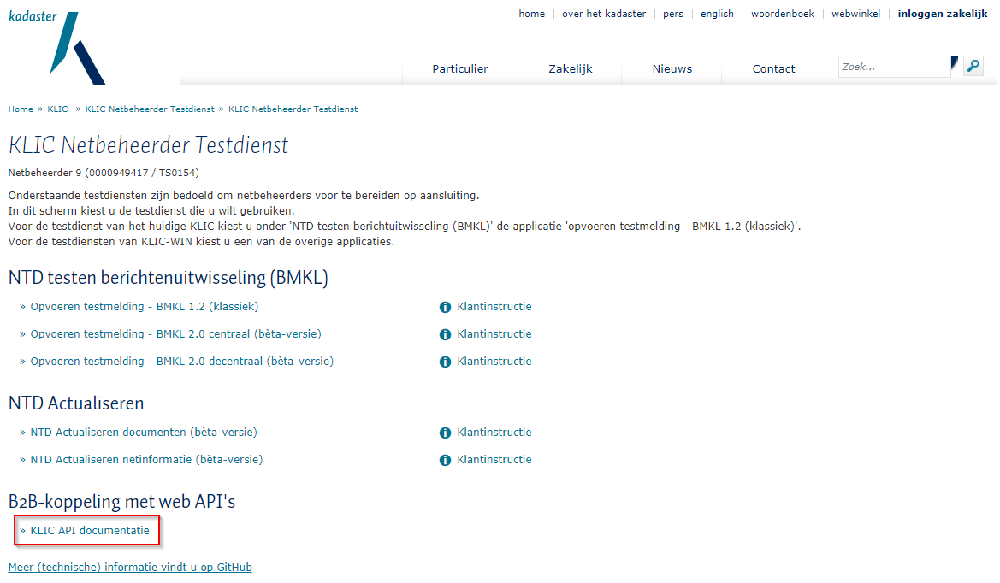
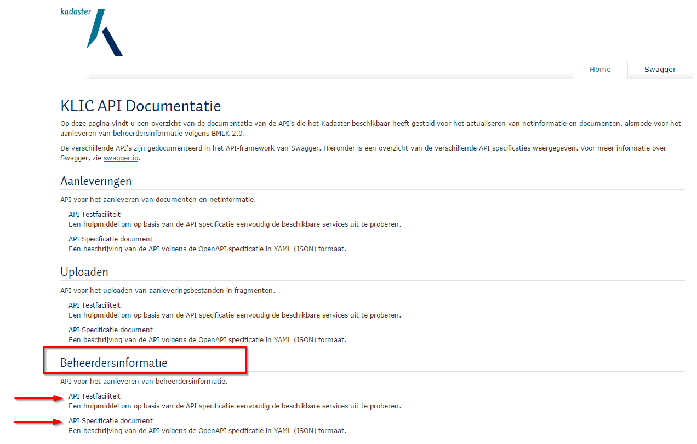
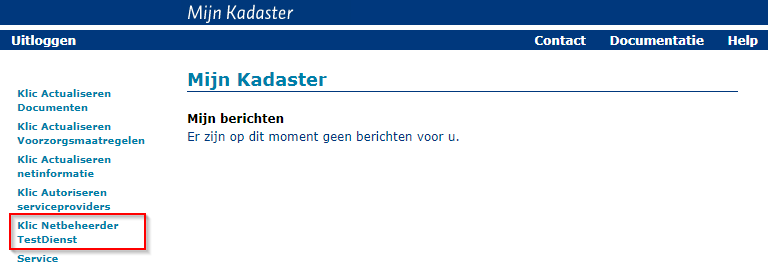
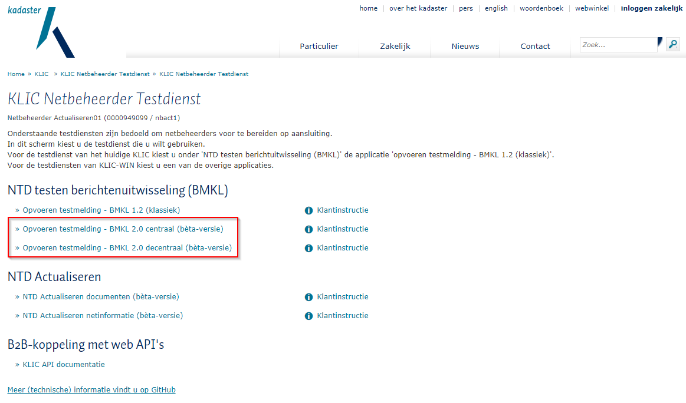
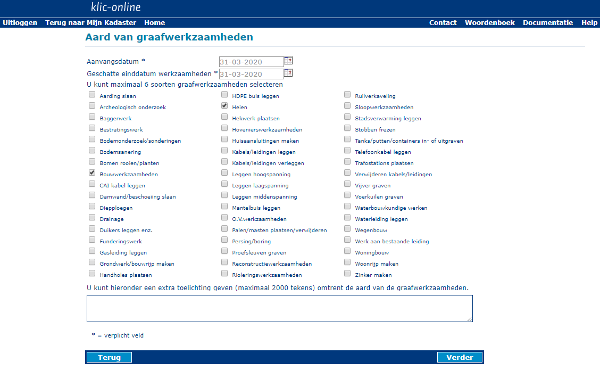
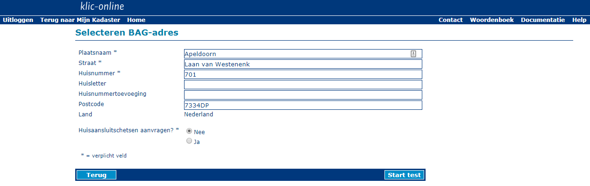
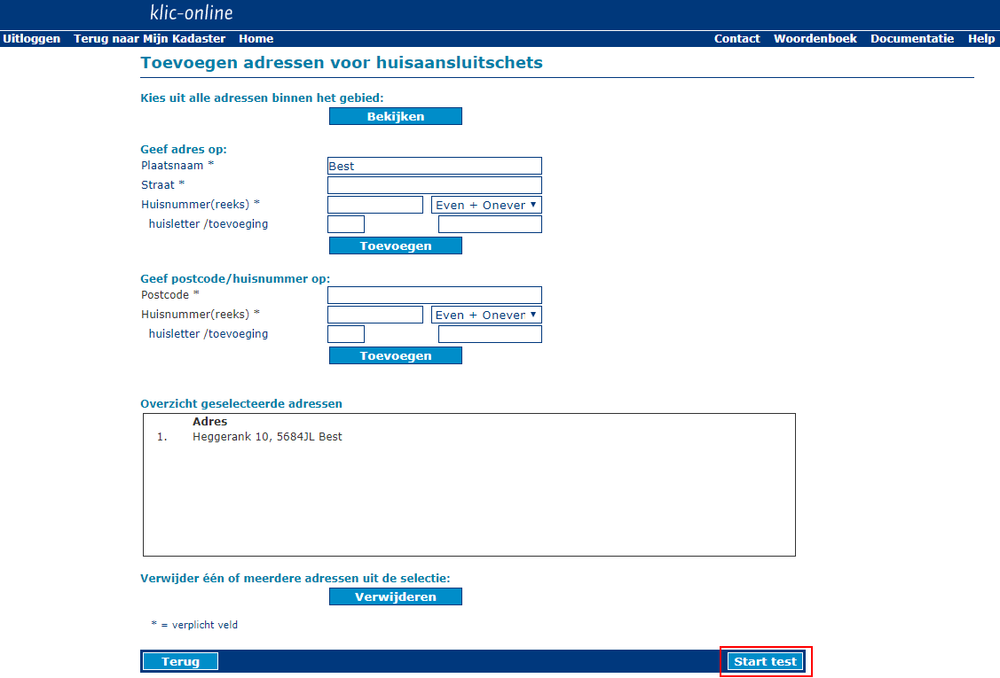
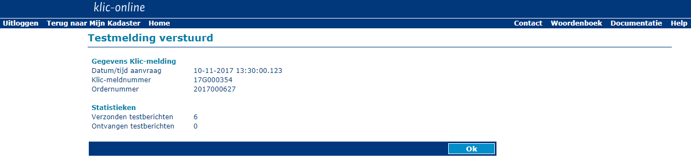

# Netbeheerder Testdienst (NTD)

Dit document geeft een handleiding voor het gebruik van portaalfuncties van de Netbeheerder Testdienst (NTD).

**Inhoudsopgave**

  - [Context](#context)
  - [Documentatie over gebruik BMKL API's](#documentatie-over-gebruik-bmkl-apis)
      - [REST interfaces](#rest-interfaces)
	  - [KLIC API Documentatie](#klic-api-documentatie)
        - [API Testfaciliteit](#api-testfaciliteit)
		- [API Specificatie document](#api-specificatie-document)
	  - [Swagger UI](#swagger-ui)
	  - [OAuth token meegeven](#oauth-token-meegeven)
  - [Opvoeren testmelding](#opvoeren-testmelding)
	  - [Mijn Kadaster](#mijn-kadaster)
	  - [KLIC Netbeheerder Testdienst portaal](#klic-netbeheerder-testdienst-portaal)
	  - [Opvoeren testmelding - 1 van 5](#opvoeren-testmelding---1-van-5)
	  - [Opvoeren testmelding - 2 van 5](#opvoeren-testmelding---2-van-5)
	  - [Opvoeren testmelding - 3 van 5](#opvoeren-testmelding---3-van-5)
	  - [Opvoeren testmelding - 4 van 5](#opvoeren-testmelding---4-van-5)
	  - [Opvoeren testmelding - 5 van 5](#opvoeren-testmelding---5-van-5)

---------------------------------------------------------
## Context
De netbeheerder heeft een wezenlijke rol bij het samenstellen van gebiedsinformatie op basis van een gebiedsinformatie-aanvraag.

Als een netbeheerder belanghebbend is bij een aanvraag, zal deze beheerdersinformatie voor deze aanvraag moeten aanleveren.
Bij een decentrale netbeheerder zal dit per aanvraag afgehandeld moeten worden, bij een centrale netbeheerder verzameld de centrale voorziening van KLIC deze beheerdersinformatie namens de netbeheerder.
De centrale netbeheerder heeft daarvoor reeds eerder alle netinformatie, eventueel aangevuld met bijbehorende documenten en voorzorgsmaatregelen, geactualiseerd in de centrale voorziening.

Zowel de centrale, als de decentrale netbeheerder zullen behoefte hebben om het proces van aanleveren en uitleveren van beheerdersinformatie nauwlettend te volgen. \
Daarvoor is een koppelvlak tussen KLIC en netbeheerders ontworpen, geimplementeerd door REST-API's. Het koppelvlak met berichtuitwisseling wordt kortweg BMKL genoemd (momenteel BMKL2.0).

Voor de netbeheerder is een platform ontwikkeld, waarmee de netbeheerder dit koppelvlak kan testen: de Netbeheerder Testdienst (NTD). \
De NTD heeft tevens een online-portaal. Hiermee kunnen testmeldingen worden aangemaakt, waarvoor de netbeheerder belanghebbend is. De netbeheerder kan vervolgens voor deze melding de berichtuitwisseling met betrekking tot het afhandelen van beheerdersinformatie testen.

Dit document beschrijft de functionaliteit die in het portaal van de Netbeheerder Testdienst worden aangeboden..
De werking van het koppelvlak en de BMKL API's wordt in andere documentatie beschreven.

---------------------------------------------------------
## Documentatie over gebruik BMKL API's

### REST interfaces
Voor het geautomatiseerd afhandelen van berichten tussen KLIC en netbeheerder heeft het Kadaster REST interfaces beschikbaar gesteld. \
De documentatie over de werking van deze interfaces is beschikbaar in de vorm van [Swagger](http://swagger.io) specificatie. Deze documentatie is te vinden bij de “KLIC API Documentatie”-applicatie.

De applicatie biedt een overzicht van de endpoints van de verschillende API’s en hoe deze endpoints gebruikt kunnen worden. \
De API's zijn onderverdeeld naar
- "aanleveringen"
- "uploaden" en
- “beheerdersinformatie”
en de meeste endpoints zijn meteen uit te proberen via de aangeboden interface.eerdere regels.

### KLIC API Documentatie

De API Documentatie is beschikbaar via een Swagger-implementatie. Deze is te bereiken via een link het KLIC Netbeheerder Testdienst portaal of via de link <https://service10.kadaster.nl/klic/ntd/api-docs/>.

_Figuur 1 KLIC API documentatie_

Het klikken van de link brengt u naar de overzichtspagina van de API Documentatie. /
Voor de verschillende onderdelen vindt u een link naar:

#### API Testfaciliteit ####

Een hulpmiddel om op basis van de API specificatie eenvoudig de beschikbare services uit te proberen.

#### API Specificatie document ####

Een beschrijving van de API volgens de OpenAPI specificatie in YAML (JSON) formaat. Dit biedt de softwareontwikkelaar een duidelijke beschrijving van de interface ten behoeve van integratie in eigen software.

_Figuur 2 API Testfaciliteit en API Specificatie document_

De "API Testfaciliteit" link brengt u naar een Swagger pagina waar alle services beschreven zijn.

### Swagger UI ###

De link 'API Testfaciliteit' brengt u naar een overzicht van alle endpoints die in dit document beschreven zijn.
De applicatie biedt een overzicht van de endpoints van de verschillende API’s en hoe deze endpoints gebruikt kunnen worden.
Al deze endpoints zijn meteen uit te proberen via de aangeboden interface. Met uitzondering van het downloaden van de aangeleverde beheerdersinformatie, deze zal via
een browsers of via CURL moeten worden uitgevoerd aangezien Swagger ZIP responses niet ondersteunt.

### OAuth token meegeven ###

Net als in alle beschreven curl-commando's moet een OAuth-token als Authorization header meegegeven worden. In curl gaat dat via een parameter,
de Swagger-UI is een webapplicatie dus de browser moet verteld worden de header mee te geven. In Chrome kan dat door een extensie te installeren: [ModHeader](https://chrome.google.com/webstore/detail/modheader/idgpnmonknjnojddfkpgkljpfnnfcklj?hl=nl).
Wanneer de extensie geïnstalleerd is, is naast de adresbalk een icoon toegevoegd. Hierop klikken geeft onderstaand invulformulier:

_Figuur 3 ModHeader en Oauth_

Vul bij `Request Headers` "Authorization" in en als waarde "Bearer " plus het OAuth token (net als bij de curl-commandos).
Optioneel kan een filter toegevoegd worden. Een filter zorgt ervoor dat de Authorization-token alleen voor bepaalde URLs wordt meegegeven.
Dit is sterk aan te raden omdat anders andere diensten die gebruik maken van OAuth (Google-diensten bijvoorbeeld) niet meer correct zullen werken.
Om een filter toe te voegen klik op `+` en kies Filter. Selecteer `URL Pattern` en vul een patroon in dat uniek is voor de B2B-koppeling,
bijvoorbeeld "*/gebiedsinformatieAanvragen*". (dit betekent dat ieder URL waarin "/gebiedsinformatieAanvragen" voorkomt de Authorization-header meegestuurd krijgt)

Zonder Authorization-header zal iedere klik op `Try it out!` leiden tot een HTML-pagina met de melding: "Kadaster - Niet geauthenticeerd".

---------------------------------------------------------
## Opvoeren testmelding

Om het afhandelen van een gebiedsinformatie-aanvraag te kunnen testen, biedt de NTD de mogelijkheid om een testmelding op te voeren.

### Mijn Kadaster
Na het inloggen in Mijn Kadaster kiest u via het menu voor "Klic Netbeheerder Testdienst".

:information_source: Hiervoor dient u geautoriseerd te zijn.

_Figuur 4 Mijn Kadaster - Klic Netbeheerder Testdienst_

### KLIC Netbeheerder Testdienst portaal

Vervolgens opent zich het "Klic Netbeheerder Testdienst" portaalscherm met hierop alle opties die binnen de NTD beschikbaar worden gesteld,
mits u hiervoor geautoriseerd bent. Op dit portaalscherm vindt u de links waar u een testmelding kunt opvoeren:

- "Opvoeren testmelding - BMKL 2.0 centraal (b&egrave;ta-versie)" waar u als centrale netbeheerder een testmelding kunt opvoeren
- "Opvoeren testmelding - BMKL 2.0 decentraal (b&egrave;ta-versie)" waar u als decentrale netbeheerder een testmelding kunt opvoeren

_Figuur 5 Optie voor opvoeren testmelding - BMKL 2.0 (b&egrave;ta-versie)_

### Opvoeren testmelding - 1 van 5

Nadat u de link "Opvoeren testmelding - BMKL 2.0 centraal (b&egrave;ta-versie)" of "Opvoeren testmelding - BMKL 2.0 decentraal (b&egrave;ta-versie)" heeft aangeklikt opent zich het 1e scherm van het opvoeren van een testmelding.

_Figuur 6 Opvoeren testmelding - BMKL 2.0 (b&egrave;ta-versie) - scherm 1_

U maakt de keuze, of u een testcase uitvoert voor een Graafmelding, Orientatieverzoek of Calamiteitenmelding.
Kies voor een test met een Graafmelding, de meldingssoort ‘Graafmelding’. In dit voorbeeld wordt uitgegaan van een Graafmelding.

In dit scherm moet minimaal de volgende gegevens worden ingevoerd:
- _Endpoint:_ dit betreft het adres van uw eigen webservice waarop u een notificatie wilt ontvangen als er een gebiedsinformatie-aanvraag voor u als belanghebbende klaarstaat.
- _Meldingsoort:_ het soort melding; Graafmelding, Calamiteitenmelding of Orientatieverzoek
- _Gebiedspolygoon (WKT):_ de gebiedspolygoon in Well Known Text (WKT)

:information_source: De informatiepolygoon (WKT) wordt nu nog niet ondersteund / gebruikt. In een latere release zal de informatiepolygoonfunctionaliteit worden toegevoegd.

Kies daarna "Verder".

### Opvoeren testmelding - 2 van 5

Nadat alle gegevens zijn ingevoerd en de knop "Verder" is geklikt opent zich het volgende scherm waarin u de aanvangsdatum, verwachte einddatum en graafwerkzaamheden kunt opgeven.

_Figuur 7 Opvoeren testmelding - BMKL 2.0 (b&egrave;ta-versie) - scherm 2_

### Opvoeren testmelding - 3 van 5

Controleer het gegeven BAG-adres en pas deze, indien nodig, aan. Selecteer Ja of Nee voor het aanvragen van huisaansluitschetsen. Indien gekozen is voor Nee, start de test.

_Figuur 8 Opvoeren testmelding - BMKL 2.0 (b&egrave;ta-versie) - scherm 3_

Indien gekozen is om huisaansluitschetsen toe te voegen kunt u deze in het volgende scherm aanvragen.

### Opvoeren testmelding - 4 van 5

_Figuur 9 Opvoeren testmelding - BMKL 2.0 (b&egrave;ta-versie) - scherm 4_

In dit voorbeeld is gekozen om huisaansluitschetsen toe te voegen. U kunt deze in het volgende scherm aanvragen.
Klik nu op de button “Start test”. Dit zorgt er voor dat er een gebiedsinformatie-aanvraag wordt ingeschoten waarmee de testmelding is gedaan.

### Opvoeren testmelding - 5 van 5

Wanneer het bericht succesvol is verzonden, verschijnt onderstaand scherm.

**Let op: vanaf het moment dat het bericht succesvol is verzonden, kan het een paar minuten duren voordat de gebiedsinformatie-aanvraag beschikbaar is.**

_Figuur 10  Opvoeren testmelding - BMKL 2.0 (b&egrave;ta-versie) - scherm 5_