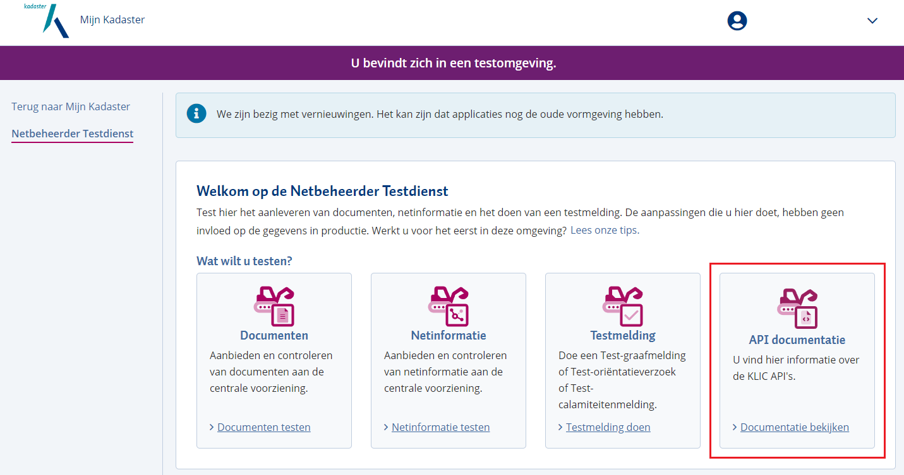
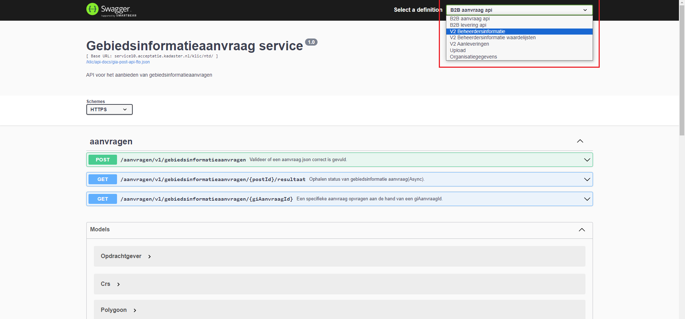
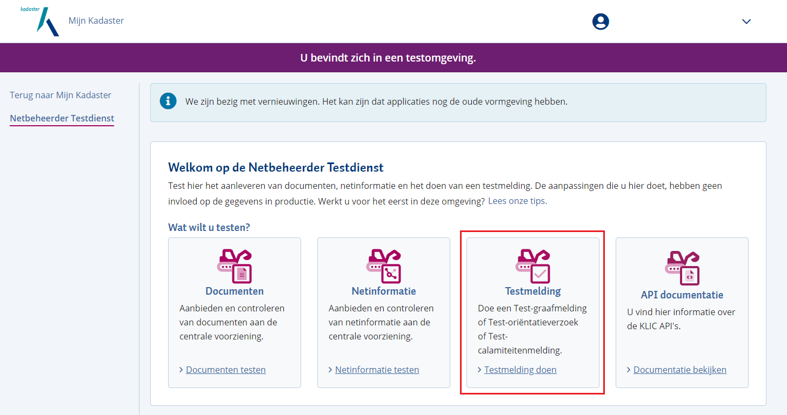
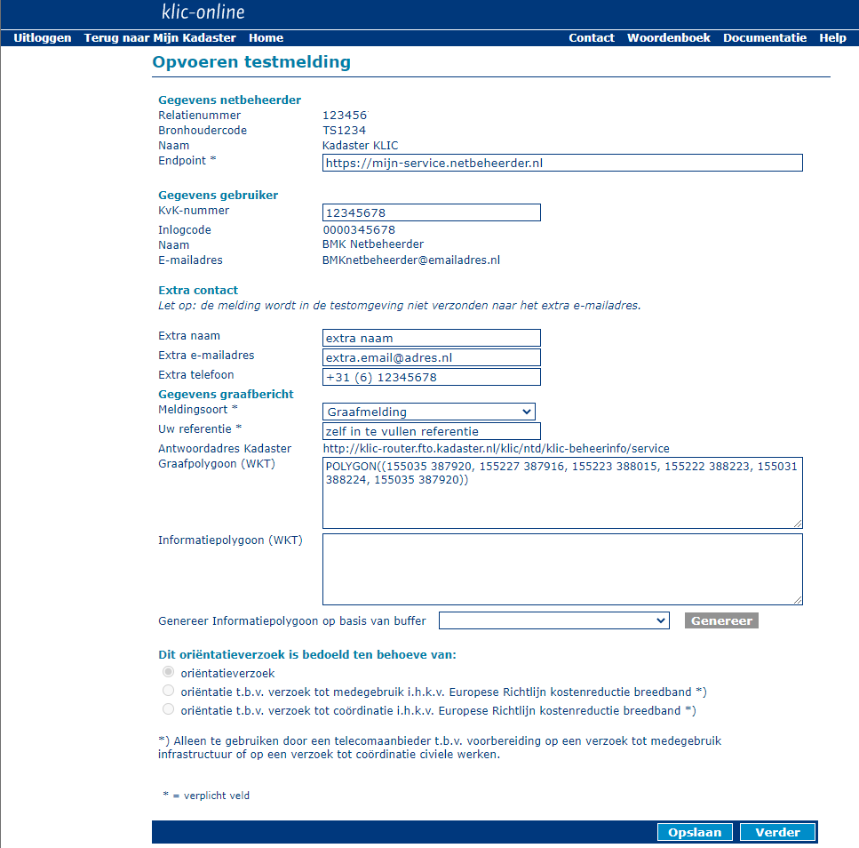
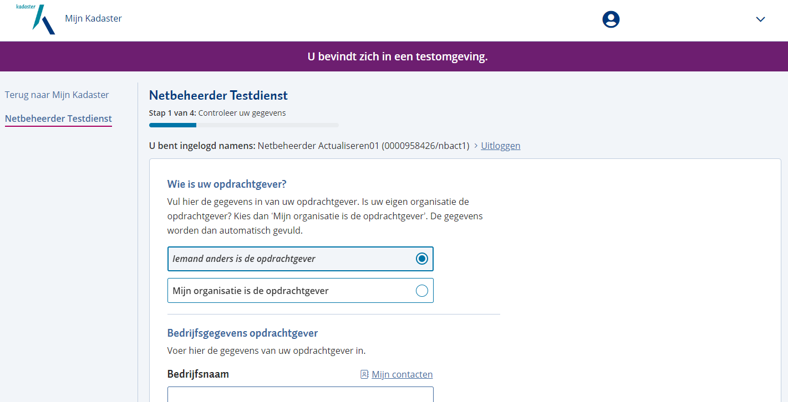
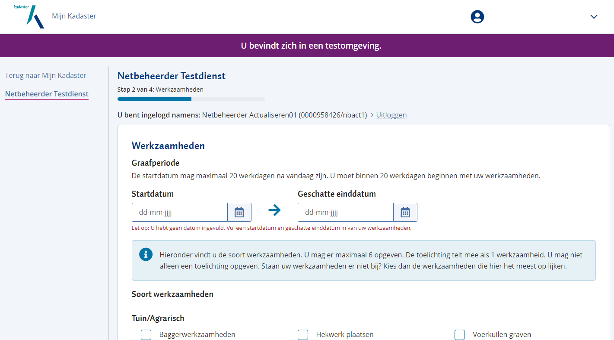
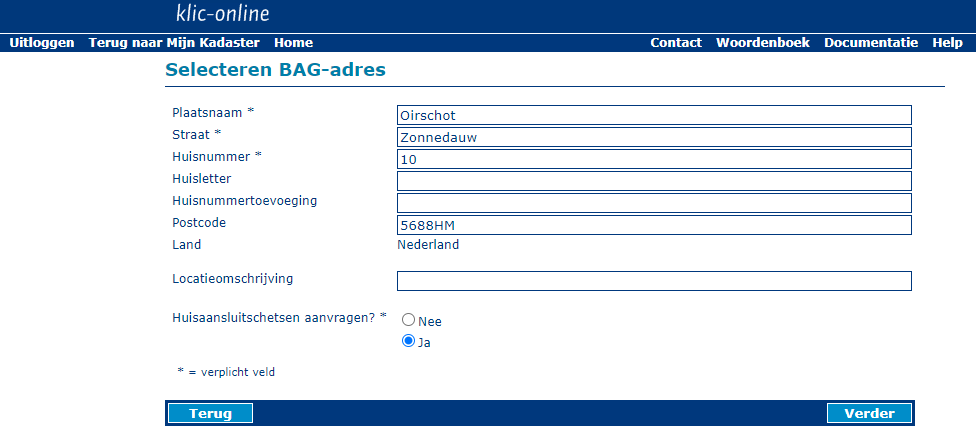
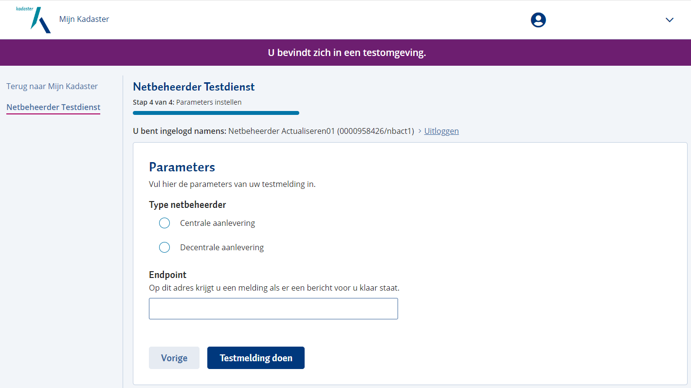
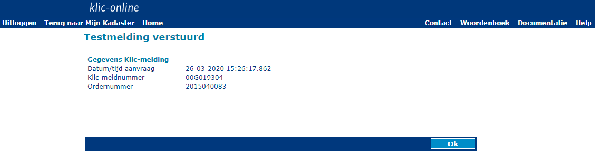

# Netbeheerder Testdienst (NTD)

Dit document geeft een handleiding voor het gebruik van portaalfuncties van de Netbeheerder Testdienst (NTD).

**Inhoudsopgave**

  - [Context](#context)
  - [Documentatie over gebruik BMKL API's](#documentatie-over-gebruik-bmkl-apis)
      - [REST interfaces](#rest-interfaces)
	  - [KLIC API Documentatie](#klic-api-documentatie)
         - [API Testfaciliteit](#api-testfaciliteit)
         - [API Specificatie document](#api-specificatie-document)
	  - [Swagger UI](#swagger-ui)
	  - [OAuth token meegeven](#oauth-token-meegeven)
  - [Opvoeren testmelding](#opvoeren-testmelding)
	  - [Mijn Kadaster](#mijn-kadaster)
	  - [KLIC Netbeheerder Testdienst portaal](#klic-netbeheerder-testdienst-portaal)
	  - [Opvoeren testmelding - 1 van 5](#opvoeren-testmelding---1-van-5)
	  - [Opvoeren testmelding - 2 van 5](#opvoeren-testmelding---2-van-5)
	  - [Opvoeren testmelding - 3 van 5](#opvoeren-testmelding---3-van-5)
	  - [Opvoeren testmelding - 4 van 5](#opvoeren-testmelding---4-van-5)
	  - [Opvoeren testmelding - 5 van 5](#opvoeren-testmelding---5-van-5)

---------------------------------------------------------
## Context
De netbeheerder heeft een wezenlijke rol bij het samenstellen van gebiedsinformatie op basis van een gebiedsinformatie-aanvraag.

Als een netbeheerder belanghebbend is bij een aanvraag, zal deze beheerdersinformatie voor deze aanvraag moeten aanleveren.
Bij een decentrale netbeheerder zal dit per aanvraag afgehandeld moeten worden, bij een centrale netbeheerder verzameld KLIC deze beheerdersinformatie namens de netbeheerder uit de centrale voorziening van KLIC.
De centrale netbeheerder heeft daarvoor reeds eerder alle netinformatie, eventueel aangevuld met bijbehorende documenten en voorzorgsmaatregelen, geactualiseerd in de centrale voorziening.

Zowel de centrale, als de decentrale netbeheerder zullen behoefte hebben om het proces van aanleveren en uitleveren van beheerdersinformatie nauwlettend te volgen. \
Daarvoor is een koppelvlak tussen KLIC en netbeheerders ontworpen, geimplementeerd door REST-API's. Het koppelvlak met berichtuitwisseling wordt kortweg BMKL genoemd (vanaf Januari 2022 is dat BMKL  versie 2.1).

Voor de netbeheerder is een platform beschikbaar gesteld, waarmee de netbeheerder dit koppelvlak kan testen: de Netbeheerder Testdienst (NTD). \
De NTD heeft tevens een online-portaal. Hiermee kunnen testmeldingen worden aangemaakt, waarvoor de netbeheerder belanghebbend is. De netbeheerder kan vervolgens voor deze melding de berichtuitwisseling met betrekking tot het afhandelen van beheerdersinformatie testen.

Dit document beschrijft de functionaliteit die in het portaal van de Netbeheerder Testdienst worden aangeboden.
De werking van het koppelvlak en de BMKL API's wordt in andere documentatie beschreven.

---------------------------------------------------------
## Documentatie over gebruik BMKL API's

### REST interfaces
Voor het geautomatiseerd afhandelen van berichten tussen KLIC en netbeheerder heeft het Kadaster REST interfaces beschikbaar gesteld. \
De documentatie over de werking van deze interfaces is beschikbaar in de vorm van [Swagger](http://swagger.io) specificatie. Deze documentatie is te vinden bij de “KLIC API Documentatie”-applicatie.

De applicatie biedt een overzicht van de endpoints van de verschillende API’s en hoe deze endpoints gebruikt kunnen worden. \
De API's zijn onderverdeeld naar
- "aanleveringen"
- "uploaden"
- “beheerdersinformatie”
en de meeste endpoints zijn uit te proberen via de aangeboden interface.
- "aanvragen" (grondroerder)

### KLIC API Documentatie

De API Documentatie is beschikbaar via een Swagger-implementatie. Deze is te bereiken via een link het KLIC Netbeheerder Testdienst portaal.

_Figuur 1 KLIC API documentatie_

Het klikken van de link brengt u naar de overzichtspagina van de API Documentatie.
Hierin vindt u rechtsboven een dropdownlist met de verschillende onderdelen:

- **B2B aanvraag API** (grondroerder)
- **B2B levering API** (grondroerder)
- **V2 Beheerdersinformatie**
- **V2 Beheerdersinformatie waardelijsten**
- **V2 aanleveringen**
- **Upload**
- **Organisatiegegevens** (RDI)

_Figuur 2 API Testfaciliteit en API Specificatie document_

### Swagger UI ###

De link 'API Testfaciliteit' brengt u naar een overzicht van alle endpoints die in dit document beschreven zijn.
De applicatie biedt een overzicht van de endpoints van de verschillende API’s en hoe deze endpoints gebruikt kunnen worden.
Al deze endpoints zijn meteen uit te proberen via de aangeboden interface. Met uitzondering van het downloaden van de aangeleverde beheerdersinformatie, deze zal via een browser of via CURL moeten worden uitgevoerd aangezien Swagger ZIP responses niet ondersteunt.

### OAuth token meegeven ###

Net als in alle beschreven curl-commando's moet een OAuth-token als Authorization header meegegeven worden. In curl gaat dat via een parameter,
de Swagger-UI is een webapplicatie dus de browser moet verteld worden de header mee te geven. In Chrome kan dat door een extensie te installeren: [ModHeader](https://chrome.google.com/webstore/detail/modheader/idgpnmonknjnojddfkpgkljpfnnfcklj?hl=nl).
Wanneer de extensie geïnstalleerd is, is naast de adresbalk een icoon toegevoegd. Hierop klikken geeft onderstaand invulformulier:

_Figuur 3 ModHeader en Oauth_

Vul bij `Request Headers` "Authorization" in en als waarde "Bearer" plus het OAuth token (net als bij de curl-commandos).
Optioneel kan een filter toegevoegd worden. Een filter zorgt ervoor dat de Authorization-token alleen voor bepaalde URLs wordt meegegeven.
Dit is sterk aan te raden omdat anders andere diensten die gebruik maken van OAuth (Google-diensten bijvoorbeeld) niet meer correct zullen werken.
Om een filter toe te voegen klik op `+` en kies Filter. Selecteer `URL Pattern` en vul een patroon in dat uniek is voor de B2B-koppeling,
bijvoorbeeld "*/gebiedsinformatieAanvragen*". (dit betekent dat ieder URL waarin "/gebiedsinformatieAanvragen" voorkomt de Authorization-header meegestuurd krijgt)

Zonder Authorization-header zal iedere API aanroep (in de swagger klikken op `Try it out!`) leiden tot een HTML-pagina met de melding: "Kadaster - Niet geauthenticeerd".

:information_source: In de nieuwste versie van Swagger is het ook mogelijk om een Authorization-header mee te geven. Vul hiervoor het OAuth-token in achter de vooraf ingevulde tekst `bearer`. Dan is het gebruik van ModHeader niet nodig.

---------------------------------------------------------
## Opvoeren testmelding

Om het afhandelen van een gebiedsinformatie-aanvraag te kunnen testen, biedt de NTD de mogelijkheid om een testmelding op te voeren.

### Mijn Kadaster
Na het inloggen in Mijn Kadaster kiest u via het menu voor "Testdienstmelding".

:information_source: Hiervoor dient u geautoriseerd te zijn.

_Figuur 4 Mijn Kadaster - Klic Netbeheerder Testdienst 1_

### KLIC Netbeheerder Testdienst portaal

Vervolgens opent zich het "Netbeheerder Testdienst" portaalscherm. Hier kunt u een keuze maken wat voor soort test melding u wilt doen. U kunt kiezen uit Graafmelding, Orientatieverzoek of Calamiteitenmelding. Deze opties zijn binnen de NTD beschikbaar gesteld, mits u hiervoor geautoriseerd bent. 

U maakt de keuze, of u een testcase uitvoert voor een Graafmelding, Orientatieverzoek of Calamiteitenmelding. In dit voorbeeld wordt uitgegaan van een Graafmelding.

_Figuur 5 Opvoeren testmelding - Klic Netbeheerder Testdienst 2_

### Opvoeren testmelding - 1 van 5

In dit scherm kunt u de opdrachtgever kiezen: 
- Mijn organisatie is de opdrachtgever: Hier worden de gegevens van de aanvrager overgenomen voor de opdrachtgever.
- Iemand anders is de opdrachtgever: Hier moeten de gegevens van de opdrachtgever ingevuld worden 

Als u gekozen hebt voor 'Iemand anders is de opdrachtgeven' kunnen de volgende gegevens worden ingevoerd:
- _Bedrijfsnaam:_ (Dit betreft een verplicht veld.)
- _KvK-nummer:_ Kvk nummer dat wordt gebruikt bij de aanvrager en opdrachtgever
- _Land:_ (Dit betreft een verplicht veld.)
- _Adres of Postbus:_ (Dit betreft een verplicht veld.)
- _Naam, Telefoonnummer, E-mailadres:_ Dit betreffen de contactgegevens van de contactpersoon opdrachtgever die zichtbaar zijn in de API en de levering (Dit betreft een verplicht veld.)
- _Extra naam, Extra e-mailadres, Extra Telefoon:_ Dit betreffen extra contactgegevens voor de aanvraag die in zichtbaar zijn in de API en de levering.
- _Uw referentie:_ een referentie van de indiener die zichtbaar is in de API en de levering. (Dit betreft een verplicht veld.)

Kies daarna "Volgende"

_Figuur 6 Opvoeren testmelding - scherm 1_
### Opvoeren testmelding - 2 van 5

Nadat alle gegevens zijn ingevoerd en op de knop "Volgende" is geklikt opent zich het volgende scherm waarin u de aanvangsdatum, verwachte einddatum en graafwerkzaamheden kunt opgeven. In dit scherm kunt u ook soort werkzaamheden selecteren

_Figuur 7 Opvoeren testmelding - scherm 2_

### Opvoeren testmelding - 3 van 5

In het volgende scherm kunt u kiezen uit een Graafgebied tekenen of een coordinatenbestand uploaden.
Als u zelf een gebied wilt tekenen wordt u gevraagd of u de grootte van informatiepolygoon wilt aanpassen. U kunt hier kiezen uit:
- 0 meter
- 5 meter
- 10 meter
- 15 meter
- 20 meter
- 25 meter
- 50 meter
- 75 meter
- 100 meter

Als u klaar bent met tekenen en de grootte van informatiepolygoon heb bepaald klik op "Volgende"

_Figuur 8 Opvoeren testmelding - scherm 3_

### Opvoeren testmelding - 4 van 5

In het volgende scherm selecteert u type netbeheerder (Centrale aanlevering of Decentrale aanlevering). U dient hier ook een Endpoint toe te voegen. Op dit adres krijgt u een melding als er een bericht voor u klaar staat.
Na het selecteren van de type netbeheerder en invoeren van Endpoint klik op "Testmelding doen" Dit zorgt er voor dat er een gebiedsinformatie-aanvraag wordt opgevoerd waarmee de testmelding is gedaan.

_Figuur 9 Opvoeren testmelding - scherm 4_

### Opvoeren testmelding - 5 van 5

Wanneer het bericht succesvol is verzonden, verschijnt onderstaand scherm.

**Let op: vanaf het moment dat het bericht succesvol is verzonden, kan het een paar minuten duren voordat de gebiedsinformatie-aanvraag beschikbaar is.**

_Figuur 10  Opvoeren testmelding - scherm 5_