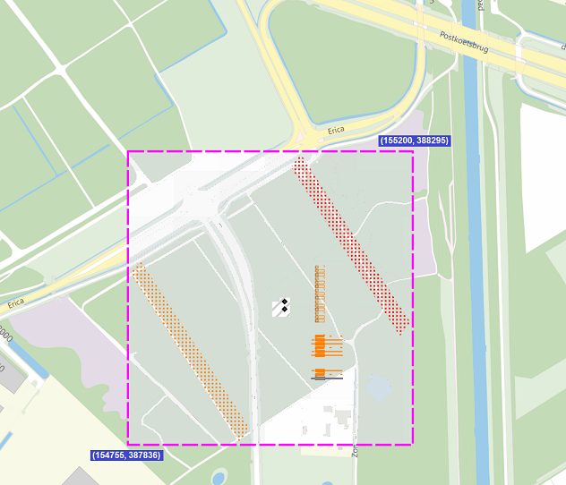

# Externe Test Omgeving (ETO)
---
| Deze functionaliteit is per eind november 2024 beschikbaar. <br> Houdt de pagina met [geplande werkzaamheden](../KLIC%20-%20Geplande%20werkzaamheden.md) in de gaten voor eventuele updates. |
|------------------------------|

---
## Achtergrond

Er is de wens geuit om een externe testomgeving te hebben die representatief is voor zowel de compleetheid van functionaliteit en het gebruik van dezelfde software die in de reguliere productie voor KLIC gebruikt wordt.  \
Daarom maakt de ETO gebruik van dezelfde software onderdelen als regulier, op een eigen omgeving/server.  \
Bij eventuele ingrijpende wijzigingen kan nieuwe software eerst op de ETO gereleaset worden, voordat diezelfde software in productie beschikbaar komt.  

Hieronder staat een overzicht van de functionaliteit op de ETO per rol. Serviceproviders kunnen de testen namens de netbeheerder of namens de grondroerder uitvoeren, indien ze daarvoor gemachtigd zijn door de betreffende partij.  

|                                              | Netbeheerder                                              | Grondroerder                                 |
|----------------------------------------------|-----------------------------------------------------------|----------------------------------------------|
| **Beheren belangen**                         | via Mijn Kadaster scherm                                  |   -                                          |
| **Actualiseren netinformatie en documenten** | via API en Mijn Kadaster scherm                           |   -                                          |
| **Aanleveren (decentraal)**                  | via API                                                   |   -                                          |
| **Testmelding**                              | via API en Mijn Kadaster scherm;                                                     <br>  een netbeheerder testmelding                    | via API                                      |
| **Levering Zip**                             |   -                                                       | via API en e-mail                            |
| **Levering BILzip**                          | via API, voor netbeheerder testen en grondroerder testen |    -                                         |
| **Terugmelden**                              | via Kadaster KLIC-Viewer op de BILzip                     | via Kadaster KLIC-Viewer op de Leveringszip  |
| **Afhandelen terugmelding**                  | via API                                                   |   -                                          |


In het geval van Netbeheerders geldt dat de eerste beheerder in Mijn Kadaster de rechten “KLIC Externe Testomgeving” aan moet zetten per gebruiker om de tegels in Mijn Kadaster zichtbaar te maken.
   \
*Schermimpressie tegels in Mijn Kadaster voor netbeheerder*

## Verschillen ETO en regulier
De verschillen ten opzichte van regulier zijn o.a.:
- Met de data die gebruikt wordt door netbeheerders mag niet gegraven worden (zowel belangen als netinformatie/documenten). 
- De reguliere stroom maakt gebruik van een ERP systeem voor proces-sturing en het versturen van e-mails. In de ETO is een eigen component gebouwd die dit nabootst.
- De ETO ontvangstbevestiging en ETO leveringsmail heeft een vereenvoudigde lay-out, in verband met de eis dat duidelijk herkenbaar moet zijn dat het om een ETO ontvangstbevestiging en ETO leveringsmail gaat. Ook het mailonderwerp is anders, deze start met “ETO TEST”. Dit zal altijd een volledige levering zijn; het deelleveringsproces bestaat niet in de ETO.  \
  Er worden geen e-mails verstuurd vanuit de testomgeving met betrekking tot het proces Afwijkende Situatie.
- De ETO KLIC-nummers zijn anders, de volgnummers starten met `00` of `99` (in plaats van `24` bij het jaar 2024).
- Er volgt geen factuur bij de ETO testmeldingen.
- In de ETO is het niet mogelijk om gebiedsinformatie te ontvangen van binnen de veiligheidsgebieden. Het proces van een verkorte ontvangstbevestiging is gelijk aan het reguliere proces, maar detail informatie is niet op te vragen bij de beheers veiligheidsgebieden. 
- De ETO heeft eigen databases voor het opslaan van de testdata. Voor een representatieve werking zijn we dus afhankelijk van de testdata die netbeheerders beschikbaar willen stellen. Een netbeheerder kan kiezen om zijn belang publiek te maken, dat wil zeggen dat de ETO-testdata beschikbaar is voor een ETO Test KLIC-melding van andere gebruikers.

## Testdata
De ETO heeft eigen databases voor het opslaan van de testdata.  \
Voor een representatieve werking zijn we dus afhankelijk van de testdata die netbeheerders beschikbaar willen stellen.  \
*Dit kan een fictief belang met fictieve netinformatie betreffen, echter wel altijd valide.* 


Bij het opvoeren van een belang in de ETO krijgt de netbeheerder de keuze om zijn belang op ‘publiek’ te zetten.  \
Bij het bepalen van welke belangen zijn geraakt in de ETO, worden alleen de belangen in beschouwing genomen die op ‘publiek’ staan. Voor deze netbeheerders wordt dan de aangeleverde netinformatie en documenten uitgeleverd als het opgegeven graafgebied een belang raakt van de netbeheerder. Deze gegevens komen alleen uit de Centrale Voorziening van de testomgeving. Een decentrale netbeheerder zonder informatie in de centrale voorziening zal dus met een publiek belang als “niet betrokken” in de levering komen.  \
De netbeheerder kan ook de BILzip’s downloaden voor deze testmeldingen.  \
Netbeheerders die niet gekozen hebben voor een publiek belang worden niet gebruikt voor grondroerders testen. De netbeheerder kan wel zelf via de netbeheerder testschermen of via de netbeheerder test-API, gebruik maken van dit belang.

:information_source: *Merk op dat als geen enkele netbeheerder zou kiezen voor een publiek belang, het voor de grondroerder niet mogelijk is om een representatieve test te doen in de ETO.*

 ### Publieke belangen
Zoals beschreven, zijn we voor een representatieve werking  afhankelijk van de testdata die netbeheerders beschikbaar willen stellen.  \
Om gelijk vanaf de introductie te kunnen testen, is er door het Kadaster een fictief (en publiek) belang met fictieve netinformatie opgevoerd. Deze ligt in de buurt van Best.  \
Indien een testmelding gedaan wordt in onderstaand gebied, wordt het Kadaster-belang geraakt en heeft de grondroerder in ieder geval geen lege levering.  \
   \
 *Kadaster test-belang in de buurt van Best*
 ```json
"coordinates": [ [ [154755, 388295], [154755, 387836], [155200, 387836], [155200, 388295], [154755, 388295] ] ]
```


## Verschil met NTD
Omdat de Externe Testomgeving de hele keten representeert, dient net als in het reguliere proces door de netbeheerder eerst een belang opgevoerd te worden, **zonder een belang zijn er geen belanghebbende netbeheerders in de KLIC melding**, ook niet als een netbeheerder zelf een test uitvoert.

----
# Netbeheerder functionaliteit
## Beheren belangen
Het beheren van belangen wordt net als in regulier alleen ondersteund via een tegel in Mijn Kadaster (zie schermimpressie bij “[Achtergrond](#achtergrond)”). Er is op dit moment geen API beschikbaar om belangen te actualiseren. Het is wel een wens voor op de lange termijn.


Het proces van beheren belangen in de Externe Testomgeving is hetzelfde als in Regulier. De data is echter strikt gescheiden. Om testen te kunnen doen in de Externe Test Omgeving is het dus belangrijk om ook in de ETO een belang aan te maken.  \
*Dit kan een fictief belang met fictieve geometrie betreffen, echter wel altijd valide.* 

Bij het opvoeren van een belang in de ETO krijgt de netbeheerder de keuze om zijn belang in de ETO op `publiek` te zetten.
- Bij het bepalen van welke belangen zijn geraakt in de ETO, worden alleen de belangen in beschouwing genomen die op ‘publiek’ staan. Voor deze netbeheerders wordt dan de aangeleverde netinformatie en documenten uitgeleverd als het opgegeven graafgebied een belang raakt van de netbeheerder. Deze gegevens komen alleen uit de Centrale Voorziening van de testomgeving. Een decentrale netbeheerder zonder informatie in de centrale voorziening zal dus met een publiek belang als “niet betrokken” in de levering komen.
- De netbeheerder kan ook de BILzip’s downloaden voor deze testmeldingen.
- Netbeheerders die niet gekozen hebben voor een publiek belang worden niet gebruikt voor grondroerders testen. De netbeheerder kan wel zelf via de netbeheerder testschermen of via de netbeheerder test-API, gebruik maken van dit belang.
- Merk op dat als geen enkele netbeheerder zou kiezen voor een publiek belang, het voor de grondroerder niet mogelijk is om een representatieve test te doen in de ETO.
 
   \
*Keuze publiek of niet bij het opvoeren van een belang in de ETO*


## Actualiseren netinformatie en documenten 
Netbeheerders die in de ETO gebruik willen maken van de Centrale Voorziening, kunnen op gelijke wijze als in het reguliere productie proces, de documenten en de netinformatie actualiseren.  \
Dit kan met een tegel in Mijn Kadaster en via de API waarvoor scope `klic.ntd.centraal` nodig is.  \
Voor het gebruik via de API is het endpoint:  \
https://service10.kadaster.nl/klic/ntd/actualiseren/v2/  \
Swagger documentatie is te vinden via: https://service10.kadaster.nl/klic/api-docs/  \
Een beschrijving is te vinden op [deze Github pagina](../Actualiseren). 


Let op: als u gekozen heeft voor een publiek belang, wordt de aangeleverde netinformatie en documenten ook bij testen door grondroerders uitgeleverd, indien er een testmelding binnen uw publieke belang gebeurt.

## Aanleveren (decentraal)
Als u een decentrale aanlevering wilt testen, kan dat alleen op een eigen netbeheerders test. (In het aanvraag scherm ‘Parameters’ kiest u voor ‘Decentrale aanlevering’.) Zie hiervoor de paragraaf ‘[Testmelding voor netbeheerder](#testmelding-voor-netbeheerder)’.

Het decentraal aanleveren gaat via de BMKL-API, waarvoor scope `klic.ntd.beheerdersinformatie` nodig is.  \
Voor het gebruik via de API is het endpoint:  \
https://service10.kadaster.nl/klic/ntd/bmkl/v2/gebiedsinformatieAanvragen/  \
Swagger documentatie is te vinden via: https://service10.kadaster.nl/klic/api-docs/  \
Een beschrijving is te vinden op [deze Github pagina](../BMKL/BMKL%202.1/BMKL%202.1%20(B2B-koppeling%20beheerdersinformatie).md).  

## Testmelding voor netbeheerder 
Voor testdoeleinden kan een netbeheerder een testmelding in de ETO doen. Bijvoorbeeld om te kijken hoe zijn netinformatie uitgeleverd wordt vanuit de Centrale Voorziening, door te testen hoe een BILzip gedownload kan worden via de BMKL-API, of om het proces te kunnen testen van het decentraal aanleveren via de BMKL-API.

Het doen van een netbeheerder-testmelding kan met een tegel in Mijn Kadaster en het kan ook gedaan worden via de API waarvoor scope `klic.ntd.gebiedsinformatieaanvraag.readonly` nodig is.  \
Voor het gebruik via de API is het endpoint:  \
https://service10.kadaster.nl/klic/ntd/testaanvragen/v1/gebiedsinformatieaanvragen  \
Swagger documentatie is te vinden via : https://service10.kadaster.nl/klic/api-docs/?urls.primaryName=B2B%20aanvraag%20api  \
Een beschrijving is te vinden op [deze Github pagina](../Aanvragen%20gebiedsinformatie/B2B%20REST%20API) 


Zowel het proces van centrale netbeheerders als het proces van decentrale netbeheerders is te testen, onafhankelijk van de rol in het reguliere proces. Daarom dient er bij iedere netbeheerders test aangegeven te worden of het een centrale of decentrale test betreft. Netbeheerders hebben daarom een extra scherm in de Mijn Kadaster testschermen, en in het modelschema voor het doen van een melding via de API zijn er voor netbeheerders testen een extra velden opgenomen. [Zie deze beschrijing](../Aanvragen%20gebiedsinformatie/B2B%20REST%20API#132-modelschema-onderdeel-testparameters) voor meer details.  
   
   
*Keuze centraal of decentraal per test op te geven. Links Mijn Kadaster schermen, rechts fragment modelschema voor API.*


Bij een netbeheerders test volgt er *geen* e-mail voor de ontvangstbevestiging of de levering. Wel is de BeheerdersInformatieLeverins-zip (BILzip) te downloaden via de BMKL API.


De ETO KLIC-nummers van netbeheerder testen starten met `00` (in plaats van `24` bij het jaar 2024).

## Levering BILzip
De beheerdersinformatie leverings-zip (BILzip) is te downloaden via de BMKL API. Net zoals in de reguliere productieomgeving is de downloadlink 20 werkdagen geldig. De gedownloade levering is ook te openen in de desktop versie van de Kadaster KLIC Viewer. De BILzip’s zijn te downloaden van:
- Eigen netbeheerder testen (de KLIC meldnummers starten met `00`)
- Indien publiek belang: BILzip van Grondroerder testen (de KLIC meldnummers starten met `99`)


## Terugmeldproces op testmelding BILzip
### Testterugmelding aanmaken
Een netbeheerder kan het terugmeldproces testen door eerst een terugmelding aan te maken op de BILzip. Het terugmeldproces kan getest worden via de API, of vanuit de desktop versie van de Kadaster KLIC Viewer. Voor het doen van een terugmelding via de API dient apart autorisatie aangevraagd te worden voor het test-endpoint van de generieke terugmeldservice. Zie voor meer informatie [deze Github pagina](../Terugmelden%20Afwijkende%20Situatie#autorisatie-voor-gebruik-van-api).

Let op: er worden geen e-mails verstuurd vanuit de testomgeving met betrekking tot het terugmeldproces.  \
Indien een netbeheerder gekozen heeft voor publiek belang, kan er ook een testterugmelding in het systeem staan die door de grondroerder is aangemaakt.


### Afhandelen testterugmeldingen
Het afhandelen van de terugmelding door de netbeheerder gebeurt op een ETO-specifiek endpoint:  \
https://service10.kadaster.nl/klic/ntd/bmkl/v2/gebiedsinformatieAanvragen/-/terugmeldingen/  \
Hiervoor is scope `klic.ntd.beheerdersinformatie` nodig.  \
Een beschrijving is te vinden op [deze Github pagina](../BMKL/BMKL%202.1/BMKL%202.1%20(B2B-koppeling%20beheerdersinformatie).md#overzicht-bmkl-apis-voor-afhandelen-afwijkende-situatie). 

## Serviceprovider namens Netbeheerder
Een serviceprovider kan namens de netbeheerder in de ETO dezelfde handelingen uitvoeren als in productie. Hij logt in als zichzelf en geeft op namens welke netbeheerder hij een actie doet. Zie hiervoor de reguliere documentatie.  \
Voor het inregelen van de machtigen dient de netbeheerder in de applicatie “autoriseren serviceprovider”  de dienst “Externe Test Omgeving” aan te zetten. De Service provider is dan voor alle functies binnen de ETO gemachtigd. Een beschrijving is [hier te vinden]( https://www.kadaster.nl/-/klic-klantinstructie-autoriseren-serviceprovider). 

----
# Grondroerder functionaliteit
## Testmelding voor grondroerder
Het doen van een ETO-testmelding kan via de API waarvoor scope `klic.eto.b2baanvraag` nodig is. Er is op dit moment geen Mijn Kadaster tegel om online aanvragen te doen.  \
Voor het gebruik via de API is het endpoint:  \
https://service10.kadaster.nl/klic/ntd/aanvragen/v1/gebiedsinformatieaanvragen  \
Swagger documentatie is te vinden via : https://service10.kadaster.nl/klic/api-docs/?urls.primaryName=B2B%20aanvraag%20api  \
Een beschrijving is te vinden op [deze Github pagina](../Aanvragen%20gebiedsinformatie/B2B%20REST%20API).

Na het doen van een testmelding, volgt een e-mail met de ontvangstbevestiging en een e-mail met de leveringsmail. Het mailonderwerp start met “ETO TEST”.  \
De link om de levering te downloaden is ook via de API op te vragen, zie hier beneden voor meer informatie.

De ETO KLIC-nummers starten met `99` (in plaats van `24` bij het jaar 2024).

:information_source: *Let op: De inhoud van de levering is afhankelijk van de netbeheerders die een publiek belang hebben opgevoerd in de ETO.*

## Levering Zip
Na het doen van een testmelding, volgt een e-mail met de ontvangstbevestiging en een e-mail met de leveringsmail. De ETO ontvangstbevestiging en ETO leveringsmail heeft een vereenvoudigde lay-out, in verband met de eis dat duidelijk herkenbaar moet zijn dat het om een ETO ontvangstbevestiging en ETO leveringsmail gaat. Ook het mailonderwerp is anders, deze start met “ETO TEST”.  \
De link om de levering te downloaden is ook via de API op te vragen. Net zoals in de reguliere productieomgeving is de leveringslink 20 werkdagen geldig. De levering is ook te openen in de Kadaster KLIC Viewer.

Voor het downloaden via de API is scope `klic.eto.b2baanvraag` nodig.  \
Het endpoint van de API is:  \
https://service10.kadaster.nl/klic/ntd/aanvragen/v1/gebiedsinformatieleveringen  \
Swagger documentatie is te vinden via : https://service10.kadaster.nl/klic/api-docs/?urls.primaryName=B2B%20levering%20api  \
Een beschrijving is te vinden op [deze Github pagina](../Uitleveren/B2B%20REST%20API).


:information_source: *Let op: De inhoud van de levering is afhankelijk van de netbeheerders die een publiek belang hebben opgevoerd in de ETO.*

## Terugmelden op ETO Zip levering
Het terugmeldproces kan getest worden via de API, of vanuit de Kadaster KLIC Viewer. Voor het doen van een terugmelding via de API dient apart autorisatie aangevraagd te worden voor het test-endpoint van de generieke terugmeldservice. Zie hiervoor [deze Github pagina](../Terugmelden%20Afwijkende%20Situatie#autorisatie-voor-gebruik-van-api).  \
Deze testterugmeldingen zijn in de testomgeving zichtbaarvoor de netbeheerders uit de testmelding.

Let op: er worden geen e-mails verstuurd vanuit de testomgeving met betrekking tot het terugmeldproces.

## Serviceprovider namens Grondroerder
Een serviceprovider kan namens de grondroerder in de ETO dezelfde handelingen uitvoeren als in productie. Hij logt in als zichzelf en geeft op namens welke grondroerder hij een actie doet. Zie hiervoor de reguliere documentatie.  \
Voor het inregelen van de machtigen dient de netbeheerder in de applicatie “autoriseren serviceprovider”  de dienst “B2B aanvraag” aan te zetten.  \
Voor het inregelen van de machtigen geldt geen gescheiden proces tussen productie regulier en de ETO: een serviceprovider is dus voor beide omgevingen tegelijk gemachtigd. 

