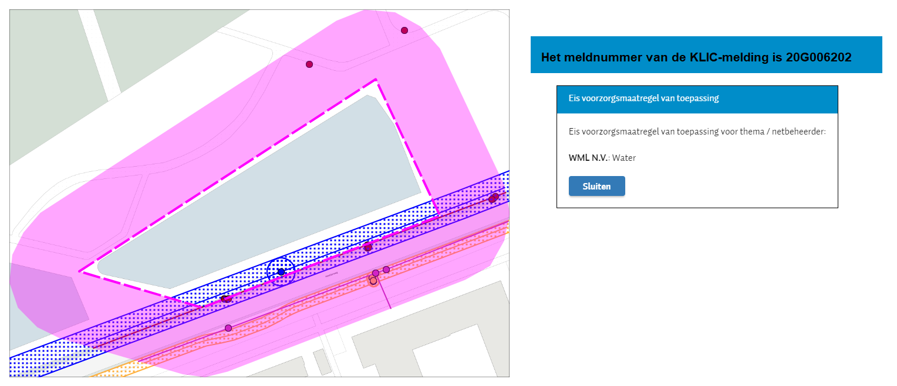
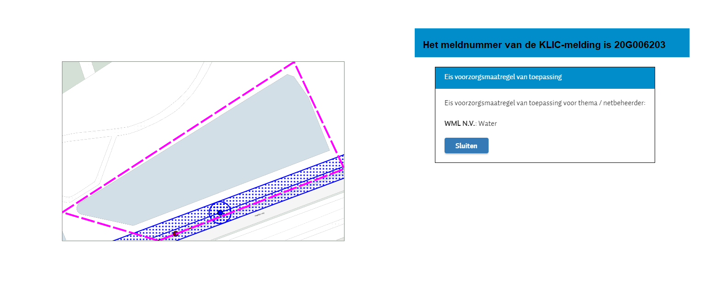
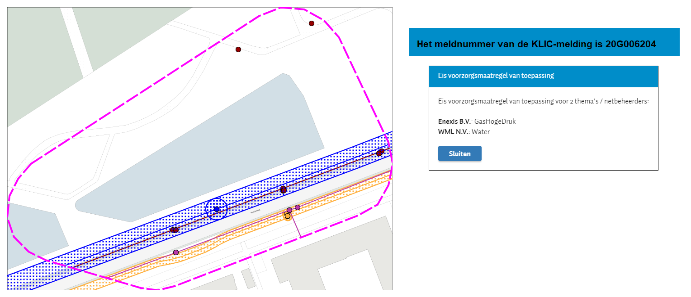

#### KLIC-meldingen zoals in demo van 24 april 2020

Drie voorbeelden:
- Graafmelding met informatiepolygoon buffer van 25 meter
- Graafmelding
- Graafmelding met groter gebied, waardoor extra EV van toepassing wordt.

Overzicht:  \
  \
  \
