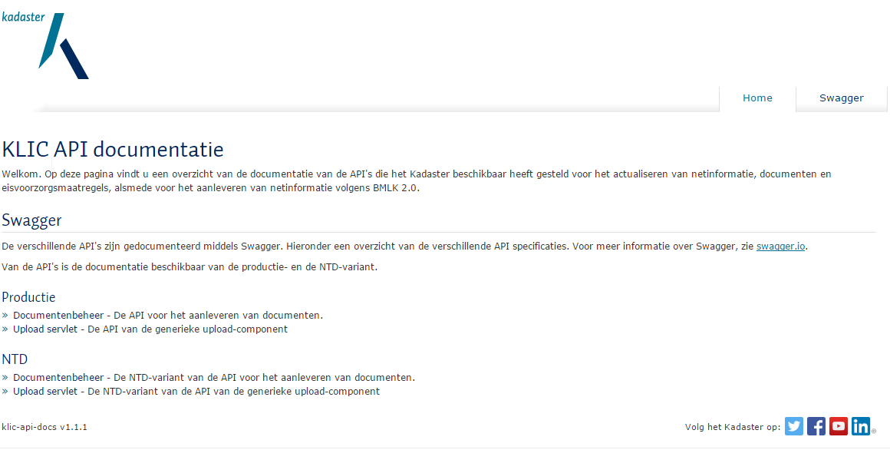
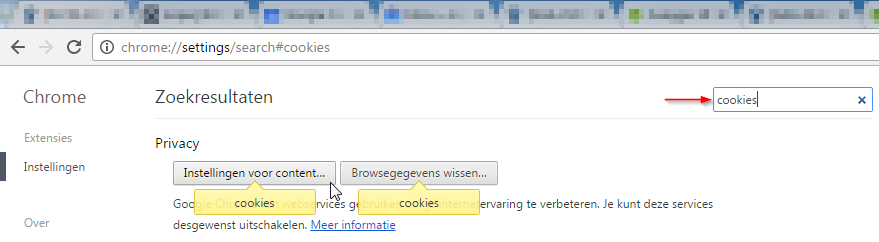
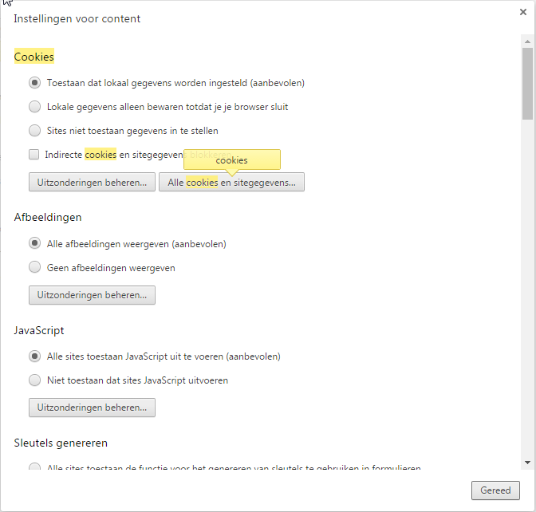
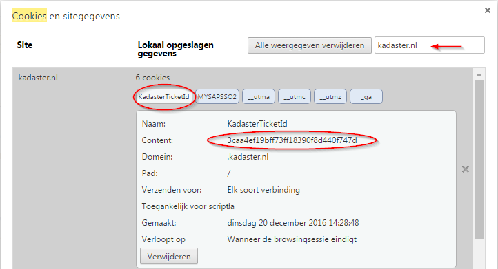

# Handleidingen Netbeheerder Testdienst

Deze pagina's bieden handleidingen voor het aanleveren van netinformatie en documenten in de Netbeheerders Testdienst (NTD). De handleidingen beschrijven de processen van het aanleveren van netinformatie en documenten door netbeheerders en serviceproviders via de Web API's die het Kadaster beschikbaar heeft gesteld.

Dit document beschrijft een aantal overkoepelende onderwerpen waarmee je te maken zult krijgen bij het doorlopen van de verschillende handleidingen. Het loont dus de moeite om eerst dit document door te lezen alvorens een van de onderstaande handleidingen te openen.

De volgende handleidingen zijn beschikbaar voor netbeheerders waarvoor hun netinformatie en documenten uitgeleverd worden vanuit de centrale gegevensopslag bij het Kadaster:

- [B2B koppeling actualiseren netinformatie](b2b-koppeling-actualiseren-netinformatie.md)
- [B2B koppeling actualiseren documenten](b2b-koppeling-actualiseren-documenten.md)

## Inhoudsopgave

- [API documentatie](#api-documentatie)
- [Mijn Kadaster](#mijn-kadaster)
- [Authenticatie](#authenticatie)
- [CURL](#curl)

## API documentatie

De documentatie van de verschillende API's is beschikbaar in de vorm van Swagger\[[1](#fn1)\] definities. Deze definities zijn verzameld in de "KLIC API documentatie" applicatie. Naast de technische specificatie van de API's biedt deze applicatie tevens de mogelijkheid om de endpoints van de API's vanuit de web-interface aan te roepen.

Om de "KLIC API documentatie"-applicatie te openen, moet de gebruiker ingelogd zijn in Mijn Kadaster (zie de sectie [Mijn kadaster](#mijn-kadaster). Vervolgens kan bovenstaande link gekopiëerd worden naar het tabblad waarin de gebruiker is ingelogd in Mijn Kadaster om de "KLIC API documentatie"-applicatie te openen.

Figuur 4 - home pagina van de KLIC API documentatie applicatie

:information_source: ***N.B.:*** *In de ntd-portaal applicatie komt waarschijnlijk nog een link naar de api-docs applicatie. Dan hoeft de URL niet geknipt en geplakt te worden.*

## Mijn kadaster

De "KLIC API documentatie" applicatie en de verschillende API's zijn onderdeel van de NTD. Om de documentatie te kunnen raadplegen, en om de verschillende API's aan te kunnen roepen, moet er ingelogd worden in Mijn Kadaster en moet de gebruiker toegang hebben tot de NTD.

Figuur 1 - Toegang tot de KLIC Netbeheerders Testdienst vanuit Mijn Kadaster

Figuur 1 toont de home pagina van Mijn Kadaster van een gebruiker die toegang heeft tot de KLIC Netbeheerder Testdienst.

## Authenticatie

Wanneer er gebruik gemaakt wordt van de interface in de "KLIC API documentatie" om de REST API uit te proberen geschiedt de authenticatie via inloggen in Mijn Kadaster. In de browser wordt dan een cookie gezet waarmee volgende requests geauthentiseerd worden.

Het Kadaster werkt aan een interface waarbij middels OAuth geauthentiseerd wordt. Wanneer de REST API dan aangeroepen wordt vanuit een andere applicatie kan OAuth gebruikt worden voor authenticatie. Omdat deze interface nog niet beschikbaar is, wordt in de voorbeelden gebruik gemaakt van het Kadaster cookie uit de browser om requests te authentiseren die verstuurd worden vanuit een andere applicatie dan de webbrowser.

Het opzoeken van het Kadaster cookie gaat in Chrome als volgt:

1.  Ga naar <https://mijn.kadaster.nl>
2.  Log in
3.  Open de 'Instellingen' pagina van Chrome.

    

    Figuur 2 - Chrome 'instellingen' optie.

4.  Zoek op 'cookies' en selecteer 'Instellingen voor content'.

    

    Figuur 3 - Zoek op cookies en selecteer 'Instellingen voor content'.

5.  Selecteer 'Alle cookies en sitegegevens':

    

    Figuur 4 - Selecteer 'Alle cookies en sitegegevens.

6.  Zoek op "kadaster.nl" en open het cookie met de naam "KadasterTicketId".

    

    Figuur 5 - Het "KadasterTicketId" cookie

De waarde van het cookie "KadasterTicketId" kan vervolgens gebruikt worden om de requests vanuit die niet vanuit de browser verzonden worden te authentiseren.

### CURL

De "KLIC API documentatie"-applicatie maakt het mogelijk om de meeste endpoints aan te roepen vanuit de browser. In de voorbeelden in de handleidingen wordt er echter gebruik gemaakt van de command-line tool CURL\[[2](#fn2)\] omdat dit een betere analogie is voor wanneer een netbeheerder of serviceprovider een eigen applicatie ontwikkelt voor het beantwoorden van gebiedsinformatie-aanvragen via de B2B koppeling.

Als de waarde van het "KadasterTicketId" cookie uit de browser is opgehaald, kan dit vervolgens in CURL meegestuurd worden om requests te authenticeren. In CURL wordt het cookie meegegeven met de parameter `--cookie "KadasterTicketId=3caa4ef19bff73ff18390f8d440f747d"`

# Footnotes

1. [Swagger](http://swagger.io/) is een framework voor het ontwerpen, bouwen, documenteren en consumeren van RESTful API's.
2. [CURL](<https://curl.haxx.se/>) is een applicatie voor het opvragen en versturen van gegevens van en naar URLs.