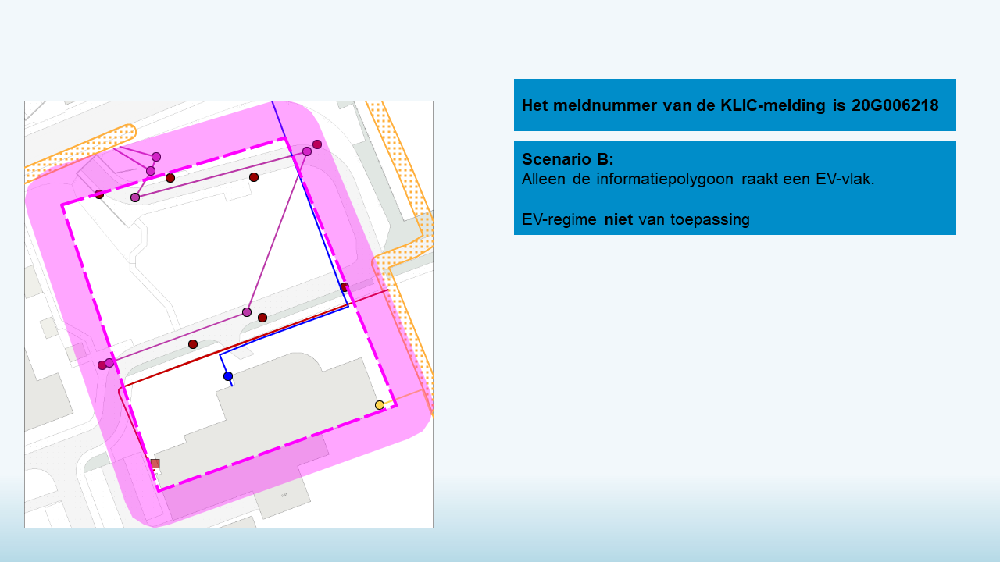
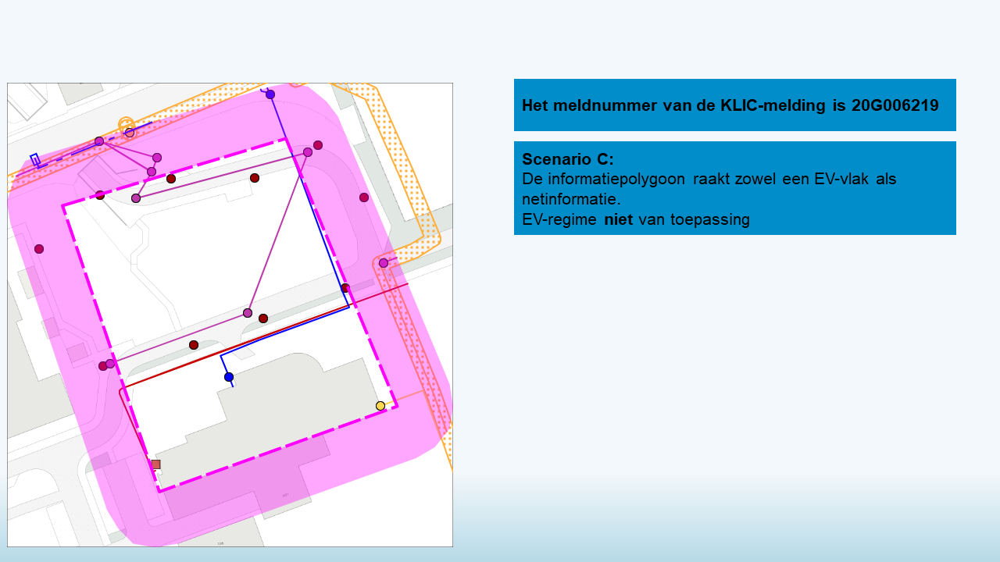

#### KLIC-meldingen die relatie laat zien tussen EV en informatiepolygoon

Er zijn voorbelden beschikbaar zoals beschreven in scenario B-E uit [dit pdf-document](../Beschrijving%205%20scenarios%20thema%20BGI%20versus%20Graafpolygoon%20en%20Informatiepolygoon%20(2016-10-02).pdf):
- 20G006218 (Scenario B): Alleen de informatiepolygoon raakt een EV-vlak.
- 20G006219 (Scenario C): De informatiepolygoon raakt zowel een EV-vlak als netinformatie.
- 20G006220 (Scenario D): De graafpolygoon raakt een EV-vlak, maar geen netinformatie. De informatiepolygoon raakt beide.
- 20G006221 (Scenario E): Zowel de graafpolygoon als de informatiepolygoon raken een EV-vlak en netinformatie

Overzicht:  \
  \
  \
  \
