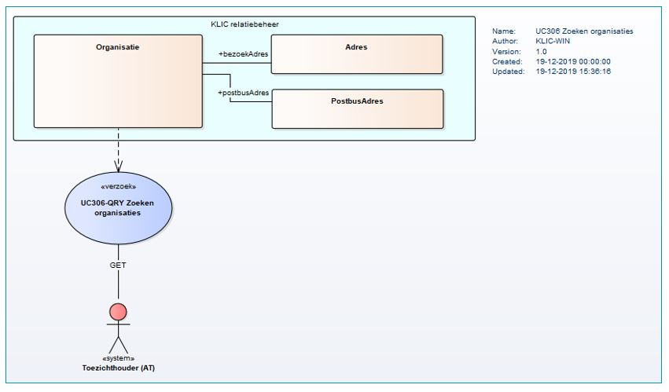

# B2B-koppeling stamgegevens organisatie

Bij het synchroniseren van KLIC-procesgegevens met Agentschap Telecom worden niet de stamgegevens van elke belanghebbende netbeheerder meegegeven.
Er is echter wél behoefte bij AT om te kunnen beschikken over de meest actuele stamgegevens. Daartoe is een API beschikbaar gesteld.  \
In dit document wordt toegelicht hoe met deze API de actuele stamgegevens van organisaties (type netbeheerder) kunnen worden opgehaald.

### Inhoudsopgave

- [Context B2B-koppeling op _Organisatie_](#context-b2b-koppeling-op-organisatie)
    - [Objecten](#objecten)
    - [Url-structuur](#url-structuur)
        - [Endpoints](#endpoints)
        - [Authenticatie](#authenticatie)
    - [Pagineren](#pagineren)
- [Use casemodel B2B-koppeling op _Organisatie_](#use-casemodel-b2b-koppeling-op-organisatie)
- [Voorbeeldberichten per endpoint](#voorbeeldberichten-per-endpoint)
    - [zoeken organisaties](#zoeken-organisaties)

# Context B2B-koppeling op _Organisatie_
De B2B-koppeling op het object _Organisatie_ sluit aan bij de concepten zoals deze al breder worden toegepast bij KLIC. Denk bijvoorbeeld aan de BMKL-API.  \
Eveneens wordt aansluiting gezocht bij ontwikkelingen die Kadaster-breed spelen.

## Objecten

De volgende objectklasse speelt een rol in deze API.
- __organisatie__  \
Dit zijn de stamgegevens van een zakelijke relatie.

## Url-structuur
De objecten van deze API zijn ondergebracht in onderstaande url-structuur:

|                                      |
|--------------------------------------|
| /[__organisaties__](#zoeken-organisaties)/{id} |
|                                      |

### Endpoints
In het [overzicht met endpoints KLIC API's](../API%20management/Overzicht%20endpoints%20KLIC%20APIs.md) wordt een overzicht gegeven van de basispaden voor de endpoints die door KLIC API's worden gebruikt.

De endpoints die in onderstaande voorbeelden worden gebruikt, zijn relatief ten opzichte van deze basispaden.  \
In de voorbeelden wordt uitgegaan van de API's op de productieomgeving KLIC.

### Authenticatie
De KLIC REST API's zijn beveiligd middels de OAuth 2.0 specificatie. Zie daarvoor
 [Authenticatie via OAuth](../API%20management/Authenticatie_via_oauth.md).

## Pagineren
Voor de endpoints die een lijst van objecten opleveren, pagineren we de output. We kunnen door deze resultaatlijst navigeren door in de response een link naar volgende pagina te geven.  Hiervoor is het gereserveerde veld `"_links"` toegevoegd.  \
Zie ook de toepassing van [standaarden en richtlijnen](../API%20management/Standaardisering%20bij%20KLIC%20APIs.md) in KLIC API's.

De API voor het zoeken van stamgegevens van organisaties is voorbereid om met pagineren om te kunnen gaan.  \
Hieronder is een voorbeeld waarbij het opvragen van organisaties een resultaatlijst oplevert met een limiet van 5 objecten per pagina:
``` json
{
    "_links": {
        "next": {
            "href": "https://service10.kadaster.nl/klic/leveren/api/v2/web/organisaties?limiet=5&offset=5"
        },
        "self": {
            "href": "https://service10.kadaster.nl/klic/leveren/api/v2/web/organisaties?limiet=5"
        }
    },
    "organisaties": [
        {
           //lijst met eerste 5 organisaties...
        }
    ]
}
```

LET WEL: momenteel is het zoeken slechts beperkt tot het het selectiecriterium `bronhoudercode`, waarbij de bronhoudercode volledig moet worden opgegeven (dus geen wildcards).  \
Het zoeken zal dus altijd resulteren een een lijst met maximaal 1 zoekresultaat.

# Use casemodel B2B-koppeling op _Organisatie_
Voor het zoeken op _Organisatie_ is onderstaand use casemodel opgesteld.


_Figuur 1 UCM B2B-koppeling zoeken op organisaties_

De use case voor dit koppelvlak is geimplementeerd als KLIC API.

# Voorbeeldberichten per endpoint

## zoeken organisaties

Agentschap Telecom kan voor zijn informatievoorziening een lijst van organisaties ophalen.

LET WEL:

- Momenteel kan als selectiecriterium alleen op bronhoudercode worden gezocht (dus op (net)beheerders);
- Omdat de bronhoudercode volledig moet worden opgegeven (dus geen wildcards), zal het zoeken dus altijd resulteren in een lijst met maximaal 1 zoekresultaat;

Benodigde scope: klic.toezicht  

GET /organisaties?bronhoudercode={bronhoudercode}  

``` http
HTTP/1.1 200 OK
Content-Type: application/json
```

``` json
{
  "_links": {
    "self": {
      "href": "https://service10.kadaster.nl/klic/leveren/api/v2/web/organisaties?bronhoudercode=KL9115"
      }
  },
  "organisaties": [
    {
      "relatienummer": "0000958426",
      "bronhoudercode": "KL9115",
      "naam": [
        "NetInfra B.V.", "afdeling onderhoud"
      ],
      "kvkNummer": "08215619",
      "bezoekAdres": {
        "openbareRuimteNaam": "Laan van Westenenk",
        "huisnummer": "701",
        "huisletter": "a",
        "huisnummertoevoeging": "HOOG",
        "postcode": "7334DP",
        "woonplaatsNaam": "APELDOORN",
        "landcode": "NL",
        "BAGid": "0200200000075716"
      },
      "postbusAdres": {
        "postbusnummer": "9046",
        "postcode": "7300GH",
        "woonplaatsNaam": "APELDOORN",
        "landcode": "NL"
      },
      "telefoon": "0881832999",
      "mobiel": "0612345678",
      "fax": "088-1832050",
      "email": "klic@netinfra.eu",
      "website": "http://www.netinfra.eu",
      "websiteKlic": "http://www.klic-info.netinfra.eu"
    }
  ]
}
```
