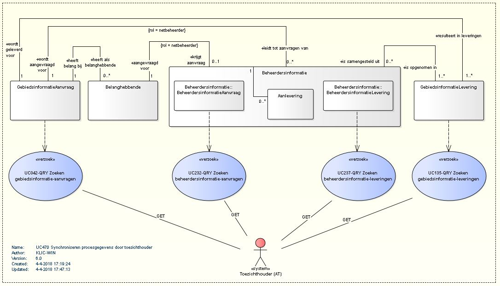

# Data synchronisatie met de KLIC BMKL API

## Inleiding

De BMKL API is zo ontworpen dat verschillende doelgroepen deze resources op een identieke wijze kunnen benaderen.
De resources worden op dezelfde manier benaderd door netbeheerders, service providers en AT.
In dit document wordt toegelicht hoe deze API gebruikt kan worden door AT voor het synchroniseren met een eigen database.

## Inhoudsopgave

- [Data synchronisatie met de KLIC BMKL API](#data-synchronisatie-met-de-klic-bmkl-api)
    - [Inleiding](#inleiding)
    - [Inhoudsopgave](#inhoudsopgave)
    - [Objecten](#objecten)
    - [Url-structuur](#url-structuur)
        - [Endpoints](#endpoints)
        - [Authenticatie](#authenticatie)
    - [Pagineren](#pagineren)
- [Use casemodel datasynchronisatie met BMKL API](#use-casemodel-data-synchronisatie-met-bmkl-api)
- [Voorbeeldberichten per endpoint](#voorbeeldberichten-per-endpoint)
    - [gebiedsinformatieAanvragen synchroniseren](#gebiedsinformatieaanvragen-synchroniseren)
    - [beheerdersinformatieAanvragen synchroniseren](#beheerdersinformatieaanvragen-synchroniseren)
    - [beheerdersinformatieLeveringen synchroniseren](#beheerdersinformatieleveringen-synchroniseren)
    - [gebiedsinformatieLeveringen synchroniseren](#gebiedsinformatieleveringen-synchroniseren)

## Objecten

De volgende objecten spelen een rol in de BMKL API.
- __gebiedsinformatieAanvraag (GIA)__  \
Dit is de aanvraag zoals deze door de grondroerder wordt gedaan.
- __beheerdersinformatieAanvraag (BIA)__  \
Dit zijn de beheerdersinformatieAanvragen die gestuurd worden naar de netbeheerders die een belang hebben in het selectiegebied van de GIA.
- __beheerdersinformatieAanlevering (BIAL)__  \
De beheerdersinformatie die geleverd word door de beheerder op basis van de beheerdersinformatieAanvraag. Dit kunnen meerdere afgekeurde leveringen zijn en + maximaal 1 goedgekeurde levering. (Alleen beschikbaar voor decentrale netbeheerders)
- __beheerdersinformatieLevering (BIL)__  \
Dit is de gevalideerde decentrale aanlevering of de centrale aanlevering aangevuld met de thema's die daarin geleverd zijn. Hiervan is er maximaal 1 per beheerdersinformatieAanvraag en deze is pas beschikbaar ná een succesvolle aanlevering. Indien gevraagd op het __/zip__ endpoint levert dit een levering met de uitsnede van de gebiedsinformatie-levering voor de betreffende netbeheerder.
- __gebiedsinformatieLeveringen (GIL)__  \
De gebiedsinformatieLevering in json, of als ziplevering. Dit kunnen één of meer (deel)leveringen zijn. Dit object is pas beschikbaar na een daadwerkelijke levering.
- __terugmeldingen__  \
Eén of meer terugmeldingen op een gebiedsinformatieLevering.
- __beheerdersTerugmeldingen__  \
De terugmeldingen die op basis van een terugmelding doorgestuurd worden naar de betrokken netbeheerders.

Voor AT zijn de objecten _gebiedsinformatieAanvraag_, _beheerdersinformatieAanvraag_, _beheerdersinformatieLevering_ en _gebiedsinformatieLevering_ van belang.

## Url-structuur
De objecten van deze API zijn ondergebracht in onderstaande url-structuur:

|                                      |                                          |                                                            |
|--------------------------------------|------------------------------------------|------------------------------------------------------------|
| /[__gebiedsinformatieAanvragen__](#gebiedsinformatieaanvragen-synchroniseren)/{id} |  /[__beheerdersinformatieAanvragen__](#beheerdersinformatieaanvragen-synchroniseren)/{id} | /__aanleveringen__/[id]                                    |
|                                      |                                          | /[__beheerdersinformatieLevering__](#beheerdersinformatieleveringen-synchroniseren)/__zip__                     |
|                                      | /[__gebiedsinformatieLeveringen__](#gebiedsinformatieleveringen-synchroniseren)/[id]    | /__terugmeldingen__/[id]/__beheerdersTerugmeldingen__/[id] |

### Endpoints

De endpoints die gebruikt worden in dit document zijn relatief ten opzichte van de betreffende API’s. \
De service "/gebiedsinformatieAanvragen" wordt bijvoorbeeld voluit \
voor de productieomgeving KLIC:
        "https://service10.kadaster.nl/klic/api/v2/gebiedsinformatieAanvragen" \
voor de Netbeheerder Testdienst (NTD):
        "<https://service10.kadaster.nl/klic/ntd/leveren/api/v2/web/gebiedsinformatieAanvragen>". \
In de voorbeelden in deze documentatie wordt uitgegaan van de API's op de productieomgeving KLIC.

### Authenticatie
De KLIC REST API's zijn beveiligd middels de OAuth 2.0 specificatie. Zie daarvoor
 [Authenticatie via OAuth](../API%20management/Authenticatie_via_oauth.md).

## Pagineren
Voor de endpoints die een lijst van objecten opleveren, pagineren we de output. In het request kan het gewenste aantal objecten per pagina opgegeven worden. Aan de serverkant zal hiervoor een maximum gelden.
Waar we een collectie geven, pagineren we door in de response een link naar volgende pagina te geven. Voor synchronisatie kan pagineren op basis van een mutatiedatum gebruikt worden.
``` json
{
   "_links":{
      "self":{
         "href":"https://service10.kadaster.nl/klic/api/v2/gebiedsinformatieAanvragen?datumType=mutatieDatum&datumVanaf=2018-07-01T19:00:00+01&datumTm=2018-07-01T20:00:00+01"
      },
      "next":{
         "href":"https://service10.kadaster.nl/klic/api/v2/gebiedsinformatieAanvragen?datumType=mutatieDatum&datumVanaf=2018-07-01T19:05:22.323+01&datumTm=2018-07-01T20:00:00+01"
      }
   },
   "collection":[
      {
         //gebiedsinformatieAanvraag1...
      },
      {
         //gebiedsinformatieAanvraag2...
      }
   ]
}
```

# Use casemodel datasynchronisatie met BMKL API
Voor het synchroniseren van de Klic-resources:

- GebiedsinformatieAanvraag
- BeheerdersinformatieAanvraag
- BeheerdersinformatieLevering
- GebiedsinformatieLevering

zijn use cases gemodelleerd in een use casemodel. Hieronder wordt daarvan een schematisch overzicht gegeven.


_Figuur 1 UCM Koppelvlak voor datasynchronisatie van procesgegevens_

De use cases voor dit koppelvlak zijn geimplementeerd als BMKL API's. Onderstaand overzicht geeft van de use cases de API-structuur.

.jpg")
_Figuur 2 UCM B2B-koppeling datasynchronisatie met BMKL API's (BMKL2.0, API-structuur)_

# Voorbeeldberichten per endpoint
## gebiedsinformatieAanvragen synchroniseren
Aanvragers van gebiedsinformatie (grondroerders) en AT kunnen een lijst van gebiedsinformatieAanvragen ophalen.
Aanvragers krijgen dan alleen eigen GIA's. AT krijgt alle GIA's.  
Benodigde scope: klic.gebiedsinformatieaanvraag of klic.gebiedsinformatieaanvraag.readonly of klic.toezicht  

GET /gebiedsinformatieAanvragen?datumType=mutatieDatum&datumVanaf=2018-07-01T19:00:00+01&datumTm=2018-07-01T20:00:00+01  
``` http
HTTP/1.1 200 OK
Content-Type: application/json
```

``` json
{
   "_links":{
      "self":{
         "href":"https://service10.kadaster.nl/klic/api/v2/gebiedsinformatieAanvragen?datumType=mutatieDatum&datumVanaf=2018-07-01T19:00:00+01&datumTm=2018-07-01T20:00:00+01"
      },
      "next":{
         "href":"https://service10.kadaster.nl/klic/api/v2/gebiedsinformatieAanvragen?datumType=mutatieDatum&datumVanaf=2018-07-01T19:05:22.323+01&datumTm=2018-07-01T20:00:00+01"
      }
   },
   "gebiedsinformatieAanvragen":[
      {
         "giAanvraagId":"2109992D-90F6-4BC7-815E-E72A02D46220",
         "ordernummer":"2015000471",
         "klicMeldnummer":"00G000227",
         "aanvrager":{
            "contact":{
                "naam":"Aanvrager01",
                "telefoon":"0881324567",
                "email":"klic.testers@kadaster.nl"
            },
            "organisatie":{
                "naam":"Netbeheerder Actualiseren01",
                "bezoekAdres":{
                    "openbareRuimteNaam":"Laan van Westenenk",
                    "huisnummer":"701",
                    "postcode":"7334DP",
                    "woonplaatsNaam":"APELDOORN"
                },
            },
         },
         "opdrachtgever":{
            "contact":{
                "naam":"Kadaster",
                "telefoon":"(088) 183 20 00",
                "email":"noreply@kadaster.nl"
            },
            "organisatie":{
                "naam":"Kadaster",
                "bezoekAdres":{
                    "openbareRuimteNaam":"Hofstraat",
                    "huisnummer":"110",
                    "postcode":"7311KZ",
                    "woonplaatsNaam":"APELDOORN"
                },
            },
        },
         "aanvraagSoort":"http://definities.geostandaarden.nl/imkl2015/id/waarde/AanvraagSoortValue/graafmelding",
         "aanvraagDatum":"2018-07-01T19:05:22.323+01",
         "mutatieDatum":"2018-07-01T19:05:22.323+01",
         "giAanvraagStatus":"https://api.kadaster.nl/klic/v2/waarde/giAanvraagStatussen/giOpen",
         "soortWerkzaamheden":[
            "http://definities.geostandaarden.nl/imkl2015/id/waarde/SoortWerkzaamhedenValue/funderingswerk",
            "http://definities.geostandaarden.nl/imkl2015/id/waarde/SoortWerkzaamhedenValue/woningbouw"
         ],
         "locatieWerkzaamheden":{
               "openbareRuimteNaam":"Laan van Westenenk",
               "huisnummer":"701",
               "postcode":"7334DP",
               "woonplaatsNaam":"Apeldoorn",
               "BAGidAdresseerbaarObject": "0200010000130331"
         },
         "startDatum":"2018-08-01",
         "eindDatum":"2018-08-08",
         "graafpolygoon":{
            "type":"Polygon",
            "crs":{
               "type":"name",
               "properties":{
                  "name":"EPSG:28992"
               }
            },
            "coordinates":[
               [
                  [
                     121070,
                     486903
                  ],
                  [
                     121095,
                     486849
                  ],
                  [
                     121220,
                     486871
                  ],
                  [
                     121480,
                     486905
                  ],
                  [
                     121507,
                     487100
                  ],
                  [
                     121564,
                     487215
                  ],
                  [
                     121539,
                     4872260
                  ],
                  [
                     121460,
                     487288
                  ],
                  [
                     121337,
                     487331
                  ],
                  [
                     121220,
                     487338
                  ],
                  [
                     121156,
                     487308
                  ],
                  [
                     121070,
                     486903
                  ]
               ]
            ]
         },
         "huisaansluitingAdressen":[{
               "openbareRuimteNaam":"Laan van Westenenk",
               "postcode":"7334DP",
               "huisnummer":"701",
               "woonplaatsNaam":"Apeldoorn",
               "BAGidAdresseerbaarObject": "0200010000130331"
            }, {
               "openbareRuimteNaam":"Evert van 't Landstraat",
               "postcode":"7334DR",
               "huisnummer":"15",
               "woonplaatsNaam":"Apeldoorn",
               "BAGidAdresseerbaarObject": "0200010003923183"
            }]
      }
   ]
}
```

## beheerdersinformatieAanvragen synchroniseren
Netbeheerders, serviceproviders of AT kunnen een lijst van beheerdersinformatieAanvragen (BIA) ophalen.
Netbeheerders en service providers krijgen dan alleen eigen BIA's. AT krijgt alle BIA's.  

GET /gebiedsinformatieAanvragen/-/beheerdersinformatieAanvragen?datumType=mutatieDatum&datumVanaf=2018-07-01T19:00:00+01&datumTm=2018-07-01T20:00:00+01  
Scope: klic.gebiedsinformatieaanvraag.readonly of klic.toezicht    

``` http
HTTP/1.1 200 OK
Content-Type: application/json
```

``` json
{
    "_links": {
        "self": {
            "href": "https://api.kadaster.nl/klic/v2/gebiedsinformatieAanvragen/-/beheerdersinformatieAanvragen?datumType=mutatieDatum&datumVanaf=2018-07-01T19:00:00+01&datumTm=2018-07-01T20:00:00+01"
        },
        "next": {
            "href": "https://api.kadaster.nl/klic/v2/gebiedsinformatieAanvragen/-/beheerdersinformatieAanvragen?datumType=mutatieDatum&datumVanaf=2018-07-01T19:05:22.323+01&datumTm=2018-07-01T20:00:00+01"
        }
    },
    "beheerdersinformatieAanvragen": [{
        "biAanvraagId": "8A1C2D58-1823-4E50-B826-7E820AD080A6",
        "giAanvraagId": "7A908F06-484E-42D7-AD86-D1E558A1F5B9",
        "bronhoudercode": "nbact2",
        "biNotificatieStatus": "https://api.kadaster.nl/klic/v2/waarde/biNotificatieStatussen/biBevestigingOntvangen",
        "biProductieStatus": "https://api.kadaster.nl/klic/v2/waarde/biProductieStatussen/biGereedVoorSamenstellenProduct",
        "datumGenotificeerd": "2018-06-30T19:00:00.323+01",
        "datumBevestigingOntvangen": "2018-06-30T19:02:01.819+01",
        "mutatieDatum":"2018-07-01T19:04:29+01"
    }, {
        "biAanvraagId": "8G33E1D5-1833-4E82-B826-7E820AD012F6",
        "giAanvraagId": "7A908F06-484E-42D7-AD86-D1E558A1F5B9",
        "bronhoudercode": "nbact1",
        "biNotificatieStatus": "https://api.kadaster.nl/klic/v2/waarde/biNotificatieStatussen/biBevestigingOntvangen",
        "biProductieStatus": "https://api.kadaster.nl/klic/v2/waarde/biProductieStatussen/biWachtOpAntwoord",
        "datumGenotificeerd": "2018-06-30T19:00:00.4+01",
        "datumBevestigingOntvangen": "2018-07-01T19:16:00+01",
        "mutatieDatum":"2018-07-01T19:16:00+01"
    }, {
        "biAanvraagId": "3D3988D5-1813-4E82-B386-7E820AD012S2",
        "giAanvraagId": "2639FD07-6A9F-4455-84D0-87EBFB13466D",
        "bronhoudercode": "nbact1",
        "biNotificatieStatus": "https://api.kadaster.nl/klic/v2/waarde/biNotificatieStatussen/biBevestigingOntvangen",
        "biProductieStatus": "https://api.kadaster.nl/klic/v2/waarde/biProductieStatussen/biWachtOpAntwoord",
        "datumGenotificeerd": "2018-07-01T19:15:00+01",
        "datumBevestigingOntvangen": "2018-07-01T19:22:00+01",
        "mutatieDatum":"2018-07-01T19:22:00+01"
    }, {
        "biAanvraagId": "42G178D6-1815-4X27-B386-7E820AD012F2",
        "giAanvraagId": "2109992D-90F6-4BC7-815E-E72A02D46220",
        "bronhoudercode": "nbact1",
        "biNotificatieStatus": "https://api.kadaster.nl/klic/v2/waarde/biNotificatieStatussen/biOpen",
        "biProductieStatus": "https://api.kadaster.nl/klic/v2/waarde/biProductieStatussen/biWachtOpAntwoord",
        "datumGenotificeerd": "2018-07-01T19:55:00+01",
        "mutatieDatum":"2018-07-01T19:55:00+01"
    }]
}
```

## beheerdersinformatieLeveringen synchroniseren
Netbeheerders, serviceproviders of AT kunnen een lijst van beheerdersinformatieLeveringen ophalen.
Netbeheerders en service providers krijgen dan alleen eigen leveringen. AT krijgt alle leveringen.  

GET /gebiedsinformatieAanvragen/-/beheerdersinformatieAanvragen/-/beheerdersinformatieLevering?datumType=mutatieDatum&datumVanaf=2018-07-01T19:00:00+01&datumTm=2018-07-01T20:00:00+01  
Scope: klic.gebiedsinformatieaanvraag.readonly of klic.toezicht    

``` http
HTTP/1.1 200 OK
Content-Type: application/json
```

``` json
{
    "_links": {
        "self": {
            "href": "https://api.kadaster.nl/klic/v2/gebiedsinformatieAanvragen/-/beheerdersinformatieAanvragen/-/beheerdersinformatieLevering?datumType=mutatieDatum&datumVanaf=2018-07-01T19:00:00+01&datumTm=2018-07-01T20:00:00+01"
        },
        "next": {
            "href": "https://api.kadaster.nl/klic/v2/gebiedsinformatieAanvragen/-/beheerdersinformatieAanvragen/-/beheerdersinformatieLevering?datumType=mutatieDatum&datumVanaf=2018-07-01T19:05:22.323+01&datumTm=2018-07-01T20:00:00+01"
        }
    },
    "beheerdersinformatieLeveringen": [{
        "biAanvraagId": "8A1C2D58-1823-4E50-B826-7E820AD080A6",
        "datumBeheerdersinformatieOntvangen": "2018-07-01T19:03:69+01",
        "mutatieDatum": "2018-07-01T19:03:69+01",
        "betrokkenBijAanvraag": "true",
        "eisVoorzorgsMaatregel": "true",
        "geleverdeThemas" : [
            {
                "thema": "http://definities.geostandaarden.nl/imkl2015/id/waarde/Thema/laagspanning",
                "eisVoorzorgsMaatregel": "false"
            },
            {
                "thema": "http://definities.geostandaarden.nl/imkl2015/id/waarde/Thema/hoogspanning",
                "eisVoorzorgsMaatregel": "true"
            },
        ]
    }, {
        "biAanvraagId": "B002B509-FE7C-45B3-83C0-CDBA2584697F",
        "datumBeheerdersinformatieOntvangen": "2018-07-01T19:04:12+01",
        "mutatieDatum": "2018-07-01T19:04:12+01",
        "betrokkenBijAanvraag": "false"
    }]
}
```

## gebiedsinformatieLeveringen synchroniseren
GET /gebiedsinformatieAanvragen/-/gebiedsinformatieLeveringen?datumType=mutatieDatum&datumVanaf=2018-07-01T19:00:00+01&datumTm=2018-07-01T20:00:00+01  
Scope: klic.gebiedsinformatieaanvraag.readonly of klic.toezicht    

``` http
HTTP/1.1 200 OK
Content-Type: application/json
```

``` json
{
    "_links": {
        "self": {
            "href": "https://api.kadaster.nl/klic/v2/gebiedsinformatieAanvragen/-/gebiedsinformatieLeveringen?datumType=mutatieDatum&datumVanaf=2018-07-01T19:00:00+01&datumTm=2018-07-01T20:00:00+01"
        },
        "next": {
            "href": "https://api.kadaster.nl/klic/v2/gebiedsinformatieAanvragen/-/gebiedsinformatieLeveringen?datumType=mutatieDatum&datumVanaf=2018-07-01T19:05:22.323+01&datumTm=2018-07-01T20:00:00+01"
        }
    },
    "gebiedsinformatieLeveringen": [{
        "giAanvraagId": "F7CB3ACE-6E73-42F9-9865-EFA57D00AEC1",
        "giLeveringId": "BE0B80CA-1301-4216-80A9-DE691356E273",
        "leveringsvolgnummer": "2",
        "datumLeveringSamengesteld": "2017-11-02T09:16:01.808",
        "mutatieDatum":"2017-11-02T09:16:01.808",
        "indicatieLeveringCompleet": "true",
        "giLeveringUrl": "https://service10.kadaster.nl/gds2/download/public/ce417a87-92cd-4c57-a70e-8a0c405b2701"
    }, {
        "giAanvraagId": "2109992D-90F6-4BC7-815E-E72A02D46220",
        "giLeveringId": "10789865-82A0-4FA5-8E07-500EA0E2487B",
        "leveringsvolgnummer": "1",
        "datumLeveringSamengesteld": "2017-11-02T09:25:01.808",
        "mutatieDatum":"2017-11-02T09:25:01.808",
        "indicatieLeveringCompleet": "false",
        "giLeveringUrl": "https://service10.kadaster.nl/gds2/download/public/cfbdaaf6-c84b-4a05-9d71-657cd43ecf21"
    }]
}
```


