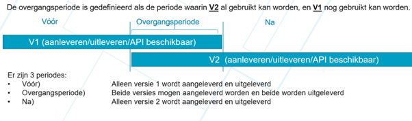
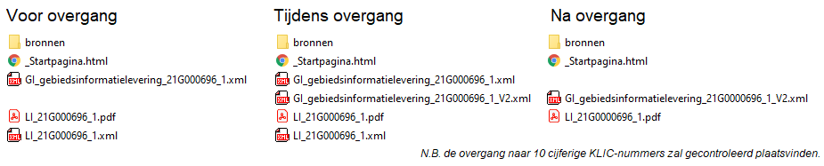

# Nieuwe versie informatiestandaarden

Over de manier waarop informatie in de KLIC-registratie wordt vastgelegd, gepresenteerd en uitgewisseld, zijn afspraken gemaakt. Deze zijn vastgelegd in het Informatiemodel Kabels en Leidingen (IMKL) en Berichtenprotocol (BMKL). Hiervoor is een nieuwe versie opgesteld. De aanpassingen aan de standaard zijn voorbereid door de Technische Commissie Standaarden KLIC (TCS).

## Over TCS
In de TCS zitten vertegenwoordigers van afnemers (namens grondroerders), bronhouders (namens netbeheerders), gemeenten, Agentschap Telecom, Geonovum, Kadaster. De Technische commissie standaarden (TCS) beoordeelt IMKL, Visualisatiemodel en BMKL. De commissie bekijkt of de standaarden in de praktijk voldoen en zorgt voor de nodige aanpassingen. Ook zorgt de commissie voor een goede doorontwikkeling van de standaarden.

## Achtergrond 
De nieuwe versies van de standaarden lagen in juli en augustus 2020 in consultatie, in oktober zijn deze als release candidate gepubliceerd en op 10 november 2020 is de versie vastgesteld.  \
Het Kadaster heeft samen met het KLIC gebruikersoverleg een planning opgesteld voor de implementatie. Op deze pagina staat een toelichting op de wijzigingen en de implementatie strategie.

## Nieuwe versie standaarden.
IMKL versie 2.0 en PMKL versie 2.0 zijn gepubliceerd op de [website van Geonovum](https://www.geonovum.nl/geo-standaarden/informatiemodel-kabels-en-leidingen#standaard).  \
Een nieuwe versie van het berichtenmodel (BMKL versie 2.1) vindt u op [deze GitHub pagina van het Kadaster](../../../BMKL/) Een toelichting op de wijzigingen van de BMKL-standaarden vindt u op [deze GitHub pagina van het Kadaster](Gewijzigde%20BMKL.md). De wijzigingen ten opzichte van BMKL 2.0 hebben betrekking op de endpoints, de labels in de berichten en de waarden(lijsten) in de berichten. 

# Toelichting implementatie Upgrade Standaarden

Op deze pagina staat een toelichting op de wijzigingen en de implementatie strategie van de upgrade van de standaarden.  \
Een link naar het implementatieplan en een presentatie van de hoofdlijnen van de implementatie staan genoemd bij [de toelichting van mijlpaal 5](#toelichting-mijlpaal-5)

## Overgangsperiode

**Uitgangspunten**:
- Nieuw informatiemodel wordt live gebracht, huidig model blijft nog 4 maanden (overgangsperiode) beschikbaar om de overgang te faciliteren.  \
    
- Gedurende de overgangsperiode vindt de uitlevering aan Grondroerders plaats, zowel in het huidige informatiemodel als in het nieuwe informatiemodel: In de ZIP-levering zitten 2 XML’s die beide de complete set aan data representeren
- Het Kadaster transformeert de aangeleverde versie van de net-informatie naar het andere model (V1 -> V2, of V2 -> V1)
- Beide volledige versies worden in één Zip uitgeleverd, vanaf start tot eind van de overgangsperiode.

**Kenmerken van de overgangsperiode**:
- De Leverings-/BIL-Zip wijzigt bij start en einde van de overgangsperiode
- Tijdens de overgangsperiode worden beide versies tegelijkertijd ondersteund en uitgeleverd
- Netbeheerders kiezen zelf wanneer ze V1 of V2 aanleveren
  - Bij onoverkomelijke problemen kan een Netbeheerder (tijdelijk) weer aanleveren in V1
- Grondroerder kan in deze periode zelf kiezen wanneer hij versie 2 wil gebruiken
- In de uitlevering naar Grondroerders (Zip-levering) zitten 2 XML’s (V1 én V2).
- In de uitlevering naar Netbeheerders (BIL-Zip) zitten 2 XML’s (V1 én V2). 
  - Beide versies representeren dus de complete set aan data 
  - Afnemers hebben daarbij de mogelijk zelf te bepalen wanneer zij (gedurende de overgangsperiode) overgaan naar de nieuwe uitlevering
  - Afnemers (bv viewers) kunnen tijdens de overgangsperiode zelf bepalen op welke XML ze acteren
- Centraal aangeleverde netinformatie (van Netbeheerders aan Kadaster) wordt alleen opgeslagen in aangeleverde versie
- Gedurende de overgangsperiode transformeert het Kadaster de informatie van de netbeheerder en levert in beide versies van het informatiemodel uit

**Planning**:
- Start overgang: maandag 3 januari 2022
- Einde overgang: vrijdag 30 april 2022 (beoogd)

Het moment van aanvragen van een KLIC-melding is het ijkpunt om te bepalen of een KLIC-melding in de periode 'voor-', 'tijdens-' of 'na-'  de overgangsperiode valt.  \
Een KLIC-melding die gedaan wordt op of na 3 januari 0:00 uur wordt beschouwd als "tijdens de overgangsperiode", en wordt dan in beide versies uitgeleverd.  \
Een KLIC-melding die gedaan wordt op of voor 2 januari 23:59 uur wordt beschouwd als "voor de overgangsperiode", en wordt dan in alleen V1 uitgeleverd; ook als de daadwerkelijke levering pas op na 3 januari plaatsvindt. Voor een decentrale netbeheerder geldt dat aanlevering in IMKL 2.0 voor deze melding nog niet mogelijk is en zal dus afgehandeld moeten worden in volgens IMKL 1.2.1. \

**Gekozen strategie**:
- [Zie deze presentatie](KLIC%20versie%20update%20strategie%20(TCS).pdf) voor een toelichting op de gekozen strategie. 

**Transformatie tijdens de overgang door het Kadaster**:
- Tijdens de overgangsperiode zal een KLIC-levering in zowel de huidige versie (IMKL 1.2.1), als de nieuwe versie (IMKL 2.0) worden uitgeleverd.
- In transformatieregels wordt per IMKL-issue aangegeven hoe deze transformatie tussen beide versies zal worden uitgevoerd.
- De transformatie regels zoals vastgesteld door de TCS [zijn hier te vinden](Transformatieregels%20versie%201.2.pdf).

## Aanvragen
**Online**:
- Aanpassingen zijn in de online aanvraagportaal zichtbaar vanaf het begin van de overgangsperiode.

**NTD**:
- Aanpassingen zijn in de NTD zichtbaar na implementatie van de tweede mijlpaal.  \
  Voor het bekijken van de BIL-Zip in de KLIC-viewer wordt geadviseerd gebruik te maken van de nieuweste versie van de KLIC-viewer.

**B2B-koppeling gebiedsinformatie-aanvraag**:  \
Door de upgrade van de KLIC-standaarden zullen gefaseerd een aantal aanpassingen doorgevoerd worden in het B2B aanvraag proces. Hiervoor is een nieuwe versie opgesteld. De nieuwe versie heeft impact op de KLIC-aanvraag (KLIC-melding).
- Per 21 mei 2021 is de [nieuwe XSD v1.2](../../../Aanvragen%20gebiedsinformatie/Schemas/) beschikbaar.
- In Q3 2021 zal het mogelijk zijn om in een Acceptatieomgeving van het Kadaster testen uit te voeren. 
- Per 3 januari 2022 wordt het verplicht om de nieuwe XSD v1.2 te gebruiken.  \
  Vanaf dan worden aanvragen afgekeurd waarbij geen referentieveld is opgegeven.

## Aanleveringen
V1 kan tot het einde van de overgangsperiode aangeleverd worden zoals men gewend is (kleine uitzondering: het aanleveringsbestand mag sinds 26 januari 2021 niet eindigen op `_V2.zip`)  \
V2 aanleveringen: er komt een extra endpoint beschikbaar om V2 aanleveringen te doen. Het bestand moet voldoen aan nieuwe standaard  en het bestandsnaam van het aangeleverde moet eindigen op `_V2.zip`  \
  \
V1-API staat open tot het einde van de overgang.  \
V2-API staat open vanaf het begin van de overgangsperiode.

## Uitlevering
Aan het begin van de overgang wordt er een extra XML in de zip geplaatst.  \
Na de overgang verdwijnen de Leveringsindex-xml (LI.xml)  en de GebiedsInformatie-xml (GI.xml) met V1 versie.  \

## Gefaseerde oplevering

In de NTD wordt de nieuwe functionaliteit gefaseerd uitgeleverd.
- **Mijlpaal 1**: Mogelijkheid geven aan sector om aangeleverde netinformatie/beheerdersinformatie te valideren tegen de nieuwe standaard in de NTD
- **Mijlpaal 2**: Gi.xml in de BIL-Zip in 2 versies beschikbaar in NTD en aangepaste schermen in NTD
- **Mijlpaal 3**: API in versie 2 beschikbaar naast de huidige API in de NTD
- **Mijlpaal 4**: Kadaster KLIC-viewer volgens PMKL versie 2.0 en werkt met versie IMKL 2.0
- **Mijlpaal 5**: Start overgangsperiode
- **Mijlpaal 6**: Na de overgangsperiode

### Toelichting Mijlpaal 1:
**Doel**: Mogelijkheid geven aan sector om aangeleverde netinformatie/beheerdersinformatie te valideren tegen de nieuwe standaard in de NTD.  
  \
Vanaf 20 mei 2021 is het mogelijk om IMKL versie 2.0 in de NTD aan te leveren en te laten valideren.  \
De netbeheerder moet netinformatie samenstellen volgens de nieuwe specificatie. Het aan te leveren ZIP-bestand dient te eindigen op `_V2.zip`.

**Demo**: Er is een demo beschikbaar met een toelichting van mijlpaal 1.  \
[Mijlpaal 1 demo op Youtube.](https://www.youtube.com/watch?v=6yqThNl1DXE&ab_channel=HetKadaster)

**Aanleveren centraal via NTD**:  \
 Het selecteren van bestanden blijft gelijk. Als het bestand eindigd op `_V2.zip`, wordt het tegen MKL versie 2.0 gevalideerd. Eindigt het bestand niet op `_V2.zip`, dan wordt het gevalideerd tegen IMKL versie 1.2.1 (huidig).

**Aanleveren centraal via endpoint**:  \
Het actualiseren van netinformatie gebeurt op basis van de resource "aanleveringen/netinformatie".  \
Deze resource is benaderbaar met de volgende endpoints (host + base url):

|IMKL versie |Omgeving                      |Host                           |Base url                           | Beschikbaarheid    | 
|------------|------------------------------|-------------------------------|-----------------------------------|--------------------|
|v1.2.1      |Netbeheerder Testdienst (NTD) | https://service10.kadaster.nl | /klic/ntd/actualiseren/api/v2/web |  tot 30 april 2022 |
|v2.0        |Netbeheerder Testdienst (NTD) | https://service10.kadaster.nl | /klic/ntd/actualiseren/v2/        |  vanaf 20 mei 2021 |

Merk op dat de bestandsnaam voor aanleveringen volgens het IMKL versie 2.0 formaat, dient te eindigen op `_V2.zip`  \
  \
Het actualiseren van documenten gebeurt op basis van de resource "aanleveringen/documenten".  \
Deze resource is benaderbaar met de volgende endpoints (host + base url):

|IMKL versie |Omgeving                      |Host                           |Base url                           | Beschikbaarheid    | 
|------------|------------------------------|-------------------------------|-----------------------------------|--------------------|
|v1.2.1      |Netbeheerder Testdienst (NTD) | https://service10.kadaster.nl | /klic/ntd/actualiseren/api/v2/web |  tot 30 april 2022 |
|v2.0        |Netbeheerder Testdienst (NTD) | https://service10.kadaster.nl | /klic/ntd/actualiseren/v2/        |  vanaf 20 mei 2021 |

Merk op dat documenten die via het V1-endpoint zijn opgeleverd, ook bruikbaar blijven vanuit aanleveringen in IMKL versie 2.0.

**Aanleveren decentraal via endpoint**:  \
De B2B-koppeling voor het afhandelen van gebiedsinformatie en beheerdersinformatie gebeurt met de resource "gebiedsinformatieAanvragen".  \
Deze resource-structuur is benaderbaar met de volgende endpoints (host + base url):

|IMKL versie |Omgeving                      |Host                           |Base url                      | Beschikbaarheid    | 
|------------|------------------------------|-------------------------------|------------------------------|--------------------|
|v1.2.1      |Netbeheerder Testdienst (NTD) | https://service10.kadaster.nl | /klic/ntd/leveren/api/v2/web |  tot 30 april 2022 |
|v2.0        |Netbeheerder Testdienst (NTD) | https://service10.kadaster.nl | /klic/ntd/bmkl/v2/           |  vanaf 20 mei 2021 |

Merk op dat de bestandsnaam voor aanleveringen volgens het IMKL versie 2.0 formaat, dient te eindigen op `_V2.zip`.

**Uitleveringen - BIL-Zip**  \
Uitleveringen bevatten de GI-xml volgens IMKL versie 1.2.1.  \
Als er aangeleverd is in versie 2.0, staat deze getransformeerd naar versie 1.2.1 in de BIL-Zip.  \
Voor aanleveringen in versie 1.2.1 wijzigt er niets ten opzichte van voor de implmentatie van 20 mei 2021.

### Toelichting Mijlpaal 2:
**Doel**: Mogelijkheid geven aan sector om in de NTD een testmelding te doen, waarbij er 2 XML’s (V1 én V2) in de BeheerdersinformatieLevering (BIL-Zip) zit.  
Vanaf 15 juli 2021 staat de NTD ingesteld 'alsof' de overgangsperiode begonnen is. 

**Demo**: Er is een demo beschikbaar met een toelichting van mijlpaal 2.  \
[Mijlpaal 2 demo op Youtube.](https://youtu.be/KBvngJnwmno)
 
\
**Wijzigingen NTD testmelding**:
- Referentie veld is toegevoegd en verplicht gesteld.
- Mogelijkheid om een extra emailadres, een extra naam en een extra telefoon nummer (allen optioneel) op te geven.
- Mogelijkheid om bij het Locatieadres (optioneel) een omschrijving op te geven.
- Mogelijkheid om bij het Locatieadres een adres op te geven die geen postcode heeft.
- Mogelijkheid om een Huisaansluitschets op te vragen van een adres die geen postcode heeft.

**BeheerdersinformatieLevering (BIL-Zip)**:
- Er zitten twee XML bestanden in de levering zoals het tijdens de overgangsperiode op productie ook zal zijn:  \
  
- Beide XML's representeren de complete set aan data: een XML is volgens IMKL versie 1.2.1 en de andere volgens IMKL versie 2.0.  
  - Netinformatie (centraal aangeleverd) of Beheerdersinformatie (decentraal aangeleverd) in IMKL versie 1.2.1 staat -onveranderd- in GI_gebiedsinformatielevering.xml, en getranformeerd naar IMKL 2.0 naar GI_gebiedsinformatielevering_V2.xml.
  - Netinformatie (centraal aangeleverd) of Beheerdersinformatie (decentraal aangeleverd) in IMKL versie 2.0 staat -onveranderd- in GI_gebiedsinformatielevering_V2.xml, en getranformeerd naar IMKL 1.2.1 naar GI_gebiedsinformatielevering.xml.
-  Voor het bekijken van de BIL-Zip in de KLIC-viewer wordt geadviseerd gebruik te maken van de nieuwste versie van de KLIC-viewer.
  
  
[Zie deze presentatie](KLIC%20versie%20update%20strategie%20(TCS).pdf) voor een toelichting op de gekozen strategie.  \
De transformatie regels zoals vastgesteld door de TCS [zijn hier te vinden](Transformatieregels%20versie%201.2.pdf). 

**Voorbeeldbestanden**: 

 > _Het Kadaster stelt op verzoek van de sector voorbeeldbestanden beschikbaar aan de netbeheerder en de grondroerer._   \
 _De voorbeeldbestanden wordt door het Kadaster enkel aangeboden om als hulpmiddel te worden gebruikt._  \
 _De voorbeeldbestanden zijn aangeboden zonder enige vorm van garantie op volledigheid en juistheid. Het is geen representatieve data van kabels en leidingen en heeft op geen enkele manier een relatie met de betreffende locatie.  Het is test data om de werking van het KLIC-systeem te testen._  \
 _Netbeheerders en grondroerders blijven te allen tijde verantwoordelijk_
 
|bestand|uitleg|
|---|---|
|[netinformatie_TS1392.zip](bijlagen/netinformatie_TS1392.zip)|Netinformatie voor centrale actualisatie in versie IMKL 1.2.1; gebruikt in NTD-demo op 9 juli 2021|
|[BeheerdersinformatieLevering_00G001694_TS1392.zip](bijlagen/BeheerdersinformatieLevering_00G001694_TS1392.zip)|BeheerdersinformatieLevering (BIL-Zip) Met daarin: Netinformatie in IMKL1.2.1 (zoals in bovenstaand bestand aangeleverd), Netinformatie IMKL 2.0, getransformeerd door het kadaster; gebruikt in NTD-demo op 9 juli 2021|
|[Levering_21G002822_1.zip](bijlagen/Levering_21G002822_1.zip)|voorbeeld levering uit testomgeving van het Kadaster met meerdere netbeheerders; bevat IMKL1.2.1 en IMKL 2.0|
|[BeheerdersinformatieLevering_21G002822_TS1392.zip](bijlagen/BeheerdersinformatieLevering_21G002822_TS1392.zip)|voorbeeld BeheerdersinformatieLevering (BIL-Zip) uit testomgeving van het Kadaster die hoort bij bovenstaande melding; bevat IMKL1.2.1 en IMKL 2.0|

_Let op: Omdat deze bestanden uit de Testomgeving van het Kadaster afkomstig zijn, zijn ze **niet** met de Kadaster KLIC-viewer te openen._

### Toelichting Mijlpaal 3:
**Doel**: Mogelijkheid geven aan sector om in de NTD gebruik te maken van de nieuwe API's. De nieuwe endpoints zijn naast de huidige endpoints te gebruiken.  \
Beide API’s kunnen gebruikt worden voor alle dossiers/meldingen op te vragen.  

### Toelichting Mijlpaal 4:
**Doel**: De Kadaster KLIC-viewer visualiseert de netinformatie volgens PMKL versie 2.0. De Kadaster KLIC-viewer  maakt gebruik van de netinformatie in IMKL versie 2.0 indien beschikbaar. Meldingen met IMKL 1.2.1 kunnen ook nog geopend worden.

### Toelichting Mijlpaal 5:
**Doel**: Netbeheerders en grondroerders de mogelijkheid geven geleidelijk over te gaan naar de IMKL 2.0  \
**Start overgang**: maandag 3 januari 2022.   
**Aanvraag moment is ijkpunt**: Het moment van aanvragen van een KLIC-melding is het ijkpunt om te bepalen of een KLIC-melding in de periode 'voor-', 'tijdens-' of 'na-'  de overgangsperiode valt.  \
Een KLIC-melding die gedaan wordt op of na 3 januari 0:00 uur wordt beschouwd als "tijdens de overgangsperiode", en wordt dan in beide versies uitgeleverd.  \
Een KLIC-melding die gedaan wordt op of voor 2 januari 23:59 uur wordt beschouwd als "voor de overgangsperiode", en wordt dan in alleen V1 uitgeleverd; ook als de daadwerkelijke levering pas op na 3 januari plaatsvindt. Voor een decentrale netbeheerder geldt dat aanlevering in IMKL 2.0 voor deze melding nog niet mogelijk is en zal dus afgehandeld moeten worden in volgens IMKL 1.2.1. 

**Samenvatting**:
- API: V2 naast V1
- Aanleveren: V2 óf V1 (*documenten hóéft niet opnieuw*)
- Uitlevering: V2-xml én V1-xml (ook BILzip)
- Aanvraag: Referentie veld verplicht bij aanvraag (*en nog aantal optionele extra’s*)

Voor meer details zie de uitleg op deze pagina. 

**Voorbeeldbestanden**: 

 > _Het Kadaster stelt op verzoek van de sector voorbeeldbestanden beschikbaar aan de netbeheerder en de grondroerer._   \
 _De voorbeeldbestanden wordt door het Kadaster enkel aangeboden om als hulpmiddel te worden gebruikt._  \
  _Netbeheerders en grondroerders blijven te allen tijde verantwoordelijk_
  
  De voorbeeld bestanden zijn de vinden in de folder [Uitleveren](../../../Uitleveren/Voorbeelden%20Overgangsperiode).
 

**Documenten**:  \
Een presentatie met de hoofdlijnen van het implementatieplan [is hier te vinden](Implementatie%20hoofdlijnen%20KLIC%20standaarden-sept21.pdf)  \
Het Implementatieplan [is hier te vinden](IMPLEMENTATIEPLAN%20upgrade%20standaarden%20KLIC-1.1.pdf)

### Toelichting Mijlpaal 6:
**Doel**: Niet meer ondersteunen van IMKL versie 1.2.1 en PMKL 1.2.1 en BMKL 2.0.  

**Samenvatting**:  
- API: alleen de V2 API kan nog gebruikt worden; de V1 API gaat uit.
- Aanleveren mag alleen nog maar in IMKL versie 2.0; aanleveringen in IMKL versie 1.2.1 worden afgekerd.
- Uitleveringen (ook BILzip) bevatten alleen nog maar IMKL versie 2.0 van de Gebiedsinformatie-xml; de Gebiedsinformatie-xml van IMKL versie 1.2.1 zit niet meer in de leveringzip (*merk op dat de V2 xml zal voldoen aan dezelfde naamgevingsconventies als tijdens de overgnagperiode, dus mét* `_V2`)
- Viewers moeten voldoen aan de PMKL versie 2.0  

Tot het einde van de overgangsperiode worden een aantal zaken niet toegestaan omdat het transformeren naar IMKL 1.2.1 dan niet mogelijk is. Ná de overgangsperiode kan er bijvoorbeeld gebruik gemaakt worden van de mogelijkheid om  "overige appurartanances" van het type "onbekend" aan te leveren.  \
Daarnaast zijn er een aantal zaken die gecontroleerd zullen plaats vinden zoals het clippen op EV vlakken (gerelateerd aan issue 210), of een langer KLIC-meldnummer.  \
Het gebruik maken van de mogelijkheid om  een langer KLIC-meldnummer te hanteren wordt minimaal 2 maanden van te voren gecommuniceerd. De verwachting is dat de overgang pas in januari 2023 zal plaats vinden.

## De wijzigingen:
Hieronder staan de links naar de ingebrachte issues die in scope zijn van deze update. Tevens is er voor een aantal issues een beschrijving vanuit het Kadaster toegevoegd.  \
Een pdf versie met de issues die in scope zijn van deze update, [is hier te vinden](Upgrade%20KLIC%20standaarden%20GitHub%20geregistreerde%20issues%2020210210.pdf).  \
Merk op dat de IMKL specificatie (inclusief bijlagen) leidend is zoals die gepubliceerd is op de [website van Geonovum](https://www.geonovum.nl/geo-standaarden/informatiemodel-kabels-en-leidingen#standaard).

| Nr   | Titel                                                                                                | Issue beschrijving                                                | Wijziging                                                                                                                               | Beschrijving Kadaster                        | 
|------|------------------------------------------------------------------------------------------------------|-------------------------------------------------------------------|-----------------------------------------------------------------------------------------------------------------------------------------|----------------------------------------------|
| #193 | Storing en Beschadigingsnummer zijn opgenomen, maar dit moet één nummer worden: beschadigingsnummer. | [details](https://github.com/Geonovum/imkl2015-review/issues/193) | Geen onderscheid meer tussen contactStoring en contactBeschadiging.                                                                     | [beschrijving](bijlagen/193_beschrijving.md) |
| #239 | Beperking aan aantal tekens voor attribuut 'label'                                                   | [details](https://github.com/Geonovum/imkl2015-review/issues/239) | Attribuut 'label' maximaal 40 tekens.                                                                                                   |                                              |
| #283 | Nauwkeurigheid van (RD)-coördinaten in 3 decimalen                                                   | [details](https://github.com/Geonovum/imkl2015-review/issues/283) | Nauwkeurigheid van (RD)-coördinaten in maximaal 3 decimalen.                                                                            | [beschrijving](bijlagen/283_beschrijving.md) |
| #282 | Afsluiters niet (altijd) zichtbaar in een KLIC-viewer                                                | [details](https://github.com/Geonovum/imkl2015-review/issues/282) | Rotatiehoek verplicht bij afsluiters.                                                                                                   | [beschrijving](bijlagen/282_beschrijving.md) |
| #304 | Koppelen van leidingelement aan een BGT-object o.b.v. BGT-identifier                                 | [details](https://github.com/Geonovum/imkl2015-review/issues/304) | Koppelen van een net-element aan een BGT-object o.b.v. BGT-identifier.                                                                  |                                              |
| #195 | Niet betrokken bijlage uit het IMKL halen (KLO-werkgroep "reduceren documenten")                     | [details](https://github.com/Geonovum/imkl2015-review/issues/195) | Bijlage van type “nietBetrokken” niet meer toegestaan.                                                                                  |                                              |
| #192 | Website links van netbeheerders: Eén URL van de netbeheerder registreren i.p.v. Algemene bijlage.    | [details](https://github.com/Geonovum/imkl2015-review/issues/192) | Maximaal één bijlage van het type ‘algemeen’.                                                                                           |                                              |
| #197 | Enkele attributen van Bijlage optioneel                                                              | [details](https://github.com/Geonovum/imkl2015-review/issues/197) | Attributen ‘bestandLocatie’ en ‘bestandMediaType’ van Bijlage optioneel bij centrale aanleveringen.                                     |                                              |
| #215 | Postcode is geen verplicht attribuut van een adres                                                   | [details](https://github.com/Geonovum/imkl2015-review/issues/215) | 1) Adres: postcode geen verplicht attribuut; 2) Adres: BAGidAdresseerbaarObject wordt BAGid; 3)adres: andere volgorde van de atributen. |                                              |
| #303 | Consequenter gebruik van waarden uit waardelijst "Landcodes"                                         | [details](https://github.com/Geonovum/imkl2015-review/issues/303) | waardenlijst: Landcode via URI.                                                                                                         |                                              |
| #310 | Landcode: hoe opnemen? als uri of als waarde                                                         | [details](https://github.com/Geonovum/imkl2015-review/issues/310) | waardenlijst: Landcode via URI.                                                                                                         |                                              |
| #277 | Waardelijst VoidReasonValue niet gepubliceerd op geostandaarden                                      | [details](https://github.com/Geonovum/imkl2015-review/issues/277) | Waardenlijst VoidReasonValue niet gepubliceerd op geostandaarden.                                                                       |                                              |
| #308 | Waardelijst rdf: Links naar GWSW objecten aanpassen                                                  | [details](https://github.com/Geonovum/imkl2015-review/issues/308) | Waardenlijst: gewijzigde URI.                                                                                                           |                                              |
| #311 | Inspectieput ontbreekt bij SewerAppurtenanceValue                                                    | [details](https://github.com/Geonovum/imkl2015-review/issues/311) | Waardenlijst: toevoegen  Inspectieput.                                                                                                  |                                              |
| #250 | Appurtenance-type voor leidingelementen van thema wees of overig ontbreken.                          | [details](https://github.com/Geonovum/imkl2015-review/issues/250) | AppurtenanceType voor leidingelementen van thema Overig toegevoegd.                                                                     |                                              |
| #198 | standaard namespace afkortingen in XML datasets                                                      | [details](https://github.com/Geonovum/imkl2015-review/issues/198) | Standaard namespaces en aliassen in XML datasets.                                                                                       |                                              |
| #294 | Onjuist gebruik `srsName` bij geometrie                                                              | [details](https://github.com/Geonovum/imkl2015-review/issues/294) | Valideren op juist gebruik `srsName` bij geometrie.                                                                                     |                                              |
| #296 | Aanpassing naamgeving eisVoorzorgsmaatregel bij Belanghebbende                                       | [details](https://github.com/Geonovum/imkl2015-review/issues/296) | Belanghebbende attribuut 'eisVoorzorgsmaatregel'  wordt 'indicatieEisVoorzorgsmaatregel'.                                               |                                              |
| #210 | Gebruik multi-geometrieën bij AanduidingEisVoorzorgzorgsmaatregel en ExtraGeometrie                  | [details](https://github.com/Geonovum/imkl2015-review/issues/210) | Bij AanduidingEisVoorzorgzorgsmaatregel en ExtraGeometrie is voor de geometrie nu ook een  'multivalk' toegstaan.                       |                                              |
| #194 | Extra Detail Informatie: “Overige” aanpassen in “Specifieke netinformatie”                           | [details](https://github.com/Geonovum/imkl2015-review/issues/194) |                                                                                                                                         |                                              |
| #305 | Thema en waarde voor "(vloeibare) biomassa                                                           | [details](https://github.com/Geonovum/imkl2015-review/issues/305) |                                                                                                                                         |                                              |
| #268 | Documentation on EisVoorzorgsmaatregelBijlage elements seems incorrect                               | [details](https://github.com/Geonovum/imkl2015-review/issues/268) |                                                                                                                                         |                                              |
| #214 | UML Constraint: fout bij Objecttype Gebiedsinformatielevering                                        | [details](https://github.com/Geonovum/imkl2015-review/issues/214) |                                                                                                                                         |                                              |
| #191 | IMKL2015 v 1.2.1 Constraint op Annotatie.rotatiehoek                                                 | [details](https://github.com/Geonovum/imkl2015-review/issues/191) |                                                                                                                                         |                                              |
| #190 | IMKL2015 v1.2.1 Constraint op Maatvoering.rotatiehoek                                                | [details](https://github.com/Geonovum/imkl2015-review/issues/190) |                                                                                                                                         |                                              |
| #213 | ExtraRegels: Tabblad Maatvoering                                                                     | [details](https://github.com/Geonovum/imkl2015-review/issues/213) |                                                                                                                                         |                                              |
|   |                                                                                                      |   |                                                                                                                                         |                                              |
| #285 | Versienummer opnemen in de gebiedsinformatie-levering / beheerdersinformatie                         | [details](https://github.com/Geonovum/imkl2015-review/issues/285) |                                                                                                                                         |                                              |
| #295 | Aanpassen format voor KLIC-meldnummer                                                                | [details](https://github.com/Geonovum/imkl2015-review/issues/295) |                                                                                                                                         |                                              |
| #312 | Referentie in KLIC-melding verplicht maken                                                           | [details](https://github.com/Geonovum/imkl2015-review/issues/312) |                                                                                                                                         |                                              |
| #199 | Impact WIBON (breedband) op de KLIC standaarden (KLIC-WIN)                                           | [details](https://github.com/Geonovum/imkl2015-review/issues/199) |                                                                                                                                         |                                              |
| #298 | Mogelijk maken om een 2e telefoonnummer op te geven bij aanvrager in KLIC proces                     | [details](https://github.com/Geonovum/imkl2015-review/issues/298) |                                                                                                                                         |                                              |
| #280 | Organisatie heeft maar maximaal 1 e-mailadres                                                        | [details](https://github.com/Geonovum/imkl2015-review/issues/280) |                                                                                                                                         |                                              |
| #219 | locatieWerkzaamheden specificeren als Adres                                                          | [details](https://github.com/Geonovum/imkl2015-review/issues/219) |                                                                                                                                         |                                              |
| #286 | Meeleveren BGT-achtergrondkaart in ander formaat                                                     | [details](https://github.com/Geonovum/imkl2015-review/issues/286) |                                                                                                                                         |                                              |
| #240 | Definitie geometrieVoorVisualisatie (van Informatiepolygoon)                                         | [details](https://github.com/Geonovum/imkl2015-review/issues/240) |                                                                                                                                         |                                              |
|   |                                                                                                      |   |                                                                                                                                         |                                              |
| #251 | Visualisatie ExtraDetailinfo                                                                         | [details](https://github.com/Geonovum/imkl2015-review/issues/251) |                                                                                                                                         |                                              |
| #279 | Visualisatie EV aanduiding vlakken - Lijndikte buitenlijn is te dik                                  | [details](https://github.com/Geonovum/imkl2015-review/issues/279) |                                                                                                                                         |                                              |
| #289 | Maatvoeringspijl arrows in 1.2.1.3 style sheet                                                       | [details](https://github.com/Geonovum/imkl2015-review/issues/289) |                                                                                                                                         |                                              |
| #290 | Labels overlapping (annotatie / maatvoering)                                                         | [details](https://github.com/Geonovum/imkl2015-review/issues/290) |                                                                                                                                         |                                              |
| #284 | ExtraDetailinfo styles different on zoom level                                                       | [details](https://github.com/Geonovum/imkl2015-review/issues/284) |                                                                                                                                         |                                              |
| #278 | Beschrijving hoe Lijnobject met status "projected" gevisualiseerd moet worden is niet eenduidig      | [details](https://github.com/Geonovum/imkl2015-review/issues/278) |                                                                                                                                         |                                              |
| #246 | Aanvullingen/verbeteringen tabblad SymboolAppurtenance                                               | [details](https://github.com/Geonovum/imkl2015-review/issues/246) |                                                                                                                                         |                                              |
| #232 | xml:lang="nl" toevoegen aan skos:waardelijst                                                         | [details](https://github.com/Geonovum/imkl2015-review/issues/232 ) |                                                                                                                                         |                                              |
| #275 | URL Attributes - reading labels and matching SLDs                                                    | [details](https://github.com/Geonovum/imkl2015-review/issues/275 ) |                                                                                                                                         |                                              |
|   |                                                                                                      |   |                                                                                                                                         |                                              |
| #64  | Verkeerde waarden werkzaamheden bij gebruik BMKL-API                                                 | [details](https://github.com/kadaster/klic-win/issues/64) |                                                                                                                                         |                                              |
| #85  | BMKL: Attribuut `extraEmail` ontbreekt in GET gebiedsinformatieaanvragen                             | [details](https://github.com/kadaster/klic-win/issues/85) |                                                                                                                                         |                                              |
| #89  | BMKL: relatienummer alleen van toepassing bij Aanvrager                                              | [details](https://github.com/kadaster/klic-win/issues/89) |                                                                                                                                         |                                              |
| #90  | Aanpassing naamgeving statussen bij samenstellen beheerdersinformatie                                | [details](https://github.com/kadaster/klic-win/issues/90) |                                                                                                                                         |                                              |
| #91  | BMKL: refereer in GebiedsinformatieAanvraag naar bestaande IMKL-waardelijsten                        | [details](https://github.com/kadaster/klic-win/issues/91) |                                                                                                                                         |                                              |
| #92  | BMKL: definities en naamgeving attributen GebiedsinformatieAanvraag conform IMKL                     | [details](https://github.com/kadaster/klic-win/issues/92) |                                                                                                                                         |                                              |
| #94  | Toepassen nieuwe hostname/base-url voor KLIC-API's                                                   | [details](https://github.com/kadaster/klic-win/issues/94) |                                                                                                                                         |                                              |
| #95  | Eenduidigheid in naamgeving status beheerdersinformatie ("bi") en gebiedsinformatie ("gi")           | [details](https://github.com/kadaster/klic-win/issues/95) |                                                                                                                                         |                                              |
| #97  | Aanlever-API, eenduidige naamgeving bij verschillende informatiesoorten                              | [details](https://github.com/kadaster/klic-win/issues/97) |                                                                                                                                         |                                              |
| #98  | Aanlever-API: consequenter gebruik van waarden uit waardelijsten                                     | [details](https://github.com/kadaster/klic-win/issues/98) |                                                                                                                                         |                                              |
