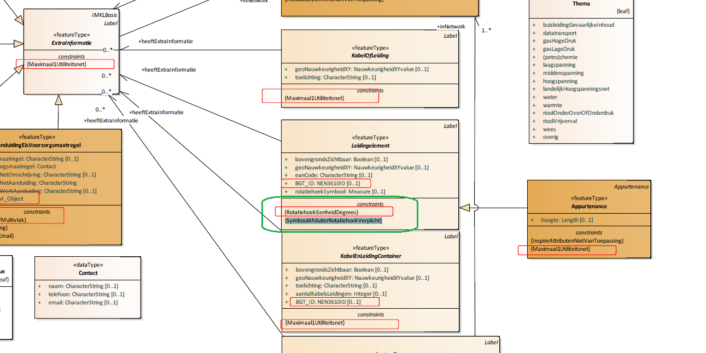
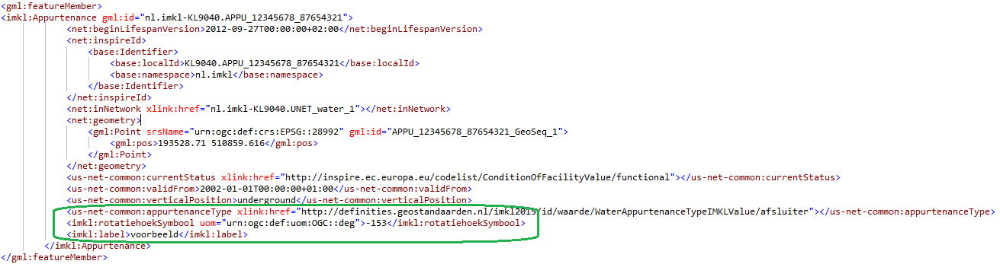

# Beschrijving Issue 282
 
## Essentie:

Rotatiehoek verplicht bij afsluiters.

## Link:

[https://github.com/Geonovum/imkl2015-review/issues/282](https://github.com/Geonovum/imkl2015-review/issues/282)

## Uitleg:

Een afsluiter wordt gevisualiseerd als dun streepje, in dezelfde kleur als het thema waar de afsluiter betrekking op heeft. In huidige IMKL-versie 1.2.1 is het reeds mogelijk om een rotatiehoek op te geven zodat de afsluiter haaks op de kabel of leiding getekend wordt. In huidige IMKL-versie 1.2.1 betreft dit een optioneel veld; als er geen rotatiehoek bekend is wordt het lijntje van de afsluiter 0 graden gedraaid en loopt dus van boven naar beneden. Op het moment dat de afsluiter betrekking heeft op een kabel/leiding die (ongeveer) Noord-Zuid ligt, is de afsluiter (vrijwel) niet zichtbaar.

_De afsluiters (binnen de cirkels) zijn 0 graden gedraaid en dus slecht zichtbaar in een Noord-Zuid leiding (zwarte cirkels) en wel bij een West-Oost leiding (groene cirkel)._

In nieuwe IMKL-versie 2.0 wordt de rotatiehoek verplicht gesteld. Het is aan de netbeheerder om te zorgen dat de rotatiehoek een waarde heeft waarmee hij genoeg afwijkt van de richting van de kabel/leiding om zichtbaar te zijn.

# De wijziging

## Model:

 

Aan IMKL 2.0 is een constraint toegevoegd voor afsluiters: `rotatiehoekSymbool` is nu verplicht

## Voorbeelden:

### GebiedsinformatieLevering-XML (IMKL v2.0)

## Mogelijke impact:

### Actualiseren netinformatie / aanleveren beheerdersinformatie:

Netinformatie of beheerdersinformatie die in IMKL 1.2.1 nog wordt goedgekeurd, zou vanwege deze validatie nu kunnen worden afgekeurd.
Bij het actualiseren/aanleveren in IMKL-versie 2.0 zal gevalideerd worden dat afsluiters een rotatiehoek hebben. Dit geldt voor:

| **waardelijst**                          | **waarde**   | **symbool** |
| ---------------------------------------- | ------------ | ---------   |
| OilGasChemicalsAppurtenanceTypeIMKLValue | afsluiter    | afsluiter   |
| SewerAppurtenanceTypeIMKLValue           | cleanOut     | afsluiter   |
| ThermalAppurtenanceTypeIMKLValue         | afsluiter    | afsluiter   |
| WaterAppurtenanceTypeIMKLValue           | afsluiter    | afsluiter   |
| WaterAppurtenanceTypeIMKLValue           | checkValve   | afsluiter   |
| WaterAppurtenanceTypeIMKLValue           | controlValve | afsluiter   |

Als bij het valideren wordt geconstateerd dat een aanlevering van netinformatie (centraal) of beheerdersinformatie (decentraal) deze beperking wordt overschreden, dan wordt de aanlevering afgekeurd.

### Uitleveren / KLIC-viewers:

Huidige uitleveringen kunnen ook al rotatiehoeken bevatten bij afsluiters, daarom is er op voor de uitleveringen geen impact te verwachten.

De huidige visualisatie regels schreven al voor dat de afsluiter geroteerd moet worden aan de hand van de rotatiehoek, daarom is er op voor de viewers geen impact te verwachten.

# Overgang:

Het betreft een verplichting van een veld in IMKL-versie 2.0, die in IMKL-versie 1.2.1 als optioneel bestond.

Mocht tijdens de overgangsperiode de netinformatie van v1.2.1 getransformeerd worden naar v2.0 wordt er een rotatiehoek van 0 graden toegevoegd, indien deze niet opgegeven was.
_Let op: hiermee is deze afsluiter dus net zo goed/slecht zichtbaar als voor de invoering van IMKL-versie 2.0._

Mocht tijdens de overgangsperiode de netinformatie van v2.0 getransformeerd worden naar v1.2.1 heeft dit geen impact omdat het veld rotatiehoek reeds beschikbaar is in v1.2.1.