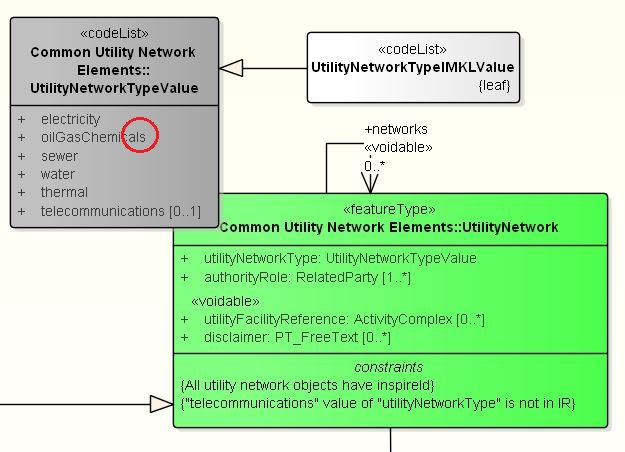

# Hints en tips bij het gebruik van IMKL2015 v1.2.1

**Inhoudsopgave**

- [Inleiding](#inleiding)
  - [Doel](#doel)
- [Namespaces en declaraties](#namespaces-en-declaraties)
  - [Standaard namespace afkortingen](#standaard-namespace-afkortingen)
  - [Verkeerde namespace declaraties](#verkeerde-namespace-declaraties)
  - [Incorrecte imkl/2015/ namespace](#incorrecte-imkl2015-namespace)
  - [Default namespace](#default-namespace)
  - [Definiering namespaces op dieper niveau](#definiering-namespaces-op-dieper-niveau)
  - [Verkeerde character encoding](#verkeerde-character-encoding)
  - [Missende namespace bij afsluitende tag](#missende-namespace-bij-afsluitende-tag)
- [XSD fouten](#xsd-fouten)
  - [Verplicht attribuut niet toegevoegd](#verplicht-attribuut-niet-toegevoegd)
  - [Niet toegestaan attribuut toegevoegd](#niet-toegestaan-attribuut-toegevoegd)
  - [Voidable](#voidable)
  - [Geen NilReason opgegeven](#geen-nilreason-opgegeven)
  - [Incorrecte geometrie](#incorrecte-geometrie)
  - [Verkeerde volgorde in gml-features](#verkeerde-volgorde-in-gml-features)
  - [Volgorde van elementen](#volgorde-van-elementen)
- [Extra validatieregels](#extra-validatieregels)
  - [IMKL v1.2.1 ExtraRegels](#imkl-v121-extraregels)
  - [OCL-constraints](#ocl-constraints)
  - [Toelichting controles netinformatie KLIC](#toelichting-controles-netinformatie-klic)
  - [KLIC-WIN validatiecode](#klic-win-validatiecode)
- [Verwijzingen](#verwijzingen)
  - [Verouderde codelijst gebruikt](#verouderde-codelijst-gebruikt)
  - [Verkeerde waarde uit codelijst gebruikt](#verkeerde-waarde-uit-codelijst-gebruikt)
  - [Thema oilGasChemical](#thema-oilgaschemical)
  - [Verwijzingen naar AppurtenanceType](#verwijzingen-naar-appurtenancetype)
  - [Verwijzingen met authorityRole](#verwijzingen-met-authorityrole)
  - [Gebruik van Maatvoering en Annotatie](#gebruik-van-maatvoering-en-annotatie)
  - [Lege xlink's](#lege-xlinks)
  - [Gebruik van eenheden (uom, Unit of Measure)](#gebruik-van-eenheden-uom-unit-of-measure)
  - [Gebruik `utilityFacilityReference`](#gebruik-utilityfacilityreference)
- [Identificaties van objecten](#identificaties-van-objecten)
  - [Format van identifiers](#format-van-identifiers)
  - [Vergelijking van identifier en gml:id](#vergelijking-van-identifier-en-gmlid)
  - [Maximaal aantal tekens](#maximaal-aantal-tekens)
  - [Associatie naar Utiliteitsnet en UtilityLink](#associatie-naar-utiliteitsnet-en-utilitylink)
  - [Driehoeksverhouding feature - Utiliteitsnet - UtilityLink](#driehoeksverhouding-feature---utiliteitsnet---utilitylink)

---------
## Inleiding

Met de introductie van IMKL2015 zal de wijze waarop de graafsector kabel- en leidinginformatie uitwisselt, sterk gaan veranderen. Waar tot nog deze informatie werd uitgewisseld op basis van "plaatjes" en bijlages, zal nu steeds meer informatie worden uitgewisseld op basis van objecten en vectordata (ook wel "features" genoemd).
Ondertussen hebben al veel verschillende netbeheerders enige ervaring opgedaan met de wijze waarop deze IMKL-features toegepast kunnen/moeten worden.

Dit document is ontstaan naar aanleiding van veel voorkomende bevindingen die in het voortraject bij het toepassen van IMKL2015 zijn geconstateerd. Een aantal voorlopende netbeheerders heeft in dat traject IMKL2015-data samengesteld en aangeleverd aan het Kadaster.\
Daarnaast is het document aangevuld met kleine voorbeelden hoe IMKL-features kunnen worden gebruikt. Wellicht handig als leidraad bij de toepassing van IMKL.

Dit document is geen wijziging, toelichting of aanvulling op de IMKL2015-standaard. Hiervoor wordt naar de IMKL2015-documentatie van Geonovum verwezen. Deze is terug te vinden op
https://github.com/Geonovum/imkl2015. \
Daarnaast heeft het Kadaster diverse presentaties opgesteld en voorbeelden uitgewerkt die de IMKL2015-gebruiker veel informatie kan geven over de toepassing van IMKL bij het KLIC-WIN-systeem.
Zie daarvoor ook https://github.com/kadaster/klic-win.

### Doel

Doel van dit document is de lezer een samenvatting met opgedane ervaringen te geven bij het toepassen van het IMKL2015-model tot nog toe. Dit kan toekomstig aansluitende netbeheerders helpen om veelvoorkomende fouten te voorkomen, waardoor het
aansluitproces soepel en effectief verloopt.

---------
## Namespaces en declaraties

De volgende bevindingen komen voort uit het gebruik van namespaces in IMKL2015 compliant GML.

### Standaard namespace afkortingen

Een willekeurig XML-dataset zit zo in elkaar dat de namespace afkorting geen betekenis heeft en alleen bedoeld is om het XML beter leesbaar te maken.
Elke dataset kan zijn eigen afkortingen definieren. Dat betekent dat in de uitwisseling tussen de datasets verschillende typen afkortingen kunnen voorkomen. 
Dat is voor de herkenbaarheid niet zo handig.  
In de sector zijn daarom werkafspraken gemaakt om op een _gelijksoortige_ wijze om te gaan met __afkortingen__ voor namespaces.  

In onderstaand voorbeeld wordt een overzicht gegeven van de te gebruiken namespace afkortingen:

```xml
<?xml version="1.0" encoding="UTF-8"?>
<gml:FeatureCollection
    xmlns:imkl="http://www.geostandaarden.nl/imkl/2015/wion/1.2"
    xmlns:gml="http://www.opengis.net/gml/3.2" 
    xmlns:xsi="http://www.w3.org/2001/XMLSchema-instance" 
    xmlns:xlink="http://www.w3.org/1999/xlink" 
    xmlns:net="http://inspire.ec.europa.eu/schemas/net/4.0" 
    xmlns:base="http://inspire.ec.europa.eu/schemas/base/3.3" 
    xmlns:base2="http://inspire.ec.europa.eu/schemas/base2/2.0" 
    xmlns:us-net-common="http://inspire.ec.europa.eu/schemas/us-net-common/4.0" 
    xmlns:us-net-ogc="http://inspire.ec.europa.eu/schemas/us-net-ogc/4.0" 
    xmlns:us-net-el="http://inspire.ec.europa.eu/schemas/us-net-el/4.0" 
    xmlns:us-net-sw="http://inspire.ec.europa.eu/schemas/us-net-sw/4.0" 
    xmlns:us-net-tc="http://inspire.ec.europa.eu/schemas/us-net-tc/4.0" 
    xmlns:us-net-th="http://inspire.ec.europa.eu/schemas/us-net-th/4.0" 
    xmlns:us-net-wa="http://inspire.ec.europa.eu/schemas/us-net-wa/4.0" 
    ...
```

Het geeft veel voordelen om op een eenduidige manier met deze namespaces om te gaan:
* Namespaces zijn direct herkenbaar voor de gebruiker
* Er is geen verschil tussen de mogelijke manieren waarop netbeheerders namespaces definiëren
* Uniformiteit geeft betere leesbaarheid (veel minder tekst; alleen de relevante informatie wordt getoond)
* Namespaces kunnen in de header worden gezet (eenmalige definitie) en binnen de elementen worden weggelaten, waardoor de omvang van de xml-file aanzienlijk wordt gereduceerd

### Verkeerde namespace declaraties

De namespace van de nieuwe versie van IMKL is `"http://www.geostandaarden.nl/imkl/2015/wion/1.2"`.   
Een voorbeeld van correcte namespace declaraties in IMKL2015 met een verwijzing naar versie 1.2.1 van IMKL:

```xml
<?xml version="1.0" encoding="UTF-8"?>
<gml:FeatureCollection
    xmlns:imkl="http://www.geostandaarden.nl/imkl/2015/wion/1.2"
    ...
    gml:id="ID_netinformatie_KL9999_2018-01-15" 
    xsi:schemaLocation="http://www.geostandaarden.nl/imkl/2015/wion/1.2 http://register.geostandaarden.nl/gmlapplicatieschema/imkl2015/1.2.1/imkl2015-wion.xsd">
```

### Incorrecte imkl/2015/ namespace

Op dit moment ondersteunt het Kadaster de imkl/2015/wion/1.2 namespace.

### Default namespace
Het is niet de bedoeling dat in een aangeleverde XML-dataset een default namespace wordt gebruikt.
De Klic-programmatuur gaat uit van de voorgedefinieerde afkortingen voor namespaces, zoals hierboven gespecificeerd.

Voorbeeld *onjuist* gebruik:
```xml
<?xml version="1.0" encoding="UTF-8"?>
<gml:FeatureCollection
    xmlns="http://www.geostandaarden.nl/imkl/2015/wion/1.2"
    ...
```

### Definiering namespaces op dieper niveau
Het is mogelijk om op een dieper niveau eigen namespaces te definieren.
De Klic-programmatuur zal deze namespaces respecteren en opnemen in de uitlevering van gebiedsinformatie.

Voorbeeld eigen namespace:
```xml
<gml:featureMember>
    <imkl:Utiliteitsnet gml:id="nl.imkl-KL3131.UNET_gasHogeDruk_4">
        ...
        <us-net-common:disclaimer >
            <gmd:PT_FreeText xmlns:gmd="http://www.isotc211.org/2005/gmd">
                <gmd:textGroup>
                    <gmd:LocalisedCharacterString>https://www.enexis.nl/Documents/brochures/brochure-graaf-zorgvuldig-klic-noord-en-zuid.pdf</gmd:LocalisedCharacterString>
                </gmd:textGroup>
            </gmd:PT_FreeText>
        </us-net-common:disclaimer>
        ...
    </imkl:Utiliteitsnet>
</gml:featureMember>
```

### Verkeerde character encoding

IMKL hanteert de UTF-8 encoding. Een voorbeeld van waar zoiets mis kan gaan is bijvoorbeeld het oude florijn teken.
Een correct voorbeeld:

```xml
    <?xml version="1.0" encoding="UTF-8"?>
```

### Missende namespace bij afsluitende tag

De afsluitende tag bevat verplicht een namespace.
Een voorbeeld is: “Afsluitende tag voor rotatiehoek mist de namespace: `</rotatiehoek>` moet `</imkl:rotatiehoek>` zijn.”

## XSD fouten

Een door netbeheerders aangeleverd XML-bestand met IMKL-features wordt gevalideerd door een laag XSD-validaties op basis van schema-definities. Dit niveau bevat een eigen laag feedback.
De schema-definities waartegen wordt gevalideerd zijn vastgelegd "imkl2015-wion.xsd".

Het voorbeeld heeft betrekking op het aanleveren van een _Rioolleiding_ met attributen die gedefinieerd zijn volgens de onderliggende INSPIRE-definities.
In het klasse-diagram van IMKL2015 is deze beschreven volgens onderstaande figuur.


### Verplicht attribuut niet toegevoegd

Attribuut vergeten toe te voegen welke verplicht is voor dat feature type.

voorbeeld: Element `pipeDiameter` is verplicht binnen het IMKL maar heeft geen waarde.

voorbeeld: Rioolleiding element `Currentstatus` is verplicht binnen het IMKL maar heeft geen waarde.

Een syntactisch juiste invulling zou kunnen zijn:
```xml
<imkl:Rioolleiding gml:id="nl.imkl-KL9999.riool00057">
    <net:beginLifespanVersion>2001-12-17T09:30:47.00+01:00</net:beginLifespanVersion>
    <net:inspireId>
        <base:Identifier>
            <base:localId>KL9999.riool00057</base:localId>
            <base:namespace>nl.imkl</base:namespace>
        </base:Identifier>
    </net:inspireId>
    <net:inNetwork xlink:href="nl.imkl-KL9999.nw_riool00052"/>
    <net:link xlink:href="nl.imkl-KL9999.ulink_00413"/>
    <us-net-common:currentStatus xlink:href="http://inspire.ec.europa.eu/codelist/ConditionOfFacilityValue/functional"/>
    <us-net-common:validFrom>2001-12-17T09:30:47.00+01:00</us-net-common:validFrom>
    <us-net-common:verticalPosition>underground</us-net-common:verticalPosition>
    <us-net-common:warningType xlink:href="http://inspire.ec.europa.eu/codelist/WarningTypeValue/net"/>
    <us-net-common:pipeDiameter uom="urn:ogc:def:uom:OGC::cm">12</us-net-common:pipeDiameter>
    <us-net-common:pressure uom="urn:ogc:def:uom:OGC::bar">2</us-net-common:pressure>
    <us-net-sw:sewerWaterType xlink:href="http://inspire.ec.europa.eu/codelist/SewerWaterTypeValue/sanitary"/>
</imkl:Rioolleiding>
```

### Niet toegestaan attribuut toegevoegd
Attribuut toegevoegd welke niet is toegestaan voor dat feature type.

voorbeeld: Element 'us-net-el:operatingVoltage' is niet toegestaan binnen het IMKL van dit feature type.

Een syntactisch *onjuiste* invulling...:
```xml
<imkl:Rioolleiding gml:id="nl.imkl-KL9999.riool00057">
    ...
    <us-net-el:operatingVoltage uom="urn:ogc:def:uom:OGC::V">220</us-net-el:operatingVoltage>
    ...
</imkl:Rioolleiding>
```

### Voidable
Bij attributen en associaties die het stereotype "\<\<voidable\>\>" hebben kan, indien het van
toepassing is, geen waarde worden ingevuld. Optioneel kan er ook een reden opgenomen worden waarom
er geen waarde is ingevuld.  
De benoemde redenen volgens INSPIRE zijn:
- `Unknown`: Waarde onbekend: De waarde is bij de zender niet bekend.
- `Unpopulated`: Niet ondersteund: De zender houdt in zijn registratie geen waarde voor dit attribuut bij.
Geldt voor alle objecten van dit objecttype.
- `Withheld`: Niet geautoriseerd: De zender vindt dat de ontvanger niet geautoriseerd is om de waarde te
kennen. Waarde is vertrouwelijk en wordt niet uitgewisseld.

Zie: http://inspire.ec.europa.eu/codelist/VoidReasonValue/

NB. In de XSD wordt gerefereerd naar de waardelijst `gml:NilReasonEnumaration`.
Deze heeft andere mogelijk in te vullen waarden. We bevelen aan om de door INSPIRE voorgeschreven waarden te gebruiken.

### Geen NilReason opgegeven
Bij verplichte attributen die aangegeven zijn als "\<\<voidable\>\>" moet
- óf een waarde worden ingevuld,
- óf een NilReason worden opgegeven als de waarde ontbreekt. De opgave van de reden is overigens optioneel.

Voorbeeld foutmelding: Attribuut `us-net-common:verticalPosition` heeft geen waarde en geen NilReason.

In onderstaande XML-gegevensset zijn enkele verplichte attributen van een rioolleiding ingevuld met geldige referenties naar codelijsten:
```xml
    ...
    <!-- attribuutwaarden toegekend -->
    <us-net-common:currentStatus xlink:href="http://inspire.ec.europa.eu/codelist/ConditionOfFacilityValue/projected"/>
    <us-net-common:verticalPosition>underground</us-net-common:verticalPosition>
    <us-net-common:warningType xlink:href="http://inspire.ec.europa.eu/codelist/WarningTypeValue/net"/>
    <us-net-common:pipeDiameter uom="urn:ogc:def:uom:OGC::cm">12</us-net-common:pipeDiameter>
    <us-net-sw:sewerWaterType xlink:href="http://inspire.ec.europa.eu/codelist/SewerWaterTypeValue/sanitary"/>
    ...
```
Voorbeelden van syntactisch juiste invullingen als een NilReason wordt opgegeven::
```xml
    ...
    <!-- attribuutwaarden met NilReason -->
    <us-net-common:currentStatus xsi:nil="true"/>
    <us-net-common:verticalPosition xsi:nil="true"/>
    <!-- attribuutwaarden met NilReason en opgave van reden -->
    <us-net-common:warningType xsi:nil="true" nilReason="Unknown"/>
    <us-net-common:pipeDiameter xsi:nil="true" nilReason="Unpopulated"/>
    <us-net-sw:sewerWaterType xsi:nil="true" nilReason="Withheld"/>
    ...
```

### Incorrecte geometrie
In de dataset is incorrecte INSPIRE GML geometrie gebruikt, bijvoorbeeld het type Multicurve.

voorbeeld: XSD validatiefout: cvc-complex-type.2.4.a: Invalid content was found starting with element 'gml:MultiCurve'

Een niet in IMKL gedefinieerd GML 3.2.1 geometrie type is gebruikt.
Het type Multicurve is weliswaar ondersteund in GML, echter niet ondersteund in geometrie in INSPIRE (UtilityLink).

### Verkeerde volgorde in gml-features
Een fout in de volgorde van hóe het feature is gedefinieerd in de GML.

voorbeeld:
Invalid content was found starting with element 'imkl:Annotatie'. One of '{"http://www.opengis.net/gml/3.2":AbstractFeature}' is expected. \[lineNr: x, columnNr: y\]

Voorbeeld van syntactisch juiste invulling:
```xml
<imkl:Annotatie gml:id="nl.imkl-KL9999.ann_tst00532">
    ...
    <imkl:ligging>
        <gml:LineString srsName="urn:ogc:def:crs:EPSG::28992" gml:id="nl.imkl-KL9999.ann_tst00532_geo">
            <gml:posList>123281.263 383887.883 123279.616 383891.403</gml:posList>
        </gml:LineString>
    </imkl:ligging>
</imkl:Annotatie>
```

### Volgorde van elementen
De volgorde van de elementen `thema` en `standaardDieptelegging` is niet correct.

Voorbeeld van _onjuiste_ volgorde:
```xml
<imkl:Utiliteitsnet gml:id="nl.imkl-KL9999.nw_00004">
    <us-net-common:utilityNetworkType xlink:href="http://inspire.ec.europa.eu/codelist/UtilityNetworkTypeValue/electricity"/>
    <us-net-common:authorityRole xlink:href="http://inspire.ec.europa.eu/codelist/RelatedPartyRoleValue/operator"/>
    ...
    <imkl:standaardDieptelegging uom="urn:ogc:def:uom:OGC::m">0.65</imkl:standaardDieptelegging>
    <imkl:thema xlink:href="http://definities.geostandaarden.nl/imkl2015/id/waarde/Thema/laagspanning"/>
</imkl:Utiliteitsnet>
```
Het element `thema` dient in IMKL boven het optionele element `standaardDieptelegging` te worden geplaatst.

---------
## Extra validatieregels
Naast validaties die afgedwongen kunnen worden op basis van een XML-schema-definitie (XSD), zijn er binnen IMKL nog regels afgesproken die niet in een XSD zijn te valideren.

### IMKL v1.2.1 ExtraRegels
In het Excel-document "IMKL2015 v 1.2.1_object-attributen-ExtraRegels.xlsx" wordt op een tabblad per IMKL-feature van elk attribuut aangegeven welke regels hiervoor gelden.   
Zie de publicatie zoals vastgelegd bij Geonovum: https://github.com/Geonovum/imkl2015/tree/master/regels.

Voorbeeld:   
Voor feature "Electriciteitskabel" is het attribuut "operatingVoltage" verplicht en de UOM wordt uitgedrukt met urn:ogc:def:uom:OGC::V

### OCL-constraints
Niet alle regels zijn in een XSD vast te leggen.  
In het IMKL zijn veel extra validatieregels vastgelegd als "OCL-constraint". Zie daarvoor het informatiemodel, zoals vastgelegd bij Geonovum. Zie https://github.com/Geonovum/imkl2015/tree/master/informatiemodel/1.2.1

Met deze constraints kunnen regels worden gedefinieerd waarbij bijzondere condities of afhankelijkheden tussen verschillende elementen worden aangegeven.
Het uitvoeren van deze validatieregels dient te gebeuren met specifiek daarvoor bedoelde software (bijv. Schematron) en vraagt de nodige systeemresources.  
In het Klic-systeem zijn deze controles geimplementeerd in de eigen software.

Voorbeeld bij IMKL-feature `ContainerLeidingelement` (abstract) met constraint "RotatiehoekEenheidDegrees":
```xml
/* Rotatiehoek van het symbool in graden. */
Inv: self.rotatiehoekSymbool.Measure.uom = 'urn:ogc:def:uom:OGC::deg'
```

Voorbeeld bij IMKL-feature `Belanghebbende` met constraint "RegelsIndienNietbetrokken":
```xml
/* Regels indien netbeheerder niet betrokken:
geen netinformatie,
geen eigenTopografie,
eisVoorzorgsmaatregelBijlage=nee,
wel bijlage optioneel */

Inv RegelsIndienNietbetrokken:
(Gebiedsinformatielevering :: allInstances() -> size () = 1 and not(self.betrokkenBijAanvraag)) implies
(self.netinformatie->isEmpty()
and
self.eigenTopografie->isEmpty()
and
not(self.eisVoorzorgsmaatregel)
and
not(self.bijlage.oclIsTypeOf(EisVoorzorgsmaatregelBijlage))
```

### Toelichting controles netinformatie KLIC
In de publicatie [Toelichting controles netinformatie KLIC](Toelichting%20controles%20netinformatie%20KLIC.md) wordt een toelichting gegeven op controles die door het Klic-systeem worden uitgevoerd bij aanlevering van IMKL-netinformatie.

Netbeheerders krijgen in het nieuwe KLIC de keuze om centraal te gaan, waarbij ze hun netinformatie in een centrale voorziening zetten, of decentraal te gaan waarbij ze - net als in de oude situatie - per gebiedsinformatie-aanvraag beheerdersinformatie aanleveren aan het Kadaster.

In beide gevallen wordt voor de definiëring van de aan te leveren vectordata gebruik gemaakt van hetzelfde IMKL-model. De validatie van de vector informatie is in beide gevallen - op een enkele uitzondering na - gelijk.

### KLIC-WIN validatiecode
Het Kadaster heeft voor het project KLIC-WIN eenmalig ("as-is") validatiecode beschikbaar gesteld aan de netbeheerder of degene die in opdracht van hem werkzaamheden verricht, om naast de functionele beschrijving aanvullend inzicht te geven in de door het Kadaster gerealiseerde validaties van netinformatie.  
Deze validatiecode kan als hulpmiddel worden gebruikt voor de realisatie van validaties van netinformatie bij netbeheerders.

De validatiecode is gepubliceerd op Github (https://github.com/kadaster/klic-win/blob/master/Toepassing%20IMKL/KLIC-WIN%20validatiecode.zip).  
Op deze code is een disclaimer van toepassing.

---------
## Verwijzingen

Onderstaande bevindingen komen voort uit validaties waarbij wordt gecontroleerd of er juiste (geldige) verwijzingen worden gebruikt in de IMKL-dataset.
Let op dat bepaalde waardelijsten thema-gebonden zijn: niet elke waarde kan voor elk IMKL-thema worden gebruikt.

### Verouderde codelijst gebruikt

De gebruikte codelijst is verouderd. Er moet een referentie naar de nieuwe codelijst moet worden gebruikt.

Incorrect is bijvoorbeeld: `<imkl:thema xlink:href="http://www.geonovum.nl/imkl/2015/1.0/def/Thema/water"/>`

Correct is hier: `<imkl:thema xlink:href="http://definities.geostandaarden.nl/imkl2015/id/waarde/Thema/water"/>`

### Verkeerde waarde uit codelijst gebruikt

De ingevulde waarde komt komt niet voor in de gebruikte codelijst. Foutmelding is dan: Waarde '\[CODELIJSTWAARDE\] komt niet
voor in codelijst '\[CODELIJST\]'. (Incorrecte codelijst gebruikt).

### Thema `oilGasChemical`
In het UML-model van INSPIRE wordt met de waardelijst _UtilityNetworkTypeValue_ de mogelijke INSPIRE-thema's voor een _UtilityNetwork_ aangegeven.



In dit UML-model wordt gesproken over het thema `oilGasChemicals`, maar dit hoort te zijn `oilGasChemical` (zonder afsluitende "s")!

Deze waardelijst wordt gepubliceerd als codelijst in het register en deze is leidend.
Zie: http://inspire.ec.europa.eu/codelist/UtilityNetworkTypeValue/oilGasChemical

In het overzicht van waardelijsten (zie IMKL2015 - 1.2.1 waardelijsten.xlsx) is deze wél correct opgenomen.
De IMKL-waardelijst _UtilityNetworkTypeIMKLValue_ overerft de waarden uit _UtilityNetworkTypeValue_ en wordt nog aangevuld met de waarde "overig".

### Verwijzingen naar AppurtenanceType

Veel voorkomende foutieve verwijzingen naar een codelijst (waardelijst) hebben betrekking op de invulling van het 'AppurtenanceType'.
Een extra bijzonderheid hierbij is dat deze waardelijst varierend is per INSPIRE-thema. Er is een verschillende codelijst voor

| INSPIRE-thema      | INSPIRE-codelijst                       | IMKL-codelijst                              |
|--------------------|-----------------------------------------|---------------------------------------------|
| electricity        | ElectricityAppurtenanceTypeValue        | ElectricityAppurtenanceTypeIMKLValue        |
| oilGasChemical     | OilGasChemicalsAppurtenanceTypeValue    | OilGasChemicalsAppurtenanceTypeIMKLValue    |
| sewer              | SewerAppurtenanceTypeValue              | SewerAppurtenanceTypeIMKLValue              |
| telecommunications | TelecommunicationsAppurtenanceTypeValue | TelecommunicationsAppurtenanceTypeIMKLValue |
| thermal            | ThermalAppurtenanceTypeValue            | ThermalAppurtenanceTypeIMKLValue            |
| water              | WaterAppurtenanceTypeValue              | WaterAppurtenanceTypeIMKLValue              |

De toegestane waardes voor IMKL kunnen een uitbreiding of een inperking op de waardelijst zijn zoals deze in INSPIRE is gedefinieerd.
Zie daarvoor ook de Geonovum-documentatie op Github:
https://github.com/Geonovum/imkl2015/tree/master/waardelijst/1.2.1\
Het is niet de bedoeling dat gebruik wordt gemaakt van de verwijzingen naar de INSPIRE-waardelijst, omdat dan de inperking op de lijst niet wordt gerespecteerd.

In onderstaande figuur worden de toegestane waarden weergegeven voor een IMKL rioolleiding.
De waarden onder het kopje \<\<inspire\>\> met een '-' teken, zijn een inperking van de INSPIRE-codelijst. Ze mogen niet worden gebruikt.
De waarden onder het kopje \<\<imkl\>\> en \<\<gwsw\>\> zijn uitbreidingen op de INSPIRE-lijst.


Voorbeelden (mix van verschillende thema's):

```xml
    ...
    <!-- onderstaande verwijzing NIET gebruiken: -->
    <us-net-common:appurtenanceType xlink:href="http://inspire.ec.europa.eu/codelist/ElectricityAppurtenanceTypeValue/connectionBox"/>
    <!-- daarvoor in de plaats WEL gebruiken: -->
    <us-net-common:appurtenanceType xlink:href="http://definities.geostandaarden.nl/imkl2015/id/waarde/ElectricityAppurtenanceTypeIMKLValue/connectionBox"/>

    <us-net-common:appurtenanceType xlink:href="http://definities.geostandaarden.nl/imkl2015/id/waarde/OilGasChemicalsAppurtenanceTypeIMKLValue/pumpingStation"/>

    <us-net-common:appurtenanceType xlink:href="http://definities.geostandaarden.nl/imkl2015/id/waarde/SewerAppurtenanceTypeValue/connection"/>

    <us-net-common:appurtenanceType xlink:href="http://definities.geostandaarden.nl/imkl2015/id/waarde/TelecommunicationsAppurtenanceTypeIMKLValue/mof"/>

    <us-net-common:appurtenanceType xlink:href="http://definities.geostandaarden.nl/imkl2015/id/waarde/ThermalAppurtenanceTypeIMKLValue/puntVanLevering"/>

    <us-net-common:appurtenanceType xlink:href="http://definities.geostandaarden.nl/imkl2015/id/waarde/WaterAppurtenanceTypeIMKLValue/afsluiter"/>
    ...
```

### Verwijzingen met authorityRole

INSPIRE biedt de mogelijkheid om veel gegevens over "gerelateerde partijen" (_RelatedParty_) vast te leggen met het attribuut `authorityRole` van een _UtilityNetwork_. Het attribuut refereert naar 'Parties authorized to manage a utility network, such as maintainers, operators or owners.'. \
In het INSPIRE-model zit een omissie, waardoor het niet mogelijk is om objecten van het type "RelatedParty" vast te leggen...\
Vanuit een WION-perspectief hoeven we daar geen gebruik van te maken, omdat veel contactgegevens van netbeheerders al op een andere wijze worden geregistreerd. Denk aan de organisatiegegevens van een beheerder, verschillende contactgegevens bij een belang, of een contact bij een eis voorzorgsmaatregel.
Voor het verplicht in te vullen attribuut `authorityRole` worden nu referenties vastgelegd naar een INSPIRE-codelijst "RelatedPartyRoleValue". In de Geonovum-documentatie over waardelijsten is aangegeven dat slechts een beperkte set is toegestaan.

Waardelijst RelatedPartyRoleValue (IMKL2015 v1.2.1):

| waarde    | naam       | definitie                                                                                                    |
|-----------|------------|--------------------------------------------------------------------------------------------------------------|
| authority | autoriteit | Een betrokkene die wettelijk is verplicht om toe te zien op een hulpbron en/of bij een hulpbron betrokkenen. |
| operator  | exploitant | Een betrokkene die een hulpbron beheert.                                                                     |
| owner     | eigenaar   | Een betrokkene die een hulpbron bezit, d.w.z. aan wie een hulpbron wettelijk toebehoort.                     |

Voorbeeld van het gebruik van `authorityRole`:
```xml
<imkl:Utiliteitsnet gml:id="nl.imkl-KL9999.nw_GLD00023">
    <us-net-common:utilityNetworkType xlink:href="http://inspire.ec.europa.eu/codelist/UtilityNetworkTypeValue/oilGasChemical"/>
    <us-net-common:authorityRole xlink:href="http://inspire.ec.europa.eu/codelist/RelatedPartyRoleValue/operator"/>
    <imkl:identificatie>
        ...
    </imkl:identificatie>
    ...
    <imkl:thema xlink:href="http://definities.geostandaarden.nl/imkl2015/id/waarde/Thema/gasLageDruk"/>
</imkl:Utiliteitsnet>
```

### Gebruik van Maatvoering en Annotatie
De featuretypes _Maatvoering_ en _Annotatie_ ondersteunen een grote variatie aan mogelijkheden om maatvoering/annotatie te plaatsen bij liggingsgegevens van kabels en leidingen.
De relevante kenmerken van deze features, zoals gedefinieerd in IMKL2015 v1.2.1, zijn weergegeven in onderstaande figuur.


De labels behorend bij de objecttypen _Maatvoering_ en _Annotatie_ worden ingevuld via het object Label.
Het af te beelden label (getal of tekst) wordt opgenomen bij het attribuut `label`. In het attribuut `omschrijving` kan een betekenis worden opgenomen.
Het plaatsingspunt van een label wordt bepaald op basis van aangrijpingspunten t.a.v. de geometrie in het attribuut `ligging`.

In onderstaand voorbeeld is een object _Maatvoering_ gespecificeerd met als `maatvoeringsType` "maatvoeringspijl" waarbij de ligging is vastgelegd met een "LineString". Het aangrijpingspunt van het label "4,5" is horizontaal en vertikaal het midden van de geometrie.


```xml
<imkl:Maatvoering gml:id="nl.imkl-KL9999.mvpijl_00543">
    ...
    <imkl:label>4,5</imkl:label>
    <imkl:inNetwork xlink:href="..."/>
    <imkl:maatvoeringsType xlink:href="http://definities.geostandaarden.nl/imkl2015/id/waarde/MaatvoeringsTypeValue/maatvoeringspijl"/>
    <imkl:rotatiehoek uom="urn:ogc:def:uom:OGC::deg">20</imkl:rotatiehoek>
    <imkl:labelpositie>
        <imkl:Labelpositie>
            <imkl:aangrijpingHorizontaal xlink:href="http://definities.geostandaarden.nl/imkl2015/id/waarde/LabelpositieValue/0"/>
            <imkl:aangrijpingVerticaal xlink:href="http://definities.geostandaarden.nl/imkl2015/id/waarde/LabelpositieValue/0"/>
        </imkl:Labelpositie>
    </imkl:labelpositie>
    <imkl:ligging>
        <gml:LineString srsName="urn:ogc:def:crs:EPSG::28992" gml:id="nl.imkl-KL9999.463d65cb-8bfe-491e-837f-599efdc78bd0">
            <gml:posList>154965.763 389492.883 154967.803 3894488.403</gml:posList>
        </gml:LineString>
    </imkl:ligging>
</imkl:Maatvoering>
```

In de huidige praktijk blijkt dat het grootste deel van aangeleverde objecten van het type _Annotatie_ en _Maatvoering_ zijn!
Het heeft dus voorkeur om als `maatvoeringsType` en `annotatieType` waarden te gebruiken die een combinatie van verschillende objectdelen beschrijven.
Gebruik dus bijv. 1 Annotatie-object van het type 'annotatiepijlDubbelgericht' i.p.v. meerdere Annotatie-objecten van resp. de types 'annotatiepijlpunt', 'annotatielijn', 'annotatiepijlpunt' en 'annotatielabel'.

### Verwijzingen naar buismateriaal
Features die leidingen definieren (bijv. _Rioolleiding_, _Waterleiding_), objecten van het type _Mantelbuis_ en objecten van het type _Overig_ overerven van het abstracte feature _BuisSpecifiek_.
Hiermee bestaat de mogelijkheid om het buismateriaal van de leiding vast te leggen.
De te gebruiken buismaterialen zijn genoemd in de codelijst "PipeMaterialTypeIMKLValue", een set met INSPIRE-waarden aangevuld met IMKL-specifieke waarden.

Voorbeeld:
```xml

<imkl:Mantelbuis gml:id="nl.imkl-KL9999.mb_00536">
    ...
    <us-net-common:verticalPosition>underground</us-net-common:verticalPosition>
    <us-net-common:warningType xlink:href="http://inspire.ec.europa.eu/codelist/WarningTypeValue/net"/>
    <us-net-common:pipeDiameter uom="urn:ogc:def:uom:OGC::cm">100</us-net-common:pipeDiameter>
    <imkl:buismateriaalType xlink:href="http://definities.geostandaarden.nl/imkl2015/id/waarde/PipeMaterialTypeIMKLValue/asbestos-cement"/>
</imkl:Mantelbuis>


<imkl:Overig gml:id="nl.imkl-KL9999.ml_00537">
    ...
    <imkl:buismateriaalType xlink:href="http://definities.geostandaarden.nl/imkl2015/id/waarde/PipeMaterialTypeIMKLValue/polyester"/>
    <imkl:pipeDiameter uom="urn:ogc:def:uom:OGC::cm">12.5</imkl:pipeDiameter>
    <imkl:pressure uom="urn:ogc:def:uom:OGC::bar">5.3</imkl:pressure>
    <imkl:producttype>Melkleiding van boer naar grootafnemer</imkl:producttype>
</imkl:Overig>
```

### Lege xlink's

Het is niet toegestaan om een `xlink` te gebruiken zonder referentie.

Voorbeelden:
```xml
    <!-- NIET correct, omdat de referentie niet is ingevuld:	-->
    <net:inNetwork xlink:href=""/>

    <!-- WEL (semantisch) correct:								-->
    <net:inNetwork xlink:href="nl.imkl-KL9999.nw_riool00052"/>
    <us-net-common:utilityNetworkType xlink:href="http://inspire.ec.europa.eu/codelist/UtilityNetworkTypeValue/thermal"/>
```

### Gebruik van eenheden (uom, Unit of Measure)

Veel objecten kennen attributen waarbij een waarde opgegeven moet worden, Denk bijvoorbeeld aan `lengte`, `diepte`, `diameter`, `rotatiehoek`, `druk`, etc.
Bij deze waarden is het verplicht op de eenheid op te geven voor de betreffende waarde. Denk bijvoorbeeld aan 'm' (meter), 'cm' (centimeter), 'deg' (graden), 'bar', etc.
Bij de waarde van het attribuut moet dan een extra attribuut worden gebruikt met de toegepaste eenheid, de 'Unit of Measure (uom)'.
Deze eenheden zijn gedefinieerd door de OGC en als standaard beschikbaar gesteld (OGC URN codes), bijvoorbeeld: `<us-net-common:pipeDiameter uom="urn:ogc:def:uom:OGC::cm">`.

De toegestane eenheden varieren per soort attribuut. Zie daarvoor ook de extra regels voor object-attributen zoals gepubliceerd in de Geonovum-documentatie op Github:
https://github.com/Geonovum/imkl2015/tree/master/regels/1.2.1

Voorbeelden van het gebruik van eenheden

| objecttype                    | attribuut              | UML-type | toegestane eenheden (URN-codes) |
|-------------------------------|------------------------|----------|---------------------------------|
| Elektricteitskabel            | operatingVoltage       | Measure  | urn:ogc:def:uom:OGC::V   |
| Elektricteitskabel            | kabelDiameter          | Measure  | urn:ogc:def:uom:OGC::m   |
|                               |                        |          | urn:ogc:def:uom:OGC::cm  |
| Telecommunicatiekabel         | kabelDiameter          | Measure  | urn:ogc:def:uom:OGC::m   |
|                               |                        |          | urn:ogc:def:uom:OGC::cm  |
|                               |                        |          | urn:ogc:def:uom:OGC::mm  |
| OlieGasChemicalienPijpleiding | pipeDiameter           | Measure  | urn:ogc:def:uom:OGC::m   |
|                               |                        |          | urn:ogc:def:uom:OGC::cm  |
|                               |                        |          | urn:ogc:def:uom:OGC::mm  |
| OlieGasChemicalienPijpleiding | pressure               | Measure  | urn:ogc:def:uom:OGC::bar |
| Duct                          | ductWidth              | Length   | urn:ogc:def:uom:OGC::m   |
|                               |                        |          | urn:ogc:def:uom:OGC::cm  |
| Appurtenance                  | hoogte                 | Length   | urn:ogc:def:uom:OGC::m   |
|                               |                        |          | urn:ogc:def:uom:OGC::cm  |
|                               |                        |          | urn:ogc:def:uom:OGC::mm  |
| Toren                         | towerHeight            | Length   | urn:ogc:def:uom:OGC::m   |
|                               |                        |          | urn:ogc:def:uom:OGC::cm  |
|                               |                        |          | urn:ogc:def:uom:OGC::mm  |
| Mast                          | poleHeight             | Length   | urn:ogc:def:uom:OGC::m   |
|                               |                        |          | urn:ogc:def:uom:OGC::cm  |
|                               |                        |          | urn:ogc:def:uom:OGC::mm  |
| Maatvoering                   | rotatieHoek            | Measure  | urn:ogc:def:uom:OGC::deg |
| DiepteTovMaaiveld             | dieptePeil             | Measure  | urn:ogc:def:uom:OGC::m   |
| DiepteNAP                     | maaiveldPeil           | Measure  | urn:ogc:def:uom:OGC::m   |
| Utiliteitsnet                 | standaardDieptelegging | Measure  | urn:ogc:def:uom:OGC::m   |

Voorbeelden:
```xml
    <us-net-el:operatingVoltage uom="urn:ogc:def:uom:OGC::V">220</us-net-el:operatingVoltage>

    <imkl:kabelDiameter uom="urn:ogc:def:uom:OGC::cm">12</imkl:kabelDiameter>

    <us-net-common:pipeDiameter uom="urn:ogc:def:uom:OGC::cm">15</us-net-common:pipeDiameter>

    <us-net-common:pressure uom="urn:ogc:def:uom:OGC::bar">5</us-net-common:pressure>

    <us-net-common:ductWidth uom="urn:ogc:def:uom:OGC::cm">40</us-net-common:ductWidth>

    <imkl:hoogte uom="urn:ogc:def:uom:OGC::cm">25</imkl:hoogte>

    <us-net-common:towerHeight uom="urn:ogc:def:uom:OGC::m">112</us-net-common:towerHeight>

    <us-net-common:poleHeight uom="urn:ogc:def:uom:OGC::m">46</us-net-common:poleHeight>

    <imkl:rotatiehoek uom="urn:ogc:def:uom:OGC::deg">20</imkl:rotatiehoek>

    <imkl:dieptePeil uom="urn:ogc:def:uom:OGC::m">1.40</imkl:dieptePeil>

    <imkl:maaiveldPeil uom="urn:ogc:def:uom:OGC::m">-2.30</imkl:maaiveldPeil>

    <imkl:standaardDieptelegging uom="urn:ogc:def:uom:OGC::m">1.25</imkl:standaardDieptelegging>
```

### Gebruik `utilityFacilityReference`
De attributen `us-net-common:utilityFacilityType` en `us-net-common:governmentalServiceReference` van het abstracte Inspire-feature _UtilityNetworkElement_ zijn beide optioneel.
De attributen hoeven dus - volgens IMKL - niet meegegeven te worden.


Voorbeeld:
```xml
<gml:featureMember>
    <imkl:OlieGasChemicalienPijpleiding gml:id="nl.imkl-KL3131.<id>">
        ...
        <us-net-common:verticalPosition >underground</us-net-common:verticalPosition>
        <!-- niets noemen -->
        <us-net-common:utilityDeliveryType xlink:href="http://inspire.ec.europa.eu/codelist/UtilityDeliveryTypeValue/distribution"></us-net-common:utilityDeliveryType>
        <us-net-common:warningType xsi:nil="true"></us-net-common:warningType>
        ...
    </imkl:OlieGasChemicalienPijpleiding>
</gml:featureMember>
```
Als het attribuut wél meegegeven wordt, dan \
a)	Moet er een _ActivityComplex_, respectievelijk een _GovernmentalService_ worden aangegeven.
Beide features hebben we in de huidige versie van het IMKL niet onderkend en er wordt niets mee gedaan,
óf \
b)	Moet er een nilReason worden aangegeven (element is “voidable”)

Voorbeeld:
```xml
<gml:featureMember>
    <imkl:OlieGasChemicalienPijpleiding gml:id="nl.imkl-KL3131.<id>">
        ...
        <us-net-common:utilityFacilityReference xsi:nil="true" nilReason="missing"/>
        <us-net-common:governmentalServiceReference xsi:nil="true" nilReason="missing"/>
        ...
    </imkl:OlieGasChemicalienPijpleiding>
</gml:featureMember>
```
Omdat IMKL er momenteel niets mee doet, is het gebruik van deze attributen zinloos.

---------
## Identificaties van objecten

Bij het valideren van een GML-compliant dataset met IMKL-objecten wordt gecontroleerd of de objecten een (syntactisch) juiste ID hebben.
Eveneens wordt gecontroleerd op gebruikte referenties naar andere objecten uit de GML-dataset. Onderstaand overzicht zijn aandachtspunten die voortkomen uit het onjuist gebruik van (referenties naar) object-ID's.

### Format van identifiers

Objecten (ook wel 'Features') worden in INSPIRE geidentificeerd door een `inspireId` van het type `Identifier`.
In IMKL worden features geidentificeerd door een `identificatie` van het type `NEN3610ID`.

Beide identifiers hebben een attribuut `namespace`, die in beide gevallen ingevuld moet zijn met “nl.imkl”.
Ook hebben beide identifiers een attribuut ten behoeve van unieke lokale identifier van een feature, respectievelijk `localId` en `lokaalID` genoemd.
Deze lokale identifier bestaat altijd uit de eigen bronhoudercode van de netbeheerder gevolgd door een punt en een door de netbeheerder vrij te bepalen unieke lokale identifier.
De bronhoudercode is een unieke code per bronhouder, uitgegeven door het Kadaster, met als format "XX9999".

Elk object in het GML-bestand krijgt een \<gml:id\>. Dit `gml:id` heeft geen informatiewaarde maar is nodig om interne en externe referenties te realiseren.
Het `gml:id` is een concatenatie van de volledige identifier, bestaande uit de namespace en lokale identifier, met een "-" als scheidingsteken.

Er is wel een beperking aan de te gebruiken karakters van de lokale identifier. Volgens NEN3610 mogen de volgende karakters voorkomen: {”A”…”Z”, “a”…”z”, ”0”…”9”, “_”, “-“, “,”, ”.”}.
Omdat echter de karakters "." en "-" ook anderszins als scheidingsteken kunnen worden gebruikt, mogen deze NIET in de lokale identifier worden gebruikt.
Zie daarvoor ook de hoofdstukken "Identifier management" en "Nadere GML implementatie specificaties" uit het 'IMKL2015_Dataspecificatie_1.2.1.pdf' document op de Github van Geonovum: https://github.com/Geonovum/imkl2015/tree/master/informatiemodel/1.2.1.

Voorbeeld van een INSPIRE-feature:
```xml
<us-net-common:UtilityLink gml:id="nl.imkl-KL9999.ul_825200388">
    <net:beginLifespanVersion>2001-12-17T09:30:47.00+01:00</net:beginLifespanVersion>
    <net:inspireId>
        <base:Identifier>
            <base:localId>KL9999.ul_825200388</base:localId>
            <base:namespace>nl.imkl</base:namespace>
        </base:Identifier>
    </net:inspireId>
    ...
</us-net-common:UtilityLink>
```

Voorbeeld van een IMKL-feature:
```xml
<imkl:Utiliteitsnet gml:id="nl.imkl-KL9999.nw_GHD_509370004">
    ...
    <imkl:identificatie>
        <imkl:NEN3610ID>
            <imkl:namespace>nl.imkl</imkl:namespace>
            <imkl:lokaalID>KL9999.nw_GHD_509370004</imkl:lokaalID>
        </imkl:NEN3610ID>
    </imkl:identificatie>
    ...
</imkl:Utiliteitsnet>
```

### Vergelijking van identifier en gml:id

Bij een INSPIRE-object moet de concatenatie van `base:namespace` + "-" + `base:localId` gelijk zijn aan de GML-identificatie `gml:id`.
Evenzo moet bij een IMKL-object de concatenatie van `imkl:namespace` + "-" + `imkl:lokaalID` gelijk zijn aan de GML-identificatie `gml:id`.
Zie bovenstaand voorbeeld.

### Maximaal aantal tekens

In het IMKL is de werkafspraak gemaakt dat het `lokaalID` maximaal 255 tekens mag bevatten.
Dat betekent dus dat de maximale lengte van een `gml:id` 265 tekens kan zijn, volgens:

| onderdelen `gml:id`   | waarde                   | aantal tekens                     |
|-----------------------|--------------------------|-----------------------------------|
| <imkl:namespace>      | "nl.imkl"                | 7 tekens                          |
| (separator)           | "-"                      | 1 teken                           |
| <imkl:lokaalID>       | bronhoudercode.lokaalID  | een totaal van maximaal 255 tekens|
| (separator)           | "-"                      | 1 teken                           |
| <imkl:versie>         | volgnummer               | aanname: maximaal 1 teken         |

### Associatie naar Utiliteitsnet en UtilityLink

IMKL-objecten moeten een verwijzing hebben naar het netwerk waartoe deze behoort. Deze verwijzing wordt gemaakt met de associatie `inNetwork`.
Bij het valideren van de dataset wordt gecontroleerd of het object waarnaar wordt verwezen, binnen de dataset bestaat.
Is dat niet het geval dan wordt gemeld dat "Feature verwijst naar een niet in dataset bestaand Utiliteitsnetwerk".

IMKL-objecten die overerven van de abstracte featuretypes _KabelOfLeiding_ of _KabelEnLeidingContainer_ moeten minimaal een (1) verwijzing hebben naar een geometrie-object van het type _UtilityLink_. Deze verwijzing wordt gemaakt met de associatie `link`.

Voorbeeld van een  verwijzing naar een bestaand netwerk (zie hierboven) en een bestaande _UtilityLink_:
```xml
<imkl:OlieGasChemicalienPijpleiding gml:id="nl.imkl-KL9999.ghd_52885200018">
    <net:beginLifespanVersion>2001-12-17T09:30:47.00+01:00</net:beginLifespanVersion>
    <net:inspireId>
        <base:Identifier>
            <base:localId>KL9999.KL9999.ghd_52885200018</base:localId>
            <base:namespace>nl.imkl</base:namespace>
        </base:Identifier>
    </net:inspireId>
    <net:inNetwork xlink:href="nl.imkl-KL9999.nw_GHD_509370004"/>
    ...
    <net:link xlink:href="nl.imkl-KL9999.ulink_4279931100403"/>
    ...
</imkl:OlieGasChemicalienPijpleiding>

<us-net-common:UtilityLink gml:id="nl.imkl-KL9999.ulink_4279931100403">
    <net:beginLifespanVersion>2001-12-17T09:30:47.00+01:00</net:beginLifespanVersion>
    <net:inspireId>
        <base:Identifier>
            <base:localId>KL9999.ulink_4279931100403</base:localId>
            <base:namespace>nl.imkl</base:namespace>
        </base:Identifier>
    </net:inspireId>
    <net:inNetwork xlink:href="nl.imkl-KL9999.nw_GHD_509370004"/>
    <net:centrelineGeometry>
        <gml:Curve srsName="urn:ogc:def:crs:EPSG::28992" gml:id="nl.imkl-KL9999.ulink_4279931100403_geo">
            ...
        </gml:Curve>
    </net:centrelineGeometry>
    ...
</us-net-common:UtilityLink>
```

### Driehoeksverhouding feature - Utiliteitsnet - UtilityLink

Uit bovengenoemd voorbeeld is duidelijk zichtbaar dat een IMKL-feature een verwijzing heeft naar een _Utiliteitsnet_ en naar een _UtilityLink_.
Ook de _UtilityLink_ heeft een verwijzing naar een _Utiliteitsnet_ (_UtilityNetwork_).
De verwijzing naar het _Utiliteitsnet_ vanuit een IMKL-feature en de betrokken _UtilityLink_ moet gelijk zijn.
Wordt niet naar hetzelfde _Utiliteitsnet_ verwezen, dan is sprake van een inconsistente driehoeksverhouding.
