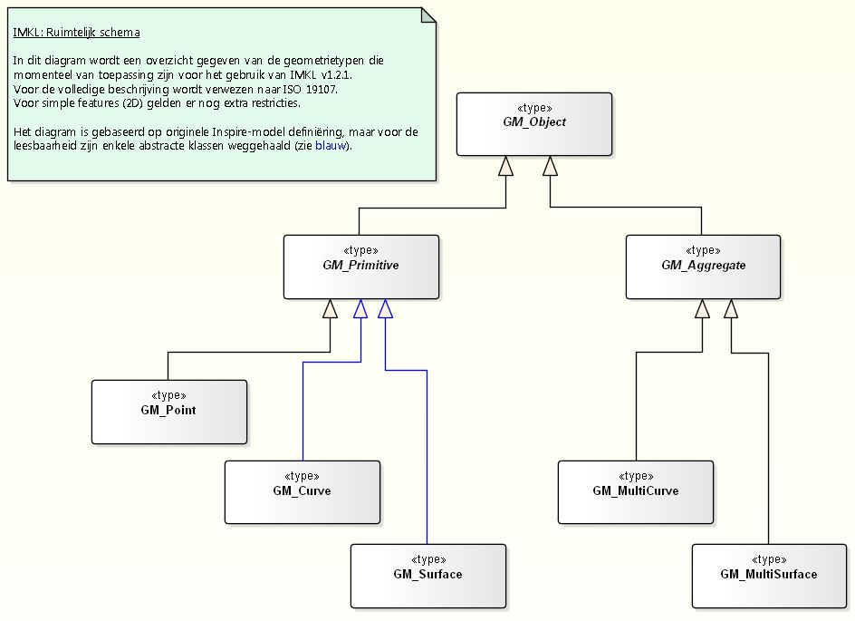

# Toelichting controles netinformatie KLIC

**Inhoudsopgave**

- [Inleiding](#inleiding)
  - [Centrale Voorziening](#centrale-voorziening)
    - [Aanleveren gegevens](#aanleveren-gegevens)
  - [Decentrale aanlevering](#decentrale-aanlevering)
    - [Aanleveren gegevens](#aanleveren-gegevens-1)
- [Controles](#controles)
  - [Zipbestand eigenschappen](#zipbestand-eigenschappen)
  - [XML](#xml)
    - [Encoding, tekenset](#encoding-tekenset)
    - [XSD validatie](#xsd-validatie)
    - [Codelijsten/Waardelijsten](#codelijstenwaardelijsten)
    - [Object Identificatie](#object-identificatie)
    - [gml:id](#gmlid)
    - [Numerieke waarden](#numerieke-waarden)
      - [Hoogte](#hoogte)
      - [Diepte](#diepte)
    - [Tijdaanduiding](#tijdaanduiding)
    - [Geometrie](#geometrie)
      - [Bounding Box](#bounding-box-gmlboundedby)
      - [Referentiestelsel en dimensie](#referentiestelsel-en-dimensie)
        - [srsName](#srsname)
        - [srsDimension](#srsdimension)
      - [Geldige geometrietypen](#geldige-geometrietypen)
        - [Punt](#punt)
        - [Lijn](#lijn)
        - [Multilijn](#multilijn)
        - [Vlak](#vlak)
        - [Multivlak](#multivlak)
      - [Geometrie niet leeg en voldoende coördinaten](#geometrie-niet-leeg-en-voldoende-co%C3%B6rdinaten)
      - [Topologisch correct](#topologisch-correct)
      - [Aantal punten](#aantal-punten)
      - [Draairichting van polygonen](#draairichting-van-polygonen)
      - [Nauwkeurigheid coördinaten](#nauwkeurigheid-co%C3%B6rdinaten)
  - [Associaties](#associaties)
    - [href](#href)
    - [Controles](#controles)
    - [1..n associaties naar Utiliteitsnet](#1n-associaties-naar-utiliteitsnet)
  - [Extra regels](#extra-regels)
    - [Kabel of leiding](#kabel-of-leiding)
    - [Kabel en leidingcontainer](#kabel-en-leidingcontainer)
    - [Leidingelement](#leidingelement)
    - [Container leidingelement](#container-leidingelement)
    - [Utiliteitsnet](#utiliteitsnet)
    - [UtilityLink](#utilitylink)
    - [IMKL](#imkl)

## Inleiding

In het nieuwe KLIC wordt netinformatie uitgewisseld in XML conform het IMKL2015 model.

Netbeheerders krijgen in het nieuwe KLIC de keuze om centraal te gaan, waarbij ze hun netinformatie in een centrale voorziening zetten, of decentraal te gaan waarbij ze - net als in de oude situatie - per gebiedsinformatie-aanvraag informatie aanleveren aan het Kadaster.

In beide gevallen wordt voor de definiëring van de aan te leveren vectordata gebruik gemaakt van hetzelfde model wat vooralsnog conform de IMKL2015_wion XSD is. De validatie van de vector informatie is in beide gevallen gelijk, tenzij hieronder aangegeven.

Ongeacht hoe de netbeheerder de informatie aanlevert, is de netbeheerder zelf verantwoordelijk voor de kwaliteit van de aangeleverde netinformatie.

Er wordt een Netbeheerder TestDienst (NTD) beschikbaar gesteld, waarmee de netbeheerder zijn aanleveringen kan controleren.

De IMKL2015 versie die het Kadaster gebruikt (1.2.1) staat gepubliceerd op https://register.geostandaarden.nl/imkl2015/

### Centrale voorziening

Het Kadaster beheert de centrale voorziening kabels en leidingen, waar de door de centrale netbeheerders aangeleverde netinformatie samenkomt.
De aanlevering van netinformatie van een centrale netbeheerder bestaat mogelijk uit
* alle gegevens over kabels en leidingen behorende bij een utiliteitsnet
* eigen topografie (optioneel)
* bijlagen van het type `algemeen` en/of `nietBetrokken` (optioneel)

Om de goede verwerking van de centrale voorziening te kunnen garanderen, wordt een aangeleverd bestand technisch en functioneel gecontroleerd alvorens de gegevens in de centrale voorziening opgenomen worden.

#### Aanleveren gegevens

Een centrale netbeheerder of serviceprovider kan op twee manieren netinformatie aanleveren:
* In Mijn Kadaster is de functie _KLIC Actualiseren Netinformatie_ beschikbaar
* Via de _Actualiseren Netinformatie_ API

In beide gevallen wordt de netinformatie aangeleverd in een zipbestand. De specifieke eigenschappen van het zipbestand worden verderop in het document beschreven.

In het zipbestand staat in de root één XML-bestand conform de IMKL2015_wion XSD. Er zitten verder geen andere bestanden in het zipbestand.

Het XML-bestand bevat altijd alle assets van de netbeheerder die van belang zijn voor de WION.

### Decentrale aanlevering

Een decentrale netbeheerder of serviceprovider levert informatie op basis van een gebiedsinformatie-aanvraag d.m.v. de _KLIC Netbeheerder API_.

De aanlevering van beheerdersinformatie van een belanghebbende decentrale netbeheerder bestaat mogelijk uit
* gegevens over de belanghebbende
* alle gegevens over kabels en leidingen behorende bij utiliteitsnetten die binnen het aangevraagde gebied liggen
* eigen topografie binnen het aangevraagde gebied (optioneel)
* bijlagen van het type `algemeen` en/of `nietBetrokken` (optioneel)
* bijlage(n) van het type `eisVoorzorgsmaatregel` (optioneel)

Voor de decentraal aangeleverde netinformatie worden dezelfde validatie regels gehanteerd als voor het aanleveren aan de centrale voorziening.

#### Aanleveren gegevens

De netinformatie wordt inclusief bijlagen aangeleverd in een zipbestand. De specifieke eigenschappen van het zipbestand worden verderop in het document beschreven.

In het zipbestand staat een XML-bestand, conform de IMKL2015_wion XSD, dat voldoet aan de naamgeving van een netinformatie bestand. Eventuele overige bestanden in het zipbestand worden genegeerd.

Het XML-bestand bevat alle assets van de netbeheerder die van belang zijn voor de WION en binnen de gebiedsinformatie-aanvraag vallen. Geometrieën zijn daarbij geklipt op het informatiegebied indien beschikbaar en anders worden de geometriën geklipt op het graafgebied.


## Controles

Hieronder worden de controles behandeld.

### Zipbestand eigenschappen

Een aangeleverd zipbestand wordt gecontroleerd op de punten:
* Het aangeleverde bestand moet een ZIP-archief zijn en mag niet groter zijn dan een bepaalde grootte. De maximale grootte voor de eindsituatie is voorlopig gesteld op 2GB.
* Het te gebruiken ZIP-formaat is beschreven in Info-ZIP Application Note 970311 (ZIP). Sommige ZIP-tools gebruiken compressie methodes die niet in deze specificatie staan, deze methodes worden niet ondersteund.
* Ten behoeve van de aanlevering van netinformatie dient het zipbestand één XML-bestand te bevatten, waarvan de bestandsnaam begint met 'netinformatie' en eindigt met de extensie '.xml'.De bestands-extensie is met kleine letters.
* Ten behoeve van de aanlevering van voorzorgsmaatregelen dient het zipbestand een tweede XML-bestand te bevatten.  \
Dit bestand bevat de beslissingsregels voor de bapling van voorzorgsmaatregelen. De bestandsnaam begint met 'voorzorgsmaatregelen' en eindigt met de extensie '.xml'. De bestands-extensie is met kleine letters.  \
Tevens moeten bij de voorzorgsmaatregelen één of meerdere EV-sjablonen meegeleverd worden waar naar gerefereerd wordt vanuit de voorzorgsmaatregelen xml.  
* De bestandsnaam van het zipbestand of XML-bestand mag een maximaal aantal tekens en geen ongeldige tekens bevatten.
  * Bestandsnaam mag niet langer zijn dan 120 tekens.
  * De bestandsnaam mag niet bestaan uit vreemde tekens; als geldige tekens worden gezien de ASCII-characters:<br>"a-z", "A-Z", "0-9", "<spatie>", ".", "-", "\_", "(" en ")"
* Het aangeleverde bestand mag niet beveiligd zijn met een wachtwoord.

### XML

Het format waarin data worden geleverd is GML 3.2.1. simple features profile 2 (SF-2).

De aangeleverde netinformatie XML wordt gecontroleerd op de volgende punten:

#### Encoding, tekenset
Voor de encoding van het GML bestand wordt UTF-8 gebruikt. Van UTF-8 wordt de tekenset ISO-8859-1 ondersteunt en binnen deze tekenset wordt gebruikt: unicode \[32 – 128\] en \[160 – 255\]. Opgemerkt wordt dat (U+8216), (U+8217), (U+8220), (U+8221) ook als tekens op een kaart weer te geven moeten zijn.

We controleren alleen op het UTF-8 zijn van de informatie.

#### XSD validatie

Voor IMKL2015 is een GML applicatieschema gemaakt. Datasets van utiliteitsnetten die conform deze specificatie zijn gemaakt moeten foutloos valideren tegen het IMKL2015 applicatieschema.

Het IMKL2015 UML is toegepast in 4 profielen. Voor elk van die is er een GML applicatieschema gemaakt.

De netinformatie voor KLIC wordt gevalideerd tegen de IMKL2015-wion.xsd die gepubliceerd staat op: https://register.geostandaarden.nl/gmlapplicatieschema/imkl2015/1.2.1/imkl2015-wion.xsd

Deze XSD geldt voor zowel de WION als INSPIRE.

Van de features types die beschreven zijn in de XSD accepteren we de volgende feature types niet:
* Electricity Network::ElectricityCable
* Telecommunications Network::TelecommunicationsCable
* OilGasChemicals Network::OilGasChemicalsPipe
* Water Network::WaterPipe
* Sewer Network::SewerPipe
* Thermal Network::ThermalPipe
* Common Utility Network Elements::Duct
* Common Utility Network Elements::Pipe
* Common Utility Network Elements::Appurtenance
* Common Utility Network Elements::Cabinet
* Common Utility Network Elements::Manhole
* Common Utility Network Elements::Pole
* Common Utility Network Elements::Tower
* Common Utility Network Elements::UtilityNetwork

We accepteren alleen de IMKL variant van deze feature types.

Bij het uitleveren van INSPIRE informatie zorgt het Kadaster voor de correcte INSPIRE feature benaming en filtering van attributen. In een INSPIRE levering zitten namelijk alleen features en attributen die geldig zijn binnen INSPIRE.

We ondersteunen, conform de afspraak in de Dataspecificatie IMKL2015, de volgende INSPIRE feature types ook niet:
* Common Utility Network Elements::UtilityLinkSequence; deze lijkt vooralsnog niet zinvol
* ActivityComplex; deze lijkt vooralsnog niet zinvol en er is ook geen visualisatie voor opgenomen

#### Codelijsten/Waardelijsten

De attributen die verwijzen naar code of waarde lijsten worden gevalideerd tegen de lijst gepubliceerd op https://register.geostandaarden.nl/waardelijst/imkl2015/1.2.1/imkl-waardelijsten-1.2.1.rdf.

Niet alle waardelijsten in deze publicatie hebben een betekenis binnen de WION of INSPIRE.

#### Object Identificatie

Alle concrete objecttypen en daarmee objecten in een dataset hebben een attribuut voor identificatie. Met deze identificatie kunnen ze uniek geïdentificeerd worden. INSPIRE gebruikt hiervoor het attribuut `inspireId` met het datatype `Identifier`. Veel objecttypen uit IMKL2015 overerven die attributen. Voor objecttypen die specifiek voor IMKL2015 zijn gecreëerd en die niet via een generalisatie aan INSPIRE zijn gekoppeld, is er een attribuut `identificatie` met het datatype `NEN3610ID`.

De systematiek voor het format van een identifier is gebaseerd op de combinatie van een uniek benoemde namespace voor een applicatiedomein en unieke lokale id's binnen een applicatiedomein. Omdat er voor utiliteitsnetten vele bronhouders zijn is het niet mogelijk om met één namespace te garanderen dat er in de combinatie van namespace en lokale identifier, unieke identifiers ontstaan. Om toch met één namespace te kunnen werken die het applicatiedomein representeert, is het volgende afgesproken:
* namespace: 'nl.imkl'
* lokaalID: bronhoudercode.lokaalID (met een totaal van maximaal 255 tekens)

De namespace is geregistreerd bij INSPIRE en in het nationale namespace register.

De bronhoudercode is uniek en representeert de bronhouder van de gegevens en wordt geregistreerd in een register van de nationale voorziening. Met de bronhouder wordt niet bedoeld de mogelijke inwinner van de gegevens. De code bestaat uit zes alfanumerieke posities. Dit is afgestemd met het format van CBS codes voor gemeenten en provincies.

Het lokaalID maakt het mogelijk per bronhouder de objecten uniek te identificeren. Het lokaalID is vrij door de bronhouder in te vullen en zal in de meeste gevallen gelijk zijn aan het id in de lokale registratie.
Om te voorkomen dat er eventuele dubbelingen gaan ontstaan bij objecten die door het Kadaster namens een bronhouder worden aangemaakt, mag het lokaalID echter niet beginnen met "_". Dit is voorbehouden aan objecten die door het Kadaster worden aangemaakt en daarmee onderscheidend.
Voorbeelden van identificaties van objecten die door het Kadaster namens een bronhouder kunnen worden aangemaakt:
```xml
<imkl:Belanghebbende gml:id="nl.imkl-KL9999._Belanghebbende_17G000041-1">
    <imkl:identificatie>
        <imkl:NEN3610ID>
            <imkl:namespace>nl.imkl</imkl:namespace>
            <imkl:lokaalID>KL9999._Belanghebbende_17G000041</imkl:lokaalID>
            <imkl:versie>1</imkl:versie>
        </imkl:NEN3610ID>
    </imkl:identificatie>
    <imkl:beginLifespanVersion>2017-01-11T09:09:11.31+01:00</imkl:beginLifespanVersion>
    ...
    <imkl:netbeheerder xlink:href="nl.imkl-KL9999._Beheerder"/>
</imkl:Belanghebbende>
```

```xml
<imkl:EisVoorzorgsmaatregelBijlage gml:id="nl.imkl-KL9999._EisVoorzorgsmaatregelBijlage_17G000041_gasHogeDruk">
    <imkl:identificatie>
        <imkl:NEN3610ID>
            <imkl:namespace>nl.imkl</imkl:namespace>
            <imkl:lokaalID>KL9999._EisVoorzorgsmaatregelBijlage_17G000041_gasHogeDruk</imkl:lokaalID>
        </imkl:NEN3610ID>
    </imkl:identificatie>
    <imkl:beginLifespanVersion>2017-01-11T09:09:15.00+01:00</imkl:beginLifespanVersion>
    ...
</imkl:EisVoorzorgsmaatregelBijlage>
```

Het Kadaster geeft op verzoek bronhoudercodes uit.

De volgende karakters mogen in een lokaalID voorkomen: {"A"…"Z", "a"…"z", "0"…"9", "\_", "-", ",", "."}. (bron: NEN3610)

In NEN3610 en INSPIRE kunnen identifiers ook nog voorzien zijn van een versienummer van een object. Hier maken we in de IMKL2015 slechts beperkt gebruik van.

Het Kadaster controleert of aanleverende partij geautoriseerd is om gegevens te leveren met de opgegeven bronhoudercode.

#### gml:id

Elk object in het GML bestand krijgt een `gml:id`. Dit `gml:id` heeft geen informatiewaarde maar is nodig om interne en externe referenties te realiseren. De in een GML bestand opgenomen `gml:id` is een concatenatie van de volledige identifier, bestaande uit de namespace, het lokale id en eventueel een versie.

Voor het concateneren van `namespace`, `lokaalID` en mogelijk in de toekomst `versie` gebruiken we als scheidingsteken `-` (in INSPIRE-termen respectievelijk `namespace`, `localId` en `versionId`). Binnen het lokale id en de versie mogen dus geen `-`-tekens meer voorkomen.

Als scheidingsteken binnen lokaalId geldt `.`. De eerste punt komt dus na de bronhoudercode. Daarna komt de Id van de bronhouder intern en dan weer een `.` met daarna het volgnummer voor uitlevering. Binnen het Id van de bronhouder intern mag dus geen punt meer voorkomen.

#### Numerieke waarden

Numerieke waarden bij attributen worden opgenomen conform de bij het attribuut opgegeven eenheid en nauwkeurigheid.

Indien de waarde als label is opgenomen en dus een alfanumeriek datatype heeft geldt de komma als decimaal scheidingsteken. Waarden in labels worden niet gecontroleerd.

Voor de in specifieke datatypen gedefinieerde waarden geldt een punt als het afgesproken decimaal scheidingsteken. Dit wordt tijdens de XSD validatie gecontroleerd

De specifieke datatypen voor waarden zoals Measure bestaan uit een combinatie van een waarde en een eenheid (UOM). In de [Extra regels](#extra-regels) wordt dit per attribuut uitgewerkt.

##### Hoogte

De hoogte van een leidingelement is met het attribuut hoogte op te nemen. De hoogte betreft de lengte van het hele leidingelement in verticale richting ongeacht of er een deel onder of boven het maaiveld bevindt. Het datatype is 'Length' waarbij de meeteenheid apart wordt gespecificeerd. Voor WION wordt er altijd meters gebruikt met maximaal 2 decimalen.

Het aantal decimalen wordt niet gecontroleerd.

##### Diepte

Het datatype van dieptepeil is 'Measure' waarbij de meeteenheid apart wordt gespecificeerd. Voor WION wordt er altijd meters (urn:ogc:def:uom:OGC::m) gebruikt met maximaal 2 decimalen.

Het aantal decimalen wordt niet gecontroleerd.

#### Tijdaanduiding

Alle tijdsaanduidingen zijn gebaseerd op de Gregoriaanse kalender en uitgedrukt is overeenstemming met de internationale standaard ISO 8601.

Voorbeelden daarvan zijn:
* 2014; het jaar 2014
* 2014-04; april 2014
* 2014-04-15; 15 april 2014
* 2014-04-15T16:30:20+01:00; 15 april 2014, 16:30 20sec, tijdzone UTC+1

Wij bevelen aan om de tijdaanduiding te hanteren, zoals genoemd in het laatste voorbeeld. Daarmee is de lokale tijd snel inzichtelijk en wordt duidelijk rekening gehouden met zomer- en wintertijd.
Voorbeelden (wisseling wintertijd/zomertijd is voor Nederland in 2017 respectievelijk 26 maart en 29 oktober):
```xml
...
2017-03-26T01:59:45+01:00 <!-- wintertijd 1:59:45 -->
...
2017-03-26T03:01:45+02:00 <!-- zomertijd 3:01:45 -->
...

...
2017-10-29T01:30:45+02:00 <!-- zomertijd 1:30:45 -->
...
2017-10-29T02:30:45+02:00 <!-- zomertijd 2:30:45 -->
...
2017-10-29T02:30:45+01:00 <!-- wintertijd 2:30:45 -->
...
2017-10-29T10:30:45+01:00 <!-- wintertijd 10:30:45 -->
...
```

#### Geometrie

In dit hoofdstuk wordt een toelichting gegeven op de toepassing van de controles op geometrie-objecten.

##### Bounding Box _(gml:boundedBy)_
Het is in GML optioneel om een bounding box te definiëren waarin een rechthoek is opgenomen die
middels een linkerbenedenhoek en rechterbovenhoek de extent van de coördinaten weergeeft.
Voor WION geldt de volgende regel:
Een bounding box is verplicht alleen voor het hele bestand bij uitleveringen en is niet opgenomen bij
individuele geometrieën.

Voorbeeld:
```xml
<gml:boundedBy>
    <gml:Envelope srsName="urn:ogc:def:crs:EPSG::28992" srsDimension="2">
        <gml:lowerCorner>......</gml:lowerCorner>
        <gml:upperCorner>......</gml:upperCorner>
    </gml:Envelope>
</gml:boundedBy>
```

###### Huidige werking
-	Volgens bovenstaand uitgangspunt moet er bij een individuele geometrie geen Bounding Box worden opgenomen.
Daarom wordt er in KLIC bij aangeleverde netinformatie of beheerdersinformatie geen rekening mee gehouden.
Als deze wél meegeleverd zou worden, wordt dus niet gecontroleerd of deze “passend” is bij de meegeleverde geometrie.
Evenmin wordt een Bounding Box aangepast als de geometrie geclipped wordt.
-	Bij het aanleveren van netinformatie of beheerdersinformatie zou er – volgens GML - voor de FeatureCollection ook een Bounding Box meegegeven kunnen worden.
In KLIC wordt daarmee geen rekening gehouden. De inhoud hiervan wordt genegeerd.
Als deze wél meegeleverd wordt, wordt dus niet gecontroleerd of deze “passend” is bij alle meegeleverde geometrieën.
-	Volgens bovenstaand uitgangspunt moet er bij uitlevering van gebiedsinformatie wél een Bounding Box van de FeatureCollection worden meegegeven.
Aangezien bronhouders in principe geen geometrieën buiten de aangevraagde polygoon uitleveren, wordt hiervoor de Bounding Box van de selectiepolygoon opgenomen.
Het is feitelijk mogelijk dat in de uitlevering geometrieën buiten deze Bounding Box vallen. Denk bijvoorbeeld aan een aangevraagde huisaansluiting buiten de selectiepolygoon.
Evenmin controleert KLIC of de door een decentrale bronhouder aangeleverde beheerdersinformatie binnen de selectiepolygoon valt.

##### Referentiestelsel en dimensie

###### srsName

srsName wordt ingevuld bij elk object op hoogste geometrie niveau.

Voor IMKL1.2 is het "Rijksdriehoekstelsel" (epsg code 28992) het verplicht te gebruiken coördinaat referentiesysteem. Deze wordt als volgt ingevuld:

`srsName="urn:ogc:def:crs:EPSG::28992"`

In de GIS-wereld is het niet ongebruikelijk om de verwijzing naar het coördinatenstelsel verkort te gebruiken, zoals hieronder genoemd. Dit wordt geaccepteerd door het Klic-systeem.

`srsName="epsg:28992"`

NB.
Onderstaande referentie mag _**niet**_ gebruikt worden bij aanlevering van IMKL-data. In de door KLIC gebruikte tool "Degree" geeft dit technische problemen.

`srsName="http://spatialreference.org/ref/epsg/28992/"`  **NIET** gebruiken!!

###### srsDimension

De srsDimension geeft aan uit hoeveel elementen een coördinaat bestaat. Voor IMKL2015 is dat standaard 2 (x,y). Dit past ook bij het GML-SF2 profiel.

srsDimension in verplicht bij elk geometrie object en wordt als volgt ingevuld:

`srsDimension="2"`

##### Geldige geometrietypen

Voor de toepassing van geometrie in informatiemodellering en de implementatie daarvan in GML refereren we naar handreikingen zoals deze o.a. door Geonovum zijn gepubliceerd.  \
Zie bijv. [Handreiking Geometrie in model en GML](https://www.geonovum.nl/uploads/documents/Geometrieinmodelengml_1.0_0.pdf).

Van de hierin beschreven geometrietypen worden de volgende (met restricties) ondersteund:

| Type            | in GML           | in UML          | Restricties                                                                                                   | Opmerking                   |
|-----------------|------------------|-----------------|---------------------------------------------------------------------------------------------------------------|-----------------------------|
| Punt            | gml:Point        | GM_Point        | geen                                                                                                          | Zie [Punt](#punt)           |
| Lijn | gml:LineString<br>gml:Curve | GM_Curve        | - gml:LineString, of<br>- gml:Curve met gml:LineStringSegment                                                 | Zie [Lijn](#lijn)           |
| Multi-<br>lijn  | gml:MultiCurve   | GM_MultiCurve   | "curveMember" beschreven met (zie GM_Curve):<br>- gml:LineString, of<br>- gml:Curve met gml:LineStringSegment | Zie [Multilijn](#multilijn) |
| Vlak            | gml:Polygon      | GM_Surface      | - gml:Polygon<br>vlakgrenzen (buitengrenzen) worden beschreven met:<br>&nbsp;&nbsp;- gml:exterior met gml:LinearRing<br>binnengrenzen (gaten, "donuts") worden beschreven met:<br>&nbsp;&nbsp;- gml:interior met gml:LinearRing | Zie [Vlak](#vlak) |
| Multi-<br>vlak  | gml:MultiSurface | GM_MultiSurface | "surfaceMember" beschreven met (zie GM_Surface):<br>- gml:Polygon (met gml:exterior, evt. gml:interior)       | Zie [Multivlak](#multivlak) |

Een geometrie wordt gevalideerd tegen de regels gespecificeerd in de OpenGIS Simple Feature Specification http://www.opengeospatial.org/standards/sfa en http://www.opengeospatial.org/standards/sfs.

In het huidige IMKL zijn er geen features gemodelleerd met geometrieen die gedefinieerd zijn volgens de geometrische aggregaties GM_MultiCurve of GM_MultiSurface.
Echter, een geometrie van het type GM_Object maakt het gebruik van deze geometrietypen - in principe - wél mogelijk.

In aanvullende regels kan per feature met een attribuut van het type GM_Object worden bepaald, welke geometrietypen worden toegestaan.  \
Voorbeeld:  \
Functioneel is het gewenst dat de `geometrie` van een _AanduidingEisVoorzorgsmaatregel_ (EV-vlak) zowel een vlak (GM_Surface), als een multivlak (GM_MultiSurface) mag zijn. Vanwege dit requirement zal dit attribuut van het type GM_Object horen te zijn.

Zie onderstaand diagram met de geometrietypen die in IMKL v1.2.1. zijn toegestaan.




###### Punt

**gml:Point**

| Groep/Element/@attribute         | Type               | Card. | Opmerking                                                                           |
|----------------------------------|--------------------|:-----:|-------------------------------------------------------------------------------------|
| @id                              | ID                 |   1   | `<nameSpace>-<lokaalID>(-<versie>)`<br>Voorbeeld: `gml:id=nl.imkl-GM0124.12345_geo` |
| @srsName                         | anyURI             |  0…1  | `srsName="urn:ogc:def:crs:EPSG::28992"`                                             |
| @srsDimension                    | Positiveinteger    |  0…1  | `srsDimension="2"`                                                                  |
| - pos                            | list of xsd:double |   1   |                                                                                    |
| &nbsp;&nbsp;pos@srsName          | anyURI             |  0…1  |                                                                                     |
| &nbsp;&nbsp;pos@srsDimension     | Positiveinteger    |  0…1  |                                                                                     |

Voorbeeld:
```xml
<gml:Point srsName="urn:ogc:def:crs:EPSG::28992" gml:id="nl.imkl-KL9999.LS_p835263_geo">
    <gml:pos srsDimension="2">155203.526 389052.316</gml:pos>
</gml:Point>
```

###### Lijn

**gml:LineString**

| Groep/Element/@attribute         | Type               | Card. | Opmerking                                                                           |
|----------------------------------|--------------------|:-----:|-------------------------------------------------------------------------------------|
| @id                              | ID                 |   1   | `<nameSpace>-<lokaalID>(-<versie>)`<br>Voorbeeld: `gml:id=nl.imkl-GM0124.12345_geo` |
| @srsName                         | anyURI             |  0…1  | `srsName="urn:ogc:def:crs:EPSG::28992"`                                             |
| @srsDimension                    | Positiveinteger    |  0…1  | `srsDimension="2"`                                                                  |
| - posList                        | list of xsd:double |   1   |                                                                                     |
| &nbsp;&nbsp;posList@srsName      | anyURI             |  0…1  |                                                                                     |
| &nbsp;&nbsp;posList@srsDimension | Positiveinteger    |  0…1  |                                                                                     |

Voorbeeld:
```xml
<gml:LineString srsName="urn:ogc:def:crs:EPSG::28992" gml:id="nl.imkl-KL9999.W_ls118334_geo">
    <gml:posList srsDimension="2">154430.283 389769.995 154431.859 389767.832 154430.610 389766.544</gml:posList>
</gml:LineString>
```

**gml:Curve**

| Groep/Element/@attribute   | Type               | Card. | Opmerking                                                                          |
|----------------------------|--------------------|:-----:|------------------------------------------------------------------------------------|
| @id                        | ID                 |   1   | `<nameSpace>-<lokaalID>(-<versie>)`<br>Voorbeeld: `gml:id=nl.imkl-GM0124.12345_geo` |
| @srsName                   | anyURI             |  0…1  | `srsName="urn:ogc:def:crs:EPSG::28992"`                                            |
| @srsDimension              | Positiveinteger    |  0…1  | `srsDimension="2"`                                                                 |
| - segments                 |                    |   1   |                                                                                    |
| &nbsp;&nbsp;- LineStringSegment      |                    |  0…*  |                                                                                    |
| &nbsp;&nbsp;&nbsp;&nbsp;- posList              | list of xsd:double |   1   |                                                                                    |
| &nbsp;&nbsp;&nbsp;&nbsp;&nbsp;&nbsp;posList@srsName      | anyURI             |  0…1  |                                                                                    |
| &nbsp;&nbsp;&nbsp;&nbsp;&nbsp;&nbsp;posList@srsDimension | Positiveinteger    |  0…1  | `srsDimension="2"`                                                                 |

Voorbeeld:
```xml
<gml:Curve srsName="urn:ogc:def:crs:EPSG::28992" gml:id="nl.imkl-KL9999.LS_C436270_geo">
    <gml:segments>
        <gml:LineStringSegment>
            <gml:posList srsDimension="2">154430.283 389769.995 154431.859 389767.832 154430.610 389766.544</gml:posList>
        </gml:LineStringSegment>
    </gml:segments>
</gml:Curve>
```
Voor Curves wordt gecontroleerd dat de segmenten (`<gml:LineStringSegment>`) aan elkaar vast zitten (beginnen waar het vorige segment eindigt).

###### Multilijn

**gml:MultiCurve met gml:curveMember: gml:LineString**

| Groep/Element/@attribute | Type               | Card. | Opmerking                                                                          |
|--------------------------|--------------------|:-----:|------------------------------------------------------------------------------------|
| @id                      | ID                 |   1   | `<nameSpace>-<lokaalID>(-<versie>)`<br>Voorbeeld: `gml:id=nl.imkl-GM0124.12345_geo` |
| @srsName                 | anyURI             |  0…1  | `srsName="urn:ogc:def:crs:EPSG::28992"`                                            |
| @srsDimension            | Positiveinteger    |  0…1  | `srsDimension="2"`                                                                 |
| - curveMember            |                    |   *   |                                                                                    |
| &nbsp;&nbsp;- LineString           |                    |  0…*  |                                                                                    |
| &nbsp;&nbsp;&nbsp;&nbsp;- posList            | list of xsd:double |   1   |                                                                                    |
| &nbsp;&nbsp;&nbsp;&nbsp;&nbsp;&nbsp;posList@srsName  | anyURI             |  0…1  |                                                                                    |
| &nbsp;&nbsp;&nbsp;&nbsp;&nbsp;&nbsp;posList@srsDimension | Positiveinteger | 0…1  |                                                                                    |

Voorbeeld:
```xml
<gml:MultiCurve srsName="urn:ogc:def:crs:EPSG::28992" srsDimension="2" gml:id="nl.imkl-KL3131.EDI_MultiCurve_LineString_geo">
    <gml:curveMember>
        <gml:LineString>
            <gml:posList>154430.283 389773.995 154431.859 389771.832 154430.610 389770.544</gml:posList>
        </gml:LineString>
    </gml:curveMember>
    <gml:curveMember>
        <gml:LineString>
            <gml:posList>154434.283 389773.995 154435.859 389771.832 154434.610 389770.544</gml:posList>
        </gml:LineString>
    </gml:curveMember>
</gml:MultiCurve>
```

**gml:MultiCurve met gml:curveMember: gml:Curve**

| Groep/Element/@attribute   | Type               | Card. | Opmerking                                                                          |
|----------------------------|--------------------|:-----:|------------------------------------------------------------------------------------|
| @id                        | ID                 |   1   | `<nameSpace>-<lokaalID>(-<versie>)`<br>Voorbeeld: `gml:id=nl.imkl-GM0124.12345_geo` |
| @srsName                   | anyURI             |  0…1  | `srsName="urn:ogc:def:crs:EPSG::28992"`                                            |
| @srsDimension              | Positiveinteger    |  0…1  | `srsDimension="2"`                                                                 |
| - curveMember              |                    |   *   |                                                                                    |
| &nbsp;&nbsp;- Curve                  |                    |   1   |                                                                                    |
| &nbsp;&nbsp;&nbsp;&nbsp;- segments             |                    |   1   |                                                                                    |
| &nbsp;&nbsp;&nbsp;&nbsp;&nbsp;&nbsp;- LineStringSegment      |                    |  0…*  |                                                                                    |
| &nbsp;&nbsp;&nbsp;&nbsp;&nbsp;&nbsp;&nbsp;&nbsp;- posList              | list of xsd:double |   1   |                                                                                    |
| &nbsp;&nbsp;&nbsp;&nbsp;&nbsp;&nbsp;&nbsp;&nbsp;&nbsp;&nbsp;posList@srsName      | anyURI             |  0…1  |                                                                                    |
| &nbsp;&nbsp;&nbsp;&nbsp;&nbsp;&nbsp;&nbsp;&nbsp;&nbsp;&nbsp;posList@srsDimension | Positiveinteger    |  0…1  |                                                                                    |

Voorbeeld:
```xml
<gml:MultiCurve srsName="urn:ogc:def:crs:EPSG::28992" srsDimension="2" gml:id="nl.imkl-KL3131.EDI_MultiCurve_Curve_geo">
    <gml:curveMember>
        <gml:Curve>
           <gml:segments>
              <gml:LineStringSegment>
                  <gml:posList>154430.283 389773.995 154431.859 389771.832 154430.610 389770.544</gml:posList>
              </gml:LineStringSegment>
           </gml:segments>
        </gml:Curve>
    </gml:curveMember>
    <gml:curveMember>
        <gml:Curve>
           <gml:segments>
              <gml:LineStringSegment>
                  <gml:posList>154434.283 389773.995 154435.859 389771.832 154434.610 389770.544</gml:posList>
              </gml:LineStringSegment>
           </gml:segments>
        </gml:Curve>
    </gml:curveMember>
</gml:MultiCurve>
```

###### Vlak

**gml:Polygon**

| Groep/Element/@attribute   | Type               | Card. | Opmerking                                                                          |
|----------------------------|--------------------|:-----:|------------------------------------------------------------------------------------|
| @id                        | ID                 |   1   | `<nameSpace>-<lokaalID>(-<versie>)`<br>Voorbeeld: `gml:id=nl.imkl-GM0124.12345_geo` |
| @srsName                   | anyURI             |  0…1  | `srsName="urn:ogc:def:crs:EPSG::28992"`                                            |
| @srsDimension              | Positiveinteger    |  0…1  | `srsDimension="2"`                                                                 |
| - exterior                 | Complex            |  0…1  |                                                                                    |
| &nbsp;&nbsp;- LinearRing             |                    |   1   |                                                                                    |
| &nbsp;&nbsp;&nbsp;&nbsp;- posList              | list of xsd:double |   1   |                                                                                    |
| &nbsp;&nbsp;&nbsp;&nbsp;&nbsp;&nbsp;posList@srsName      | anyURI             |  0…1  |                                                                                    |
| &nbsp;&nbsp;&nbsp;&nbsp;&nbsp;&nbsp;posList@srsDimension | Positiveinteger    |  0…1  |                                                                                    |
| - interior                 | Complex            |  0…*  |                                                                                    |
| &nbsp;&nbsp;- LinearRing             |                    |   1   |                                                                                    |
| &nbsp;&nbsp;&nbsp;&nbsp;- posList              | list of xsd:double |   1   |                                                                                    |
| &nbsp;&nbsp;&nbsp;&nbsp;&nbsp;&nbsp;posList@srsName      | anyURI             |  0…1  |                                                                                    |
| &nbsp;&nbsp;&nbsp;&nbsp;&nbsp;&nbsp;posList@srsDimension | Positiveinteger    |  0…1  |                                                                                    |

Voorbeeld:
```xml
<gml:Polygon srsName="urn:ogc:def:crs:EPSG::28992" srsDimension="2" gml:id="nl.imkl-KL9999.GHD_s538123224_geo">
   <gml:exterior>
      <gml:LinearRing>
          <gml:posList>154891.113 389309.387 154889.624 389309.867 154888.356 389310.783 154887.433 389312.047 154886.946 389313.533 154886.942 389315.098 154887.422 389316.587 154888.338 389317.854 154889.602 389318.777 154891.088 389319.264 154892.653 389319.268 154894.474 389318.984 154895.963 389318.504 154897.231 389317.588 154898.154 389316.325 154898.641 389314.838 154898.645 389313.274 154898.165 389311.785 154897.249 389310.517 154895.985 389309.594 154894.499 389309.107 154892.934 389309.103 154891.113 389309.387</gml:posList>
      </gml:LinearRing>
   </gml:exterior>
</gml:Polygon>
```
Voorbeeld van "donut":
```xml
<gml:Polygon srsName="urn:ogc:def:crs:EPSG::28992" srsDimension="2" gml:id="nl.imkl-KL3131.EDI_Polygon_exterior_interior_interior_geo">
   <gml:exterior>
        <gml:LinearRing>
            <gml:posList>154891 389309 154898 389312 154894 389329 154886 389328 154886 389313 154888 389310 154891 389309</gml:posList>
        </gml:LinearRing>
    </gml:exterior>
    <gml:interior>
        <gml:LinearRing>
            <gml:posList>154891 389310 154888 389311 154887 389314 154887 389327 154894 389328 154897 389311 154891 389310</gml:posList>
        </gml:LinearRing>
    </gml:interior>
</gml:Polygon>
```

Een `<gml:Polygon>` mag eventueel meerdere `<gml:interior>`-elementen hebben, maar deze mogen elkaar niet overlappen. Een "eiland in een gat" is dus ook niet toegestaan.

###### Multivlak

**gml:MultiSurface met gml:surfaceMember: gml:Polygon**

| Groep/Element/@attribute   | Type               | Card. | Opmerking                                                                          |
|----------------------------|--------------------|:-----:|------------------------------------------------------------------------------------|
| @id                        | ID                 |   1   | `<nameSpace>-<lokaalID>(-<versie>)`<br>Voorbeeld: `gml:id=nl.imkl-GM0124.12345_geo` |
| @srsName                   | anyURI             |  0…1  | `srsName="urn:ogc:def:crs:EPSG::28992"`                                            |
| @srsDimension              | Positiveinteger    |  0…1  | `srsDimension="2"`                                                                 |
| - surfaceMember            |                    |   *   |                                                                                    |
| &nbsp;&nbsp;- Polygon                |                    |   1   |                                                                                    |
| &nbsp;&nbsp;&nbsp;&nbsp;- exterior                 | Complex            |  0…1  |                                                                                    |
| &nbsp;&nbsp;&nbsp;&nbsp;&nbsp;&nbsp;- LinearRing             |                    |   1   |                                                                                    |
| &nbsp;&nbsp;&nbsp;&nbsp;&nbsp;&nbsp;&nbsp;&nbsp;- posList              | list of xsd:double |   1   |                                                                                    |
| &nbsp;&nbsp;&nbsp;&nbsp;&nbsp;&nbsp;&nbsp;&nbsp;&nbsp;&nbsp;posList@srsName      | anyURI             |  0…1  |                                                                                    |
| &nbsp;&nbsp;&nbsp;&nbsp;&nbsp;&nbsp;&nbsp;&nbsp;&nbsp;&nbsp;posList@srsDimension | Positiveinteger    |  0…1  |                                                                                    |
| &nbsp;&nbsp;&nbsp;&nbsp;- interior                 | Complex            |  0…*  |                                                                                    |
| &nbsp;&nbsp;&nbsp;&nbsp;&nbsp;&nbsp;- LinearRing             |                    |   1   |                                                                                    |
| &nbsp;&nbsp;&nbsp;&nbsp;&nbsp;&nbsp;&nbsp;&nbsp;- posList              | list of xsd:double |   1   |                                                                                    |
| &nbsp;&nbsp;&nbsp;&nbsp;&nbsp;&nbsp;&nbsp;&nbsp;&nbsp;&nbsp;posList@srsName      | anyURI             |  0…1  |                                                                                    |
| &nbsp;&nbsp;&nbsp;&nbsp;&nbsp;&nbsp;&nbsp;&nbsp;&nbsp;&nbsp;posList@srsDimension | Positiveinteger    |  0…1  |                                                                                    |

Voorbeeld:
```xml
<gml:MultiSurface srsName="urn:ogc:def:crs:EPSG::28992" srsDimension="2" gml:id="nl.imkl-KL3131.EDI_MultiSurface_Polygon_exterior_Polygon_exterior_geo">
    <gml:surfaceMember>
        <gml:Polygon>
            <gml:exterior>
                <gml:LinearRing>
                    <gml:posList>154891 389312 154893 389313 154893 389320 154892 389320 154891 389312</gml:posList>
                </gml:LinearRing>
            </gml:exterior>
        </gml:Polygon>
    </gml:surfaceMember>
    <gml:surfaceMember>
        <gml:Polygon>
            <gml:exterior>
                <gml:LinearRing>
                    <gml:posList>155091 389312 155093 389313 155093 389320 155092 389320 155091 389312</gml:posList>
                </gml:LinearRing>
            </gml:exterior>
        </gml:Polygon>
    </gml:surfaceMember>
</gml:MultiSurface>
```

##### Geometrie niet leeg en voldoende coördinaten

De geometrie van een object wordt gevormd door een verzameling geldige coördinaten in een GML-string. Deze GML-string mag niet leeg zijn en moet uit voldoende coördinaten bestaan voor het geometrie-type: een punt bestaat uit minimaal en maximaal 1 coördinaat, een lijn uit minimaal 2 coördinaten, en een polygoon of ring uit minimaal 3 coördinaten.

Een coördinaat bevat altijd 2 ordinaten.

##### Topologisch correct

Een polygoon dient *gesloten* en *samenhangend* te zijn. Gesloten betekent dat de GML-string van een polygoon begint en eindigt met hetzelfde coördinaat.

De ring van een polygoon mag zichzelf niet snijden en moet een juiste oriëntatie hebben: een buitenring tegen de klok in (counter clockwise) en een binnenring met de klok mee (clockwise). Een binnenring mag niet buiten het gebied van een buitenring liggen. Twee identieke ringen mogen niet voorkomen in de geometrie van een object.

##### Aantal punten

Het maximaal aantal punten wat een geometrieobject mag bevatten is ingesteld op 5000 punten. Dit aantal wordt berekend door het aantal punten van de individuele geometrie-objecten op te tellen. De begin– en eindpunten van aansluitende lijnen worden daarom dubbel geteld.

##### Draairichting van polygonen

Hiervoor gelden de regels van ISO19107: Geographic information – Spatial Schema.

Voor een polygoon die je van de bovenkant bekijkt: exterior ring tegen de klok in, interior ring met de klok mee. In 2d GIS bekijk je polygonen altijd van de bovenkant.

##### Nauwkeurigheid coördinaten

Nauwkeurigheid van coördinaten is 3 decimalen. Alles wat nauwkeuriger is wordt afgerond op deze nauwkeurigheid (3 decimalen). 0.0015 -> 0.002; 0.0014 -> 0.001.

Het Kadaster controleert niet op het aantal decimalen en rond de gegevens ook niet af bij uitleveren.

### Associaties

#### href
Voor een associatie naar een ander feature in de featurecollection moet gebruik gemaakt worden van referenties (`xlink:href="..."`). In de referentie moet dan de identificatie van het gerefereerde feature worden aangegeven (`gml:id`).
Voorbeeld van een associatie van een elektriciteitskabel naar het utiliteitsnet waartoe deze behoort:
```xml
<imkl:Utiliteitsnet gml:id="nl.imkl-KL9999.netwerk_ls00058">
   ...
</imkl:Utiliteitsnet>

<imkl:Elektriciteitskabel gml:id="nl.imkl-KL9999.kb_ls07100034">
   ...
   <net:inNetwork xlink:href="nl.imkl-KL9999.netwerk_ls00058"/>
   ...
</imkl:Elektriciteitskabel>
```
Daarnaast zijn er natuurlijk associaties naar codelijsten/waardelijsten die elders beschikbaar worden gesteld. Ook deze worden gerefereerd met behulp van `xlink:href="..."`.
Voorbeelden:
```xml
<us-net-common:utilityNetworkType xlink:href="http://inspire.ec.europa.eu/codelist/UtilityNetworkTypeValue/thermal"/>

<us-net-common:authorityRole xlink:href="http://inspire.ec.europa.eu/codelist/RelatedPartyRoleValue/operator"/>

<imkl:thema xlink:href="http://definities.geostandaarden.nl/imkl2015/id/waarde/Thema/warmte"/>

<imkl:aanvraagSoort xlink:href="http://definities.geostandaarden.nl/imkl2015/id/waarde/AanvraagSoortValue/graafmelding"/>
```

#### Controles
Er wordt gecontroleerd of een object waar naar verwezen wordt, ook daadwerkelijk bestaat.
Momenteel wordt er niet gecontroleerd of deze associaties - functioneel gezien - juist zijn. Een elektriciteitskabel kan bijvoorbeeld verwijzen naar een utiliteitsnet die niet een thema laagspanning, middenspanning, hoogspanning of landelijkHoogspanningsnet heeft. Ook kan een netwerkelement refereren naar een ander utiliteitsnet dan de UtilityLink(s) waar vanuit dat netwerkelement naar gerefereerd wordt.

#### 1..n associaties naar Utiliteitsnet
In IMKL2015 is gemodelleerd dat een KabelEnLeidingContainer en een ContainerLeidingelement naar meerdere utiliteitsnetten kan refereren en daarmee ook naar meerdere thema's kan refereren.
Daarnaast kunnen featuretypes die vanuit een KabelEnLeidingContainer of een ContainerLeidingelement kunnen worden gerefereerd (Diepte, ExtraInformatie, ExtraGeometrie) daarmee ook naar meerdere utiliteitsnetten/thema's refereren.
Momenteel wordt de relatie vanuit deze featuretypes naar meerdere thema's nog niet ondersteund.

### Extra regels

Alleen de rode en groene INSPIRE-attributen uit het Excel-document met extra regels over de object-attributen van IMKL2015 worden hieronder toegelicht. Zie het document: https://register.geostandaarden.nl/regels/imkl2015/1.2.1/IMKL2015%20v%201.2.1_object-attributen-ExtraRegels.xlsx


#### Kabel of leiding

| Property naam                       | Card. | Extra regels                                                                                                                                                         | Implementatie-status                         |
|-------------------------------------|:-----:|----------------------------------------------------------------------------------------------------------------------------------------------------------------------|----------------------------------------------|
| **(_NetworkElement_)**              |       |                                                                                                                                                                      |                                              |
| beginLifespanVersion                |   1   | Strikte verplichting IMKL. Voor niet INSPIRE plichtige dataset mag 'dummy waarde'                                                                                    | :heavy_minus_sign: Wordt niet gecontroleerd, alleen xsd-validatie |
| inspireId                           |  0…1  | Strikte verplichting IMKL; extra check op vorm IMKL identificator                                                                                                    | :heavy_check_mark:                           |
| endLifespanVersion                  |  0…1  | Geen extra regels                                                                                                                                                    | :heavy_check_mark:                           |
| inNetwork                           |   1   | Strikte verplichting IMKL; extra check of UtilityNetwork bestaat en op vorm IMKL identificator                                                                       | :heavy_check_mark: Alleen NTD, Alleen of feature bestaat |
| **(_LinkSet/UtilityLinkSet_)**      |       |                                                                                                                                                                      |                                              |
| link                                |  1…*  | Strikte verplichting IMKL; Extra check: Alleen link naar een UtilityLink is toegestaan. UtilityLinkSequence komt niet voor.                                          | :heavy_check_mark: Alleen NTD, Alleen of feature bestaat |
| warningType                         |   1   | nilReason mag.                                                                                                                                                       | :heavy_check_mark:                           |
| **(_UtilityNetworkElement_)**       |       |                                                                                                                                                                      |                                              |
| currentStatus                       |   1   | nilReason mag.                                                                                                                                                       | :heavy_check_mark:                           |
| validFrom                           |   1   | nilReason mag.                                                                                                                                                       | :heavy_check_mark:                           |
| validTo                             |  0…1  | Geen extra regels                                                                                                                                                    | :heavy_check_mark:                           |
| verticalPosition                    |   1   | nilReason mag.                                                                                                                                                       | :heavy_check_mark:                           |
| utilityFacilityReference            |  0…1  | Doet IMKL niets mee. nilReason mag.                                                                                                                                  | :heavy_check_mark:                           |
| governmentalServiceReference        |  0…1  | Doet IMKL niets mee. nilReason mag.                                                                                                                                  | :heavy_check_mark:                           |
|                                     |       |                                                                                                                                                                      |                                              |
| **(alle kabels (_Cable_))**         |       |                                                                                                                                                                      |                                              |
|                                     |       |                                                                                                                                                                      |                                              |
| **Elektriciteitskabel**             |       |                                                                                                                                                                      |                                              |
| operatingVoltage                    |   1   | Verplicht.<br>De UOM wordt uitgedrukt met urn:ogc:def:uom:OGC::V                                                                                                     | :heavy_check_mark:                           |
| nominalVoltage                      |   1   | Strikte verplichting IMKL.<br>De UOM wordt uitgedrukt met urn:ogc:def:uom:OGC::V                                                                                     | :heavy_check_mark:                           |
|                                     |       |                                                                                                                                                                      |                                              |
| **Telecommunicatiekabel**           |       |                                                                                                                                                                      |                                              |
| telecommunicationsCableMaterialType |   1   | nilReason mag.                                                                                                                                                       | :heavy_check_mark:                           |
|                                     |       |                                                                                                                                                                      |                                              |
| **(alle leidingen (_Pipe_))**       |       |                                                                                                                                                                      |                                              |
| pipeDiameter                        |   1   | nilReason mag.<br>De UOM wordt uitgedrukt via 1 van de volgende OGC URN codes:<br>• urn:ogc:def:uom:OGC::m<br>• urn:ogc:def:uom:OGC::cm<br>• urn:ogc:def:uom:OGC::mm | :heavy_check_mark:                           |
| cables                              |  0…*  | Mag niet voorkomen in IMKL                                                                                                                                           | :heavy_check_mark:                           |
| pipes                               |  0…*  | Mag niet voorkomen in IMKL                                                                                                                                           | :heavy_check_mark:                           |
|                                     |       |                                                                                                                                                                      |                                              |
| **OlieGasChemicalienPijpleiding**   |       |                                                                                                                                                                      |                                              |
| pressure                            |  0…1  | Strikte verplichting IMKL.<br>De UOM wordt uitgedrukt met urn:ogc:def:uom:OGC::bar                                                                                   | :heavy_check_mark:                           |
| oilGasChemicalsProductType          |  1…*  | Strikte verplichting IMKL                                                                                                                                            | :heavy_check_mark:                           |
|                                     |       |                                                                                                                                                                      |                                              |
| **RioolPijpleiding**                |       |                                                                                                                                                                      |                                              |
| sewerWaterType                      |   1   | Strikte verplichting IMKL                                                                                                                                            | :heavy_check_mark:                           |
|                                     |       |                                                                                                                                                                      |                                              |
| **WaterPijpleiding**                |       |                                                                                                                                                                      |                                              |
| waterType                           |   1   | Strikte verplichting IMKL.                                                                                                                                           | :heavy_check_mark:                           |
|                                     |       |                                                                                                                                                                      |                                              |
| **ThermischePijpleiding**           |       |                                                                                                                                                                      |                                              |
| thermalProductType                  |   1   | Strikte verplichting IMKL; extra check op codelijst                                                                                                                  | :heavy_check_mark:                           |
|                                     |       |                                                                                                                                                                      |                                              |
| **(kabels/leidingen (Overig))**     |       |                                                                                                                                                                      |                                              |
| pipeDiameter                        |  0…1  | De UOM wordt uitgedrukt via 1 van de volgende OGC URN codes:<br>• urn:ogc:def:uom:OGC::m<br>• urn:ogc:def:uom:OGC::cm<br>• urn:ogc:def:uom:OGC::mm                   | :heavy_check_mark:                           |
| pressure                            |  0…1  | De UOM wordt uitgedrukt met urn:ogc:def:uom:OGC::bar                                                                                                                 | :heavy_check_mark:                           |
| productType                         |  1…*  | Geen extra regels                                                                                                                                                    | :heavy_check_mark:                           |


#### Kabel en leidingcontainer

| Property naam                       | Card. | Extra regels                                                                                                                                                         | Implementatie-status                         |
|-------------------------------------|:-----:|----------------------------------------------------------------------------------------------------------------------------------------------------------------------|----------------------------------------------|
| **(_NetworkElement_)**              |       | (zie hierboven bij kabel of leiding)                                                                                                                                 |                                              |
|                                     |       |                                                                                                                                                                      |                                              |
| **(_LinkSet/UtilityLinkSet_)**      |       |                                                                                                                                                                      |                                              |
|                                     |       |                                                                                                                                                                      |                                              |
| **(_UtilityNetworkElement_)**       |       |                                                                                                                                                                      |                                              |
|                                     |       |                                                                                                                                                                      |                                              |
| **Mantelbuis**                      |       |                                                                                                                                                                      |                                              |
| pipeDiameter                        |   1   | nilReason mag.<br>De UOM wordt uitgedrukt via 1 van de volgende OGC URN codes:<br>• urn:ogc:def:uom:OGC::m<br>• urn:ogc:def:uom:OGC::cm<br>• urn:ogc:def:uom:OGC::mm | :heavy_check_mark:                           |
| pressure                            |  0…1  | Mag niet voorkomen in IMKL                                                                                                                                           | :heavy_check_mark:                           |
| cables                              |  0…*  | Geen extra regels                                                                                                                                                    | :heavy_check_mark: Alleen NTD, Alleen of feature bestaat |
| pipes                               |  0…*  | Geen extra regels                                                                                                                                                    | :heavy_check_mark: Alleen NTD, Alleen of feature bestaat |
|                                     |       |                                                                                                                                                                      |                                              |
| **Duct/Kabelbed**                   |       |                                                                                                                                                                      |                                              |
| ductWidth                           |   1   | nilReason mag.<br>De UOM wordt uitgedrukt via 1 van de volgende OGC URN codes:<br>• urn:ogc:def:uom:OGC::m<br>• urn:ogc:def:uom:OGC::cm<br>• urn:ogc:def:uom:OGC::mm | :heavy_check_mark:                           |
| ducts                               |  0…*  | Geen extra regels                                                                                                                                                    | :heavy_check_mark: Alleen NTD, Alleen of feature bestaat |
| cables                              |  0…*  | Geen extra regels                                                                                                                                                    | :heavy_check_mark: Alleen NTD, Alleen of feature bestaat |
| pipes                               |  0…*  | Geen extra regels                                                                                                                                                    | :heavy_check_mark: Alleen NTD, Alleen of feature bestaat |
| aantalKabelsLeidingen               |  0…1  | Wordt opgenomen indien het aantal meer dan één is.                                                                                                                   | :heavy_minus_sign: Wordt niet gecontroleerd  |


#### Leidingelement

| Property naam                       | Card. | Extra regels                                                                                                                                                         | Implementatie-status                         |
|-------------------------------------|:-----:|----------------------------------------------------------------------------------------------------------------------------------------------------------------------|----------------------------------------------|
| **(_NetworkElement_)**              |       | (zie hierboven bij kabel of leiding)                                                                                                                                 |                                              |
|                                     |       |                                                                                                                                                                      |                                              |
| **(_UtilityNetworkElement_)**       |       |                                                                                                                                                                      |                                              |
|                                     |       |                                                                                                                                                                      |                                              |
| **Appurtenance**                    |       |                                                                                                                                                                      |                                              |
| geometry                            |   1   | Strikte verplichting IMKL.                                                                                                                                           | :heavy_minus_sign: Wordt niet gecontroleerd, alleen xsd-validatie |
| spokeEnd                            |  0…*  | nilReason mag.                                                                                                                                                       | :heavy_check_mark:                           |
| spokeStart                          |  0…*  | nilReason mag.                                                                                                                                                       | :heavy_check_mark:                           |
| appurtenanceType                    |   1   | Strikte verplichting IMKL                                                                                                                                            | :heavy_check_mark:                           |
| specificAppurtenanceType            |  0…1  | Mag niet voorkomen in IMKL                                                                                                                                           | :heavy_minus_sign: Wordt niet gecontroleerd  |


#### Container leidingelement

| Property naam                  | Card. | Extra regels                                                                                                                                       | Implementatie-status                         |
|--------------------------------|:-----:|----------------------------------------------------------------------------------------------------------------------------------------------------|----------------------------------------------|
| **(_UtilityNetworkElement_)**  |       | (zie hierboven bij kabel of leiding)                                                                                                                                 |                                              |
|                                |       |                                                                                                                                                                      |                                              |
| **(_UtilityNodeContainer_)**   |       |                                                                                                                                                    |                                              |
| geometry                       |   1   | Strikte verplichting IMKL.                                                                                                                         | :heavy_check_mark:                           |
| inspireId                      |  0…1  | Strikte verplichting IMKL; extra check op vorm IMKL identificator                                                                                  | :heavy_check_mark:                           |
| nodes                          |  0…*  | Aanbevolen om toe te voegen indien beschikbaar, dan ook check op vorm IMKL identificator                                                           | :heavy_check_mark: Alleen NTD, Alleen of feature bestaat |
|                                |       |                                                                                                                                                    |                                              |
| inNetwork                      |  1…*  | Strikte verplichting IMKL. Kan bij meerdere netwerken horen; extra check of UtilityNetwork bestaat en op vorm IMKL identificator.                  | :heavy_check_mark: Alleen NTD, Alleen of feature bestaat. Meerdere netwerken nu NIET mogelijk |
|                                |       |                                                                                                                                                    |                                              |
| **Toren**                      |       |                                                                                                                                                    |                                              |
| towerHeight                    |   1   | De UOM wordt uitgedrukt via 1 van de volgende OGC URN codes:<br>• urn:ogc:def:uom:OGC::m<br>• urn:ogc:def:uom:OGC::cm<br>• urn:ogc:def:uom:OGC::mm | :heavy_check_mark:                           |
|                                |       |                                                                                                                                                    |                                              |
| **Mast**                       |       |                                                                                                                                                    |                                              |
| poleHeight                     |   1   | De UOM wordt uitgedrukt via 1 van de volgende OGC URN codes:<br>• urn:ogc:def:uom:OGC::m<br>• urn:ogc:def:uom:OGC::cm<br>• urn:ogc:def:uom:OGC::mm | :heavy_check_mark:                           |
|                                |       |                                                                                                                                                    |                                              |
| **Mangat**                     |       |                                                                                                                                                    |                                              |
|                                |       |                                                                                                                                                    |                                              |
| **Kast**                       |       |                                                                                                                                                    |                                              |
|                                |       |                                                                                                                                                    |                                              |
| **TechnischGebouw**            |       |                                                                                                                                                    |                                              |


#### Utiliteitsnet

| Property naam           | Card. | Extra regels                                                                                                                                                                         | Implementatie-status                        |
|-------------------------|:-----:|--------------------------------------------------------------------------------------------------------------------------------------------------------------------------------------|---------------------------------------------|
| **Utiliteitsnet**       |       |                                                                                                                                                                                      |                                             |
| elements                |  0…*  | Niet gebruiken. Wordt genegeerd. NetworkElement verwijst naar Utiliteitsnet en niet andersom.                                                                                       | :heavy_check_mark:                          |
| utilityNetworkType      |   1   | Strikte verplichting IMKL                                                                                                                                                            | :heavy_check_mark:                          |
| authorityRole           |  1…*  | Is technisch verkeerd opgenomen in INSPIRE. Strikte verplichting IMKL. Los dit op door een lege referentie op te nemen.                                                                | :heavy_check_mark:                          |
| networks                |  0…*  | Voorlopig niet toestaan; Heeft geen bruikbare toepassing in KLIC-WIN. Zou data onnodig compliceren.                                                                                   | :heavy_minus_sign: Wordt niet gecontroleerd |
| identificatie           |   1   | Strikte verplichting IMKL; extra check op vorm IMKL identificator                                                                                                                    | :heavy_check_mark:                          |
| beginLifespanVersion    |   1   | Strikte verplichting IMKL. Voor niet INSPIRE plichtige dataset mag 'dummy waarde'                                                                                                    | :heavy_check_mark:                          |
| endLifespanVersion      |  0…1  | Geen extra regels                                                                                                                                                                    | :heavy_check_mark:                          |
| thema                   |   1   | Strikte verplichting IMKL, nilReason is niet toegelaten.                                                                                                                             | :heavy_check_mark:                          |
| standaardDieptelegging  |  0…1  | Voor WION eenheid is meter met max twee decimalen. Sterk aanbevolen om toe te voegen De UOM wordt uitgedrukt in meters middels de volgende OGC URN code:<br>• urn:ogc:def:uom:OGC::m | :heavy_check_mark: (URN code)               |
| heeftExtraInformatie    |  0…*  | Verplicht wanneer één of meerdere ExtraInformatie objecten zijn die bij het hele utiliteitsnet horen (binnen deze dataset), extra check op vorm IMKL identificator                   | :heavy_check_mark: Alleen NTD, Alleen of feature bestaat|


#### UtilityLink

Meervoudig gebruik van geometrieën (UtilityLink) is niet toegestaan.  \
In principe staat het INSPIRE model toe dat een UtilityLink door meerdere netwerkelementen wordt gebruikt. In de IMKL-uitwisseling is dat echter niet toegestaan. Elke link wordt maar door één netwerkelement gebruikt.

| Property naam                | Card. | Extra regels                                                                                                                                                                                      | Implementatie-status                                                         |
|------------------------------|:-----:|---------------------------------------------------------------------------------------------------------------------------------------------------------------------------------------------------|-----------------------------------------------------------------|
| **UtilityLink**              |       |                                                                                                                                                                                                   |                                                                              |
| beginLifespanVersion         |   1   | Strikte verplichting IMKL. Voor niet INSPIRE plichtige dataset mag 'dummy waarde'                                                                                                                 | :heavy_minus_sign: Wordt niet gecontroleerd, alleen xsd-validatie |
| inspireId                    |  0…1  | Strikte verplichting IMKL; extra check op vorm IMKL identificator                                                                                                                                 | :heavy_check_mark:                                                           |
| endLifespanVersion           |  0…1  | Geen extra regels                                                                                                                                                                                 |                                                                              |
| inNetwork                    |   1   | Strikte verplichting IMKL; extra check of UtilityNetwork bestaat en op vorm identificator; 1 utilitylink mag maar door 1 Netwerkelement worden gebruikt. (geen meervoudig gebruik van geometrien) | :heavy_check_mark: Alleen NTD, Alleen of feature bestaat                     |
| centrelineGeometry           |   1   | Strikte verplichting IMKL.                                                                                                                                                                        | :heavy_minus_sign: Controle op soort geometrie Wordt niet gecontroleerd, alleen xsd-validatie |
| fictitious                   |   1   | false                                                                                                                                                                                             | :heavy_minus_sign: Wordt niet gecontroleerd, alleen xsd-validatie |
| currentStatus                |   1   | Deze info zit al in de UtilityLinkSet. Op niveau van de individuele link is dit niet meer nodig. Wordt bijgevolg genegeerd als toch meegegeven wordt.                                             |                                                                              |
| validFrom                    |   1   | Deze info zit al in de UtilityLinkSet. Op niveau van de individuele link is dit niet meer nodig. Wordt bijgevolg genegeerd als toch meegegeven wordt.                                             |                                                                              |
| validTo                      |  0…1  | Deze info zit al in de UtilityLinkSet. Op niveau van de individuele link is dit niet meer nodig. Wordt bijgevolg genegeerd als toch meegegeven wordt.                                             |                                                                              |
| verticalPosition             |   1   | Deze info zit al in de UtilityLinkSet. Op niveau van de individuele link is dit niet meer nodig. Wordt bijgevolg genegeerd als toch meegegeven wordt.                                             |                                                                              |
| utilityFacilityReference     |  0…1  | Deze info zit al in de UtilityLinkSet. Op niveau van de individuele link is dit niet meer nodig. Wordt bijgevolg genegeerd als toch meegegeven wordt.                                             |                                                                              |
| governmentalServiceReference |  0…1  | Deze info zit al in de UtilityLinkSet. Op niveau van de individuele link is dit niet meer nodig. Wordt bijgevolg genegeerd als toch meegegeven wordt.                                             |                                                                              |


#### IMKL

Toelichting op regels van features die alléén in het IMKL-deel (niet-INSPIRE) van het IMKL-model voorkomen.

| Property naam                              | Card. | Extra regels                                                                                                                                                                                                                                                  | Implementatie-status                                                                              |
|--------------------------------------------|:-----:|---------------------------------------------------------------------------------------------------------------------------------------------------------------------------------------------------------------------------------------------------------------|---------------------------------------------------------------------------------------------------|
| **(IMKLBasis)**                            |       |                                                                                                                                                                                                                                                               |                                                                                                   |
| identificatie                              |   1   | Strikte verplichting IMKL; extra check op vorm IMKL identificator                                                                                                                                                                                             | :heavy_check_mark:                                                                                |
| beginLifespanVersion                       |   1   | Strikte verplichting IMKL. Voor niet INSPIRE plichtige dataset mag 'dummy waarde'                                                                                                                                                                             | :heavy_minus_sign: Wordt niet gecontroleerd, alleen xsd-validatie                                 |
| endLifespanVersion                         |  0…1  | Geen extra regels                                                                                                                                                                                                                                             | :heavy_check_mark:                                                                                |
|                                            |       |                                                                                                                                                                                                                                                               |                                                                                                   |
| **ExtraGeometrie**                         |       |                                                                                                                                                                                                                                                               |                                                                                                   |
| vlakgeometrie2D                            |  0…1  | Geen extra regels                                                                                                                                                                                                                                             | :heavy_minus_sign: Wordt niet gecontroleerd, alleen xsd-validatie, zie ondersteunde geometrieën   |
| puntgeometrie2.5D                          |  0…1  | Geen extra regels                                                                                                                                                                                                                                             | :heavy_minus_sign: Wordt niet gecontroleerd, alleen xsd-validatie, zie ondersteunde geometrieën   |
| lijngeometrie2.5D                          |  0…1  | Geen extra regels                                                                                                                                                                                                                                             | :heavy_minus_sign: Wordt niet gecontroleerd, alleen xsd-validatie, zie ondersteunde geometrieën   |
| vlakgeometrie2.5D                          |  0…1  | Geen extra regels                                                                                                                                                                                                                                             | :heavy_minus_sign: Wordt niet gecontroleerd, alleen xsd-validatie, zie ondersteunde geometrieën   |
| geometrie3D                                |  0…1  | Geen extra regels                                                                                                                                                                                                                                             | :heavy_minus_sign: Wordt niet gecontroleerd, alleen xsd-validatie, zie ondersteunde geometrieën   |
| inNetwork                                  |   1   | Strikte verplichting IMKL; extra check of UtilityNetwork bestaat en op vorm IMKL identificator                                                                                                                                                                | :heavy_check_mark: Alleen NTD, Alleen of feature bestaat                                          |
|                                            |       |                                                                                                                                                                                                                                                               |                                                                                                   |
| **ExtraDetailInfo**                        |       |                                                                                                                                                                                                                                                               |                                                                                                   |
| inNetwork                                  |   1   | Strikte verplichting IMKL; extra check of UtilityNetwork bestaat en op vorm IMKL identificator; (OPMERKING: 1…* bij een kabelEnLeidingContainer of ContainerLeidingelement nog niet geimplementeerd.)                                                        | :heavy_check_mark: Alleen NTD, Alleen of feature bestaat                                          |
| adres                                      |  0…1  | Verplicht indien betreft huisaansluiting                                                                                                                                                                                                                      | :heavy_minus_sign: Wordt niet gecontroleerd                                                       |
| extraInfoType                              |   1   | Strikte verplichting IMKL                                                                                                                                                                                                                                     | :heavy_minus_sign: Wordt niet gecontroleerd, alleen xsd-validatie                                 |
| bestandLocatie                             |  0…1  | Bij uitlevering verplicht (bij aanlevering genegeerd)                                                                                                                                                                                                         | :heavy_minus_sign: Wordt niet gecontroleerd, alleen xsd-validatie                                 |
| bestandMediaType                           |  0…1  | Bij uitlevering verplicht (bij aanlevering genegeerd)                                                                                                                                                                                                         | :heavy_minus_sign: Wordt niet gecontroleerd, alleen xsd-validatie                                 |
| bestandIdentificator                       |   1   | Strikte verplichting IMKL                                                                                                                                                                                                                                     | :heavy_check_mark:                                                                                |
| ligging                                    |   1   | Punt, lijn, vlak, of multilijn (of multivlak bij uitlevering).                                                                                                                                                                                                | :heavy_minus_sign: Wordt niet gecontroleerd, alleen xsd-validatie                                 |
|                                            |       |                                                                                                                                                                                                                                                               |                                                                                                   |
| **AanduidingEisVoorzorgsmaatregel**        |       |                                                                                                                                                                                                                                                               |                                                                                                   |
| inNetwork                                  |   1   | Strikte verplichting IMKL; extra check of UtilityNetwork bestaat en op vorm IMKL identificator                                                                                                                                                                | :heavy_check_mark: Alleen NTD, Alleen of feature bestaat                                          |
| eisVoorzorgsmaatregel                      |  0…1  | Verplicht bij uitlevering.                                                                                                                                                                                                                                    | :heavy_minus_sign: Wordt niet gecontroleerd                                                       |
| geometrie                                  |   1   | Strikte verplichting IMKL                                                                                                                                                                                                                                     | :heavy_minus_sign: Wordt niet gecontroleerd, alleen xsd-validatie                                 |
|                                            |       |                                                                                                                                                                                                                                                               |                                                                                                   |
| **Maatvoering**                            |       |                                                                                                                                                                                                                                                               |                                                                                                   |
| label                                      |  0…1  | Strikte verplichting in IMKL voor een maatvoeringsobject van het type maatvoeringslabel.                                                                                                                                                                      | :heavy_minus_sign: Wordt niet gecontroleerd                                                       |
| inNetwork                                  |   1   | Strikte verplichting IMKL; extra check of UtilityNetwork bestaat en op vorm IMKL identificator; (zie OPMERKING: 1…*)                                                                                                                                          | :heavy_check_mark: Alleen NTD, Alleen of feature bestaat                                          |
| maatvoeringsType                           |   1   | Strikte verplichting IMKL                                                                                                                                                                                                                                     | :heavy_check_mark:                                                                                |
| rotatiehoek                                |  0…1  | Strikte verplichting voor maatvoeringsobjecten van het type maatvoeringslabel.<br>De unit of measure moet zijn `urn:ogc:def:uom:OGC::deg`.<br>Bij maatvoeringsobjecten van het type maatvoeringslijn of maatvoeringshulplijn wordt de waarde van deze property genegeerd. | :heavy_minus_sign: Wordt niet gecontroleerd                                                     |
| labelpositie                               |  0…1  | Strikte verplichting in IMKL voor een maatvoeringsobject van het type maatvoeringslabel.<br>Verplichte attributen:<br>- aangrijpingHorizontaal<br>- aangrijpingHorizontaal                                                                                    | :heavy_minus_sign: Wordt niet gecontroleerd                                                       |
| ligging                                    |   1   | Strikte verplichting IMKL.Toegelaten geometrietypen: - voor annotatietypes maatvoeringsHulplijn, maatvoeringsLijn en annotatielijn: enkel lijnen- voor maatvoeringsLabel, annotatieLabel, pijl: enkel punten                                                  | :heavy_minus_sign: Wordt niet gecontroleerd, alleen xsd-validatie                                 |
|                                            |       |                                                                                                                                                                                                                                                               |                                                                                                   |
| **Annotatie**                              |       |                                                                                                                                                                                                                                                               |                                                                                                   |
| label                                      |  0…1  | Strikte verplichting in IMKL voor een annotatieobject van het type annotatielabel.                                                                                                                                                                            | :heavy_minus_sign: Wordt niet gecontroleerd                                                       |
| inNetwork                                  |   1   | Strikte verplichting IMKL; extra check of UtilityNetwork bestaat en op vorm IMKL identificator; (zie OPMERKING: 1…*)                                                                                                                                          | :heavy_check_mark: Alleen NTD, Alleen of feature bestaat                                          |
| annotatieType                              |   1   | Strikte verplichting IMKL                                                                                                                                                                                                                                     | :heavy_check_mark:                                                                                |
| rotatiehoek                                |  0…1  | Strikte verplichting voor annotatieobjecten van het type annotatielabel of annotatiepijlpunt. De unit of measure moet zijn `urn:ogc:def:uom:OGC::deg`                                                                                                         | :heavy_minus_sign: Wordt niet gecontroleerd                                                       |
| labelpositie                               |  0…1  | Strikte verplichting in IMKL voor een annotatieobject van het type annotatielabel.<br>Verplichte attributen:<br>- aangrijpingHorizontaal<br>- aangrijpingHorizontaal                                                                                          | :heavy_minus_sign: Wordt niet gecontroleerd                                                       |
| ligging                                    |   1   | Strikte verplichting IMKL.Toegelaten geometrietypen: - voor annotatietypes maatvoeringsHulplijn, maatvoeringsLijn en annotatielijn: enkel lijnen- voor maatvoeringsLabel, annotatieLabel, pijl: enkel punten                                                  | :heavy_minus_sign: Wordt niet gecontroleerd, alleen xsd-validatie                                 |
|                                            |       |                                                                                                                                                                                                                                                               |                                                                                                   |
| **EigenTopografie**                        |       |                                                                                                                                                                                                                                                               |                                                                                                   |
| status                                     |   1   | Strikte verplichting IMKL                                                                                                                                                                                                                                     | :heavy_check_mark:                                                                                |
| typeTopografischObject                     |   1   | Strikte verplichting IMKL                                                                                                                                                                                                                                     | :heavy_check_mark:                                                                                |
| ligging                                    |   1   | Strikte verplichting IMKL.Toegelaten geometrietypen:  punten, lijnen, polygonen en multigeometry bestaande uit punten, lijnen en/of polygonen                                                                                                                 | :heavy_minus_sign: Wordt niet gecontroleerd                                                       |
|                                            |       |                                                                                                                                                                                                                                                               |                                                                                                   |
| **Bijlage / EisVoorzorgsmaatregelBijlage** |       |                                                                                                                                                                                                                                                               |                                                                                                   |
| bijlageType                                |   1   | Strikte verplichting IMKL                                                                                                                                                                                                                                     | :heavy_check_mark:                                                                                |
| bestandLocatie                             |   1   | Strikte verplichting IMKL; extra check op bestand en op vorm IMKL identificator                                                                                                                                                                               | :heavy_check_mark: Bij decentraal aanleveren                                                      |
| bestandMediaType                           |   1   | Strikte verplichting IMKL; extra check of in codelijst en of het bestandMediaType overeenkomt met de bestandsextensie van het bestand zelf                                                                                                                    | :heavy_plus_sign: Gaat gecontroleerd worden                                                       |
| bestandIdentificator                       |   1   | Strikte verplichting IMKL;                                                                                                                                                                                                                                    | :heavy_plus_sign: Gaat gecontroleerd worden                                                       |
| inNetwork                                  |   1   | Strikte verplichting IMKL; extra check of UtilityNetwork bestaat en op vorm IMKL identificator                                                                                                                                                                | :heavy_check_mark: Alleen NTD, Alleen of feature bestaat                                          |
|                                            |       |                                                                                                                                                                                                                                                               |                                                                                                   |
| **(Diepte)/DiepteTovMaaiveld**             |       |                                                                                                                                                                                                                                                               |                                                                                                   |
| diepteNauwkeurigheid                       |   1   | Strikte verplichting IMKL                                                                                                                                                                                                                                     | :heavy_check_mark:                                                                                |
| dieptePeil                                 |   1   | Strikte verplichting IMKLDe UOM wordt uitgedrukt in meters eenheid meter met max twee decimalen middels de volgende OGC URN code:<br>• urn:ogc:def:uom:OGC::m                                                                                                 | :heavy_minus_sign: Wordt niet gecontroleerd, alleen xsd-validatie                                 |
| diepteAangrijpingspunt                     |   1   | Strikte verplichting IMKL: default waarde is bovenkant                                                                                                                                                                                                        | :heavy_check_mark:                                                                                |
| inNetwork                                  |   1   | Strikte verplichting IMKL; extra check of UtilityNetwork bestaat en op vorm IMKL identificator; (zie OPMERKING: 1…*)                                                                                                                                          | :heavy_check_mark: Alleen NTD, Alleen of feature bestaat                                          |
|                                            |       |                                                                                                                                                                                                                                                               |                                                                                                   |
| **DiepteNAP**                              |       |                                                                                                                                                                                                                                                               |                                                                                                   |
| maaiveldPeil                               |  0…1  | Voor WION is eenheid meter met max twee decimalen. Sterk aanbevolen indien beschikbaarDe UOM wordt uitgedrukt via 1 van de volgende OGC URN codes:<br>• urn:ogc:def:uom:OGC::m                                                                                | :heavy_minus_sign: Wordt niet gecontroleerd                                                       |
