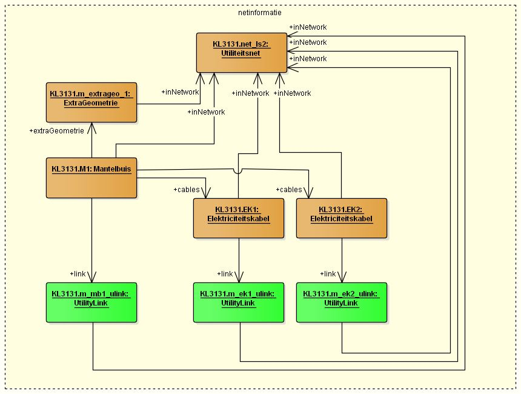
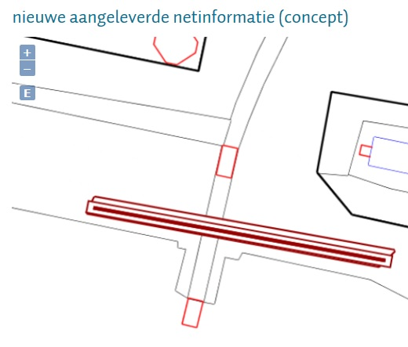

#### Voorbeeld 1. Utiliteitsnet met Mantelbuis en ExtraGeometrie

Een feature _Mantelbuis_ verwijst met een link (naam `link`) naar feature(s) van het type _UtilityLink_, die elk `centrelineGeometry` (type _GM_Curve_) bevat.   
Bovendien staat bij deze features aangegeven tot welk _Utiliteitsnet_ ze behoren door de link `inNetwork`.

Een _Mantelbuis_ is daarnaast een specialisatie van het abstracte type _KabelEnLeidingContainer_.   
Aan een feature die overerft van _KabelEnLeidingContainer_ kan daarnaast met de link `extraGeometrie` verwijzen naar een feature _ExtraGeometrie_.   
Het feature _ExtraGeometrie_ kent verschillende geometrie-attributen, waarvan momenteel alleen het attribuut `vlakGeometrie2D` (type _GM_Surface_) door KLIC wordt ondersteund.   
Ook van het feature _ExtraGeometrie_ moet worden aangegeven tot welk _Utiliteitsnet_ (momenteel maximaal 1 netwerk) deze behoort door de link `inNetwork`.

In bijgevoegd diagram is een uitsnede uit IMKL v1.2.1 gemaakt met de relevante features.

**Let wel**

Een mantelbuis wordt in de kaart al gevisualiseerd als een buis (“buffer” om de centreline-geometrie), in de kleur van het IMKL-thema van het netwerk waar deze naar refereert.

Voor de bufferbreedte wordt daarbij geen rekening gehouden met de daadwerkelijke `pipeDiameter`.
Als aan de mantelbuis ook nog ExtraGeometrie wordt gekoppeld, wordt ook deze (als polygoon) gevisualiseerd!

Voorbeeld van een FeatureCollection met een _Mantelbuis_ en _ExtraGeometrie_: zie   
Voorbeeld 1. Utiliteitsnet met Mantelbuis en ExtraGeometrie.xml

In onderstaande bijlage wordt het objectenmodel van de gebruikte features weergegeven.

Onderstaande schermafdruk laat zien hoe de features uit dit voorbeeld worden gevisualiseerd in de kaart (bij actualiseren netinformatie).

