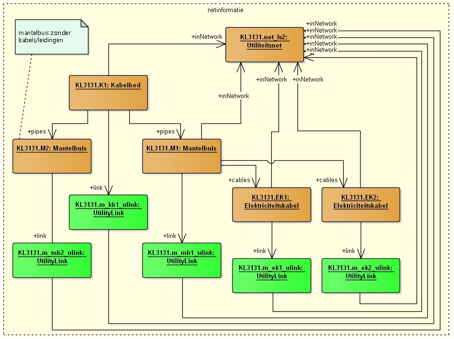
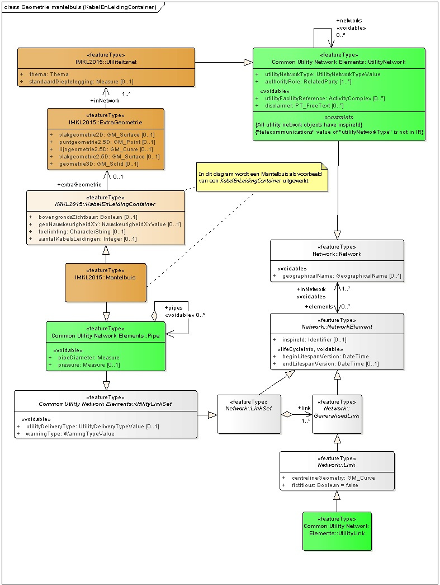
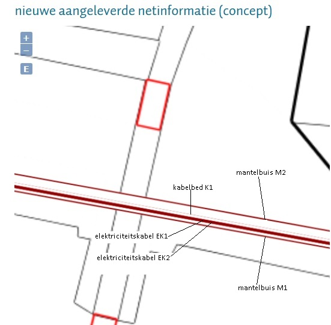

#### Voorbeeld 2. Utiliteitsnet met Duct, Pipe en Cable

...geimplementeerd als IMKL-features: _Utiliteitsnet_ met _Kabelbed_, _Mantelbuis_ en _Elektricteitskabel_.

In dit voorbeeld worden topologische relaties tussen IMKL-objecten in een netwerk uitgewerkt.

Het betreft een kabelbed met daarin twee mantelbuizen.  \
Door één mantelbuis lopen twee elektriciteitskabels; door de andere loopt (nog) geen enkele kabel of leiding.

Dit voorbeeld gaat met name in op de topologische relatie. Andere attributen zijn minimaal ingevuld of alleen om het schema valide te maken.  \
De geometrie van deze objecten is vastgelegd in de bijbehorende links naar features van het type _UtilityLink_.

In onderstaande bijlage wordt het objectenmodel van de gebruikte features weergegeven.

Het bestand is gebaseerd op een aanlevering van netinformatie.
Een feature _Mantelbuis_ verwijst met een link (naam `link`) naar feature(s) van het type _UtilityLink_, die elk `centrelineGeometry` (type _GM_Curve_) bevat.   
Bovendien staat bij deze features aangegeven tot welk _Utiliteitsnet_ ze behoren door de link `inNetwork`.

Een _Mantelbuis_ is daarnaast een specialisatie van het abstracte type _KabelEnLeidingContainer_.   
Aan een feature die overerft van _KabelEnLeidingContainer_ kan daarnaast met de link `extraGeometrie` verwijzen naar een feature _ExtraGeometrie_.   
Het feature _ExtraGeometrie_ kent verschillende geometrie-attributen, waarvan momenteel alleen het attribuut `vlakGeometrie2D` (type _GM_Surface_) door KLIC wordt ondersteund.   
Ook van het feature _ExtraGeometrie_ moet worden aangegeven tot welk _Utiliteitsnet_ (momenteel maximaal 1 netwerk) deze behoort door de link `inNetwork`.

In bijgevoegd diagram is een uitsnede uit IMKL v1.2.1 gemaakt met de relevante features.

Onderstaande schermafdruk laat zien hoe de features uit dit voorbeeld worden gevisualiseerd in de kaart (bij actualiseren netinformatie).

**Let wel**

Zowel een kabelbed, mantelbuis, als kabel/leiding wordt in de kaart gevisualiseerd als een lijn met een bepaalde dikte (afhankelijk van het schaalniveau).  \
Op het zoomniveau in bovenstaande schermafdruk bestaat de lijndikte van een mantelbuis uit 4 keer zoveel pixels als bij een kabelbed ('Duct') of een kabel/leiding.

Voor de bufferbreedte wordt daarbij geen rekening gehouden met de daadwerkelijke `pipeDiameter` of `ductWidth`.  \
Zie hiervoor ook de IMKL-documentatie: "IMKL2015-Handreiking-visualisatie_1.2.1.1.pdf".
