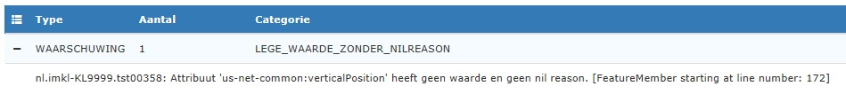

#### Voorbeeld 4. Utiliteitsnet met nilReason

In dit voorbeeld worden een aantal mogelijkheden gegeven om een 'nilReason' op te geven bij attributen (of associaties) die als "<<voidable>>" worden gekenmerkt.  \
Dit wordt gebruikt om - met reden - aan te geven dat er voor een (verplicht) attribuut geen waarde is ingevuld.

Zie ook een toelichting in de documentatie [Hints en tips bij het gebruik van IMKL2015 v1.2.1](../Toepassing%20IMKL/Hints%20en%20tips%20bij%20gebruik%20van%20IMKL%20v1.2.1.md#voidable).

**Let wel**
Er kan ook een reden opgenomen worden waarom er geen waarde is ingevuld.  
De benoemde redenen volgens INSPIRE zijn:
- `Unknown`: Waarde onbekend: De waarde is bij de zender niet bekend.
- `Unpopulated`: Niet ondersteund: De zender houdt in zijn registratie geen waarde voor dit attribuut bij.
Geldt voor alle objecten van dit objecttype.
- `Withheld`: Niet geautoriseerd: De zender vindt dat de ontvanger niet geautoriseerd is om de waarde te
kennen. Waarde is vertrouwelijk en wordt niet uitgewisseld.

Voorbeelden van een correct gebruik van een 'nilReason':
```xml
	...
	<us-net-common:currentStatus xsi:nil="true" nilReason="Unknown"/>
	...
	<us-net-common:validFrom xsi:nil="true" nilReason="Withheld"/>

	<us-net-common:verticalPosition xsi:nil="true" nilReason="Unpopulated"/>
```
Als er geen reden wordt meegegeven leidt dit mogelijk tot een waarschuwing. Zie hieronder.


