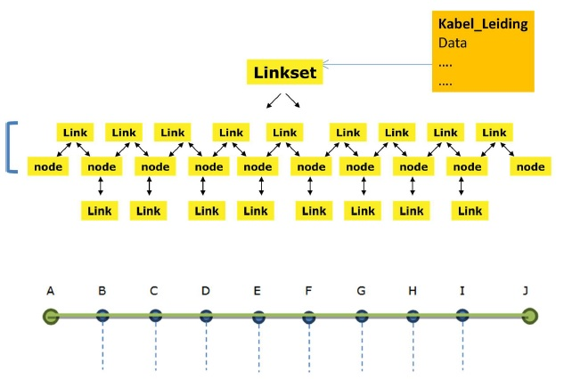

#### Voorbeeld 5. Toepassing netwerktopologie

In dit voorbeeld wordt een aanlevering gedaan van netinformatie met
- _Utiliteitsnet_ (rioolVrijverval)
- 3 objecten van het type _Rioolleiding_, met elk een
- _UtilityLink_
- 4 objecten van het type _Appurtenance_ (`appurtenanceType`: "connection")

In het voorbeeld wordt een uitwerking gegeven aan vastleggen van netwerkelementen volgens een netwerktopologie: een beschrijving van de plaats van de knooppunten en de onderlinge verbindingen in het netwerk.  \
Onderstaande schermafdruk laat zien hoe de features uit dit voorbeeld worden gevisualiseerd in de kaart (schaal 1:375).

")

De geometrie van een rioolleiding wordt vastgelegd volgens de `centrelineGeometry` van de bijbehorende _UtilityLink_. Daarnaast wordt in het object _UtilityLink_ aangegeven bij welke leidingelementen (_Appurtenance_) een leiding behoort (de topologische relatie).  \
Daartoe is met het attribuut `startNode` aangegeven bij welk leidingelement de leiding begint en met het attribuut `endNode` bij welk leidingelement de leiding eindigt.

De attributen van de _UtilityLink_ met het id "nl.imkl-GM3131.l_2205.ulink" zijn bijvoorbeeld als volgt in XML vastgelegd:
```xml
<gml:featureMember>
	<us-net-common:UtilityLink gml:id="nl.imkl-GM3131.l_2205.ulink">
		...
		<net:centrelineGeometry>
			<gml:Curve srsName="epsg:28992" gml:id="linkid.nl.imkl-GM3131.l_2205.ulink">
				<gml:segments><gml:LineStringSegment><gml:posList srsDimension="2">167465.393 441015.684 167463.570 441002.500</gml:posList></gml:LineStringSegment></gml:segments>
			</gml:Curve>
		</net:centrelineGeometry>
		<net:fictitious>false</net:fictitious>
		<net:endNode xlink:href="nl.imkl-GM3131.n_10_2256"/>
		<net:startNode xlink:href="nl.imkl-GM3131.n_10_2833"/>
		...
	</us-net-common:UtilityLink>
</gml:featureMember>
```

Hierbij wordt verwezen naar respectievelijk de `startNode` en `endNode` (objecten van het type _Appurtenance_) :
```xml
<gml:featureMember>
	<imkl:Appurtenance gml:id="nl.imkl-GM3131.n_10_2833">
		...
		<net:geometry>
			<gml:Point srsName="epsg:28992" gml:id="geomid.nl.imkl-GM3131.n_10_2833"> <gml:pos srsDimension="2">167465.393 441015.684</gml:pos></gml:Point>
		</net:geometry>
		...
		<us-net-common:appurtenanceType xlink:href="http://inspire.ec.europa.eu/codelist/SewerAppurtenanceTypeValue/connection"/>
	</imkl:Appurtenance>
</gml:featureMember>
```
```xml
<gml:featureMember>
	<imkl:Appurtenance gml:id="nl.imkl-GM3131.n_10_2256">
		...
		<net:geometry>
			<gml:Point srsName="epsg:28992" gml:id="geomid.nl.imkl-GM3131.n_10_2256"> <gml:pos srsDimension="2">167463.570 441002.500</gml:pos></gml:Point>
		</net:geometry>
		...
		<us-net-common:appurtenanceType xlink:href="http://inspire.ec.europa.eu/codelist/SewerAppurtenanceTypeValue/connection"/>
	</imkl:Appurtenance>
</gml:featureMember>
```

In onderstaande figuur is verder ingezoomd op de kaart met de verschillende features ((schaal 1:188).  \
Van de objecten van het type _UtilityLink_ en _Appurtenance_ is het `gml:id` aangegeven. Dit zijn respectievelijk de links en nodes van het topologisch netwerkmodel. Met de groene pijl wordt de richting (start -> end) gesuggereerd.

")
<br>
<br>
In de [dataspecificatie van IMKL v1.2.1](https://github.com/Geonovum/imkl2015/blob/master/informatiemodel/1.2.1/IMKL2015_Dataspecificatie_1.2.1.pdf) wordt het volgende over netwerktopologie aangegeven:

- "_Al de uitiliteitsnetten zijn opgebouwd uit verbindingen en verbindingspunten die samen een
transportnetwerk vormen. De logica van de netwerken wordt beschreven middels een topologische-, of
connectiviteitsmodel.  \
IMKL2015 volgt een arc-node topologie om de logica van het netwerk te kunnen
beschrijven. De kern van het model zit echter in het uitwisselen van de liggingsgegevens van de netten en
de netwerkelementen. Primair gebeurt dat middels centerlijnen voor de locatie van kabels en leidingen en
centerpunten voor leidingelementen._"

- "_De lijnen en punten zijn niet schematisch (niet ‘fictitious’) en representeren de locatie van
de netwerkelementen middels hartlijnen. Lijnen van leidingen en punten van bijbehorende
leidingelementen hoeven niet noodzakelijkerwijs aan te sluiten. De connectiviteit wordt gerealiseerd door
de arc-node topologie.  \
Als voorbeeld een pompstation in een rioolnetwerk. Het door een (center) punt
gerepresenteerde pompstation is niet verbonden met leidingen. Er lopen wel leidingen naar de punt toe
maar niet tot aan de punt. De leidingen hebben wel een verwijzing naar de node (connectiviteit)._"

- Zie Bijlage 3: Toelichting op geometriemodel  \
Onderstaande schema toont een geometriemodel waarbij de netwerktopologie volledig is toegepast.  \
De volledig toepassing van het netwerkmodel bestaat uit het maken van 1 linkset die bestaat uit links die
nodes met elkaar verbinden. Er is een verwijzing tussen de nodes en de links. Een leiding verwijst naar de
linkset die er bij hoort.


