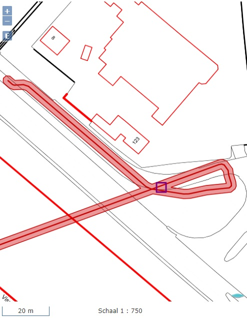

#### Voorbeeld 6. Utiliteitsnet met EV-vlak+donut

In dit voorbeeld wordt een aanlevering gedaan van netinformatie met
- _Utiliteitsnet_ (middenspanning)
- _Elektriciteitskabel_, met een
- _UtilityLink_
- _AanduidingEisVoorzorgsmaatregel_ (netaanduiding: "MS-T")  \
Voor een consistente aanlevering worden ook voorzorgsmaatregelen en een EV-sjabloon meegeleverd.

Deze _AanduidingEisVoorzorgsmaatregel_ heeft als bijzonderheid dat de geometrie is vastgelegd als een polygoon (exterior) met daarbinnen een "gat" (interior).  \
Ogenschijnlijk maakt de middenspanningsleiding een boog om vervolgens als een boring onder het kanaal door te lopen.

Onderstaande schermafdruk laat zien hoe de features uit dit voorbeeld worden gevisualiseerd in de kaart (bij actualiseren netinformatie).



De geometrie van deze _AanduidingEisVoorzorgsmaatregel_ is als volgt in XML vastgelegd:
```xml
<gml:featureMember>
	<imkl:AanduidingEisVoorzorgsmaatregel gml:id="nl.imkl-KL3131.AEVM_elec_EV_12139335donut_1">
		...
		<imkl:geometrie>
			<gml:Polygon gml:id="nl.imkl-KL3131.AEVM_elec_EV_12139335donut_1_GeoSeq_1" srsName="urn:ogc:def:crs:EPSG::28992">
				<gml:exterior>
					<gml:LinearRing>
						<gml:posList>163936.160 402970.245 163936.161 402970.246 163936.419 402970.281 ..... 163935.900 402970.244 163936.160 402970.245</gml:posList>
					</gml:LinearRing>
				</gml:exterior>
				<gml:interior>
					<gml:LinearRing>
						<gml:posList>164104.252 403033.646 164125.368 403041.492 ...... 164109.645 403032.787 164104.252 403033.646</gml:posList>
					</gml:LinearRing>
				</gml:interior>
			</gml:Polygon>
		</imkl:geometrie>
	</imkl:AanduidingEisVoorzorgsmaatregel>
</gml:featureMember>
```

**Let wel**

- In de huidige definitie van IMKL2015 (versie 1.2.1) is het geometrie-element van een _AanduidingEisVoorzorgsmaatregel_ gedefinieerd als type 'GM_Surface'.  \
Dit type ondersteunt wel een (enkelvoudige) polygoon (buitenring, 'exterior') met daarbinnen eventueel één of meerdere binnenringen ('interior').  \
Dit type ondersteunt echter geen multipolygonen (meerdere naast elkaar liggende buitenringen).
- Als er een gebiedsinformatie-aanvraag wordt gedaan in een gebied dat meerdere stukken van het EV-vlak doorsnijdt, zou dit resulteren in een geclipt EV-vlak met meerdere multipolygonen.
Zoals hierboven genoemd, kan deze met de huidige geometrie-definitie van een _AanduidingEisVoorzorgsmaatregel_ niet worden vastgelegd. Het EV-vlak zal in dat geval ongeclipt worden uitgeleverd.