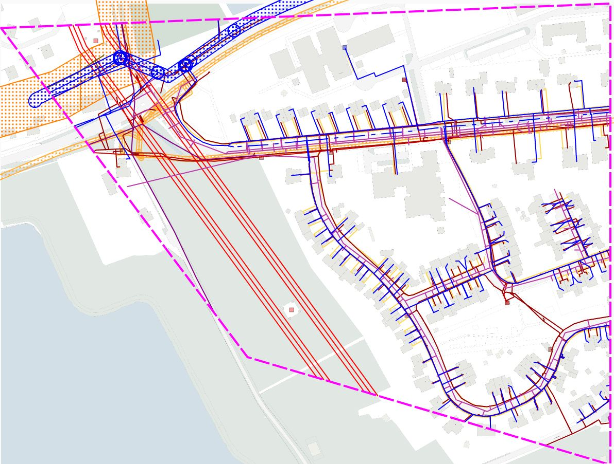

#### Uitleveren gebiedsinformatie (voorbeeld bij aanvraag 20G004726)

Kenmerken van dit voorbeeld:
- graafmelding waarbij de informatiepolygoon gelijk is aan de graafpolygoon;  \
er is geen "informatie-buffer" zichtbaar in de kaart;
- er zijn natuurlijk **geen** belanggebieden van netbeheerders die alleen door de "informatie-buffer" worden geraakt (zie ontvangstbevestiging);
- er zijn natuurlijk **geen** thema's van netbeheerders waarbij de kabel- en leidinginformatie alleen door de "informatie-buffer" loopt (conform huidige leveringsbrief);
- de _Informatiepolygoon_ is **NIET** opgenomen in de gebiedsinformatie-levering (GI.xml in zipbestand);

Uitgeleverd gebied:  \
