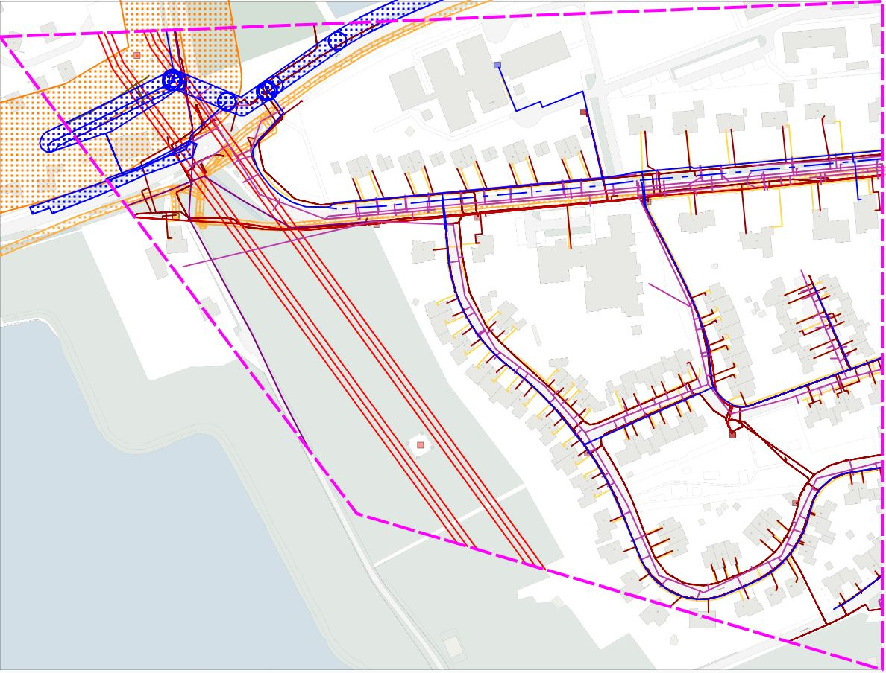

#### Uitleveren gebiedsinformatie (voorbeeld bij aanvraag 20G000006)

In dit voorbeeld hebben de volgende organisaties een KvK-nummer:
- de aanvrager
- de opdrachtgever
- alléén netbeheerder KL1031

Indien aanwezig wordt het KvK-nummer weergegeven in de volgende producten:
- ontvangstbevestiging
- gebiedsinformatie-levering (GI.xml in zipbestand)
- beheerdersinformatie-leveringen (gebiedsinformatie van een belanghebbende netbeheerders; zie GI.xml in BIL zipbestand)

Uitgeleverd gebied:  \
