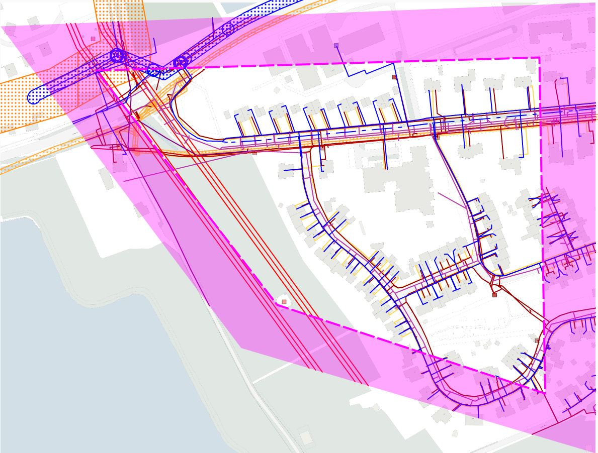

#### Uitleveren gebiedsinformatie (voorbeeld bij aanvraag 20G004725)

Kenmerken van dit voorbeeld:
- graafmelding waarbij de informatiepolygoon ruim om de graafpolygoon is getekend;  \
de "informatie-buffer" is zichtbaar gemaakt in de kaart (rose arcering);
- er zijn **geen** belanggebieden van netbeheerders die alleen door de "informatie-buffer" worden geraakt (zie ontvangstbevestiging);
- er zijn **wel** thema's van netbeheerders waarbij de kabel- en leidinginformatie **alleen** door de "informatie-buffer" loopt  \
(_**dit moet nog zichtbaar gemaakt worden op leveringsbrief**_);
- de _Informatiepolygoon_ (inclusief `geometrieVoorVisualisatie`) is opgenomen in de gebiedsinformatie-levering (GI.xml in zipbestand);

Uitgeleverd gebied:  \
