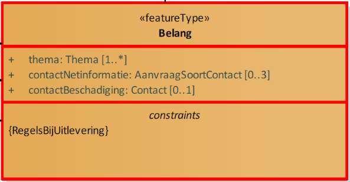

# Beschrijving Issue 193

## Essentie:

Geen onderscheid meer tussen contactStoring en contactBeschadiging.

## Link:

[https://github.com/Geonovum/imkl2015-review/issues/193](https://github.com/Geonovum/imkl2015-review/issues/193)

## Uitleg:

In het huidige IMKL-versie 1.2.1 wordt er zowel een `contactStoring` en `contactBeschadiging` onderscheiden. Het is echter niet aan de grondroerder om te bepalen of hij alleen schade heeft veroorzaakt, alleen een storing of beiden. Daarom bestaat er in het nieuwe IMKL-versie 2.0 alleen nog maar `contactBeschadiging`.

# De wijziging

## Model:

| Uitsnede IMKL v1.2.1                  | Uitsnede IMKL v2.0                    |
|---------------------------------------|---------------------------------------|
|  |  |

_contactStoringen_ niet langer meer een attribuut van _belang.
 contactBeschadiging_ blijft ongewijzigd.

## Voorbeelden:

### GebiedsinformatieLevering-XML (IMKL v2.0)

Merk op dat in dit voorbeeld alleen een `contactBeschadiging` wordt genoemd en geen `contactStoring`. Het veld `contactStoring` werd in het verleden ook al niet gebruikt.

## Mogelijke impact:

### Beheren belangen:

Netbeheerders kunnen in Mijn Kadaser bij _KLIC beheren belangen_ nu al slechts één contact opgeven voor beschadiging/storing onder `Contact beschadeging/storings nummer`.

### Uitleveren / KLIC-viewers:

**LI.xml**

In het IMKL model was het technisch mogelijk een `contactStoring` mee te geven, in de prakrijk is deze echter nooit uitgeleverd. Mocht je als grondroerder of viewer-bouwer software hebben ontwikkeld die rekening hield met dat dit veld wel had kunnen komen, kan deze code daar nu op aangepast worden.

**leveringsbrief (LI.pdf)**

In de leveringsbrief (LI.pdf) blijft het contactbeschadigingsnummer zichtbaar zoals nu onder het label `schade/storingen`.

# Overgang:

Er is geen overgang van toepassing: Er wordt nu al slechts één contact gebruikt voor beschadiging/storing. Het niet gebruikte attribuut wordt met deze wijziging nu ook uit het model gehaald.