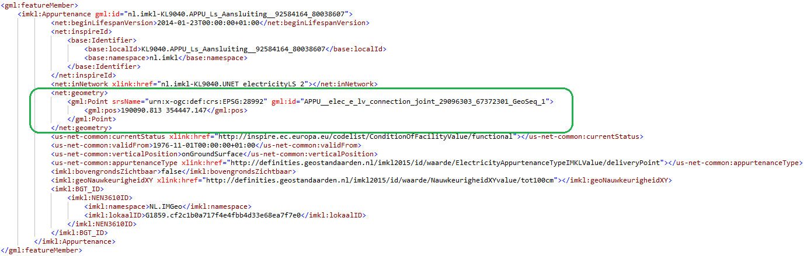

# Beschrijving Issue 283

## Essentie:

Nauwkeurigheid van (RD)-coördinaten in maximaal 3 decimalen

## Link:

[https://github.com/Geonovum/imkl2015-review/issues/283](https://github.com/Geonovum/imkl2015-review/issues/283)

## Uitleg:

Coördinaten van netinformatie zijn volgens het RD stelsel en mogen maximaal 3 decimalen bevatten. Dit betreft in de praktijk een nauwkeurigheid in millimeters. Uiteraard zijn 0, 1 of 2 decimalen ook toegestaan.

# De wijziging

## Model:

In de [IMKL Dataspecificatie]([https://docs.geostandaarden.nl/kl/vv-st-imkl-20201110/#nadere-gml-implementatie-specificaties](https://docs.geostandaarden.nl/kl/vv-st-imkl-20201110/#nadere-gml-implementatie-specificaties)) staat het volgende omschreven:

## Voorbeelden:

### GebiedsinformatieLevering-XML (IMKL v2.0)

## Mogelijke impact:

### Actualiseren netinformatie / aanleveren beheerdersinformatie:

Netinformatie of beheerdersinformatie die in IMKL 1.2.1 nog wordt goedgekeurd, zou vanwege deze validatie nu kunnen worden afgekeurd.

> Bij het actualiseren/aanleveren in IMKL-versie 2.0 zal gevalideerd worden dat coördinaten maximaal 3 decimalen hebben. Als bij het valideren wordt geconstateerd dat een aanlevering van netinformatie (centraal) of beheerdersinformatie (decentraal) deze beperking wordt overschreden, dan wordt de aanlevering afgekeurd.

### Uitleveren / KLIC-viewers:

Huidige uitleveringen kunnen ook al coördinaten hebben met 3 of minder coördinaten, daarom is er op voor de uitleveringen geen impact te verwachten.

# Overgang:

Het betreft een extra validatie bij aanleveringen in IMKL-versie 2.0, die in IMKL-versie 1.2.1 nog gedoogd is.

Mocht tijdens de overgangsperiode de netinformatie van v1.2.1 getransformeerd worden naar v2.0 worden coördinaten niet aangepast en mogelijk dus meer dan 3 decimalen uitgeleverd worden.

Mocht tijdens de overgangsperiode de netinformatie van v2.0 getransformeerd worden naar v1.2.1 heeft dit geen impact omdat de coördinaten per definitie voldoen.